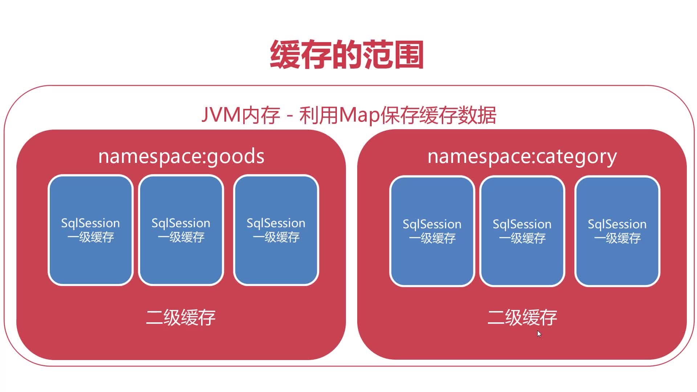

# Mybatis缓存：

缓存优化指通过数据优化，提高程序执行效率的有效方式。比如我需要查询某个商品的数据，提取了一次之后，我需要再次进行提取。因为mysql是从硬盘读取数据，硬盘读取数据的速度较慢，同时第一次和第二次提取都返回了相同记录，多次提取也不合理。我们可以把第一次查询到的数据放到内存中，到第二次要提取的时候可直接从内存取值，内存取值速度比硬盘的快至少几十倍。

```java
    @Test
    public  void testLv0Cache() {
        Goods one = sqlSession.selectOne("goods.selectById", 745);
        Goods tow = sqlSession.selectOne("goods.selectById", 745);
        Goods three = sqlSession.selectOne("goods.selectById", 745);
        //在同一会话中 无论获取多少次获取得数据都是同一对象
        System.out.println("one = " + one);
        System.out.println("tow = " + tow);
        System.out.println("tow = " + three);
    }
    @Test
    public  void testLv1Cache() {
        Goods one = sqlSession.selectOne("goods.selectById", 745);
        sqlSession.commit();//commit()提交事务时，对该namespace中的缓存强制清空
        Goods tow = sqlSession.selectOne("goods.selectById", 745);

        System.out.println("one = " + one);
        System.out.println("tow = " + tow);
    }
    @Test
    public  void testLv2Cache() {
        Goods one = sqlSession.selectOne("goods.selectById", 745);
        MyBatisUtils.closeSession(sqlSession);// 一级缓存是sqlSession级别不同sqlSession对象
        SqlSession sqlSession = MyBatisUtils.openSession();
        Goods tow = sqlSession.selectOne("goods.selectById", 745);

        System.out.println("one = " + one);
        System.out.println("tow = " + tow);
    }
```
## Mybatis缓存机制：

* 1，一级缓存默认开启，缓存范围是一个sqlsession会话，范围较小

* 2，二级缓存手动开启，范围属于Mapper Namespace，范围更大




## 二级缓存运行规则

* 1，二级开启后默认所有查询操作均使用缓存

* 2，写操作commit提交时会对该namespace缓存强制清空，为了保证数据的一致性。比如第一个用户得到一个商品叫婴幼儿奶粉，第二个用户把名称给改了，如果此时不清空缓存，第一个用户得到的仍然是婴幼儿奶粉，这样得到的数据和数据库底层得到的就不一致了。

* 3，配置`useCache=false` 表示可以不用缓存

* 4，配置`flushCache=true`代表强制清空缓存


```xml
<?xml version="1.0" encoding="UTF-8" ?>
<!DOCTYPE mapper
        PUBLIC "-//mybatis.org//DTD Mapper 3.0//EN"
        "http://mybatis.org/dtd/mybatis-3-mapper.dtd">
<mapper namespace="goods">
    <!--二级缓存配置-->
    <cache eviction="LRU" flushInterval="60000" size="512" readOnly="true"/>
</mapper>
```
### 一，`cache`缓存设置
1，eviction：缓存的清除策略，当缓存对象达到上限后，会自动触发对应算法对缓存对象进行清除。

清除策略主要有4种：

* LRU：最近最久未使用，移除最长时间不适用的对象（mybatis默认使用这个，可以使我们访问的命中率达到最高）

* LFU：最近最少使用：移除最近访问率最低的对象（用得少）

* FIFO：先进先出：按对象进入缓存的顺序来移除它们，移除最先进入的对象（用得少，了解即可）

* SOFT：软引用：移除基于垃圾收集器状态和软引用规则的对象（基于JVM的垃圾回收器，用得少，了解即可）

* WEAK：弱引用：更积极的移除基于垃圾收集器状态和弱引用规则的对象（基于JVM的垃圾回收器，用得少，了解即可）

2，flushInterval：缓存的清除间隔，单位为毫秒，可以适当的设置长一些，利用这个选项可有效对内存进行及时回收

例： flushInterval="60000"：每隔10分钟自动对缓存进行清除

3，size：缓存长度，表示当前最多能缓存多少个对象。

- 无论是缓存某个实体类，还是一个list集合，都只会被看成返回一个对象，实际开发中不推荐把list作为缓存对象在二级缓存中进行保存，因为list返回数据是多变的，导致命中率较低（比如selectALL这个），推荐selectById这种返回单个对象的进行使用，命中率高

- size的长度设置不要太小，在内存足够的情况下，比如有1400个商品，设置的size就要设置成1400，这样所有商品对象就可以在这个二级缓存中进行保存，这样按照id进行查询时候直接可以从内存进行提取，效率就非常高。
4，readOnly：是否设置成只读

- 设置为true，代表返回只读缓存，每次从缓存取出的是缓存对象本身，这种执行效率较高

- 设置为false，代表每次取出的是缓存对象的副本，每次取出的对象都是不同的，这种安全性较高

### 二，其他标签的缓存设置

1，useCache：是否使用缓存，可以设置true或者false，不推荐selectALL这种查询全局的配置进行使用，因为数据量太大了，会对内存造成很大压力，而且因为list返回数据是多变的，导致命中率较低，设置成false即可。

2，flushCache：在sql执行后是否强制清空缓存

-可以设置成true或者false，设置成true的话，效果和commit是完全相同的

- 可用于写入和查询操作。

- 设置了这个以后，同样不会被放入缓存


```xml
<insert id="insert" parameterType="com.imooc.mybatis.entity.Goods" useGeneratedKeys="true" flushCache="true">
```
这里表示插入数据成功后立刻清除缓存

## 缓存的命中率：

比如执行了2次，第一次是从数据库查询，没有使用缓存，第二次是从缓存提取，这个时候命中率就是0.5,如果查询3次，命中率就是0.66。命中率越高代表缓存使用率越高，对程序优化效果更好。


其中 eviction mybatis默认使用LRU 这样保证我们访问的命中率尽可能的高

缓存最好保存单个的实体对象缓存，不要保存大量的List查询结果（这样缓存命中率比较低）

