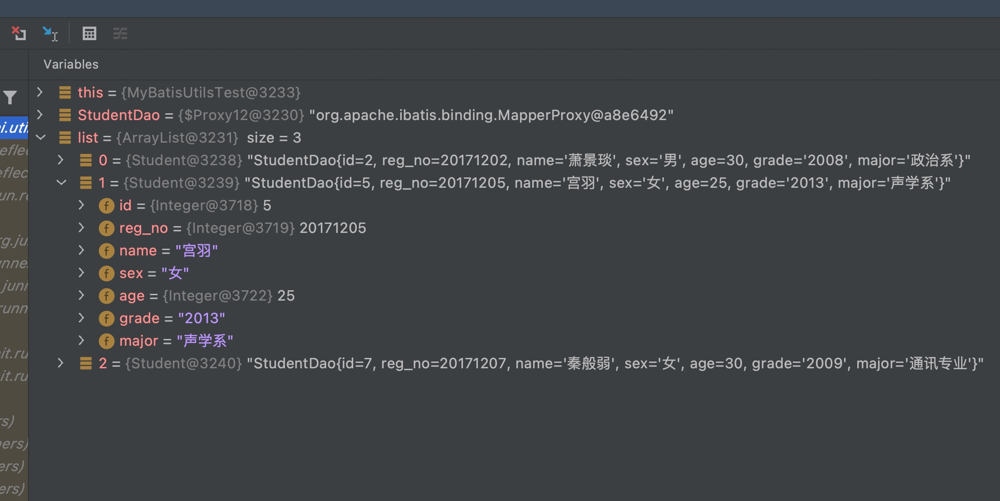

# Mybatis注解开发
注解：把原来放在xml中的配置信息和sql语句放在程序中书写，实现功能都是一样的

优点：有更好的开发体验，让程序开发的更快


## 数据查询

### 1 创建注解接口
```java
public interface StudentDao {
    @Select("select * from student where age between #{min} and  #{max} limit #{limt};")
    public List<Student> selectByAgeRange(@Param("min") int min, @Param("max") int max, @Param("limt") int limt);
}
```
### 2 在mybatis-config.xml文件新增对应说明

```xml
    <!--两种配置方式，二选一即可。-->
    <!--推荐使用第二种，因为随着工程越来越大，配置信息也越来越多，不便维护。
    如果使用包的话，就只用写这一行，mybatis加载时候会对整个包进行扫描，极大简化了配置-->
<mappers>
        <!-- <mapper class="top.xiongmingcai.dao.StudentDao"/>-->
        <package name="top.xiongmingcai.dao"/>
</mappers>
```
### 3，测试

```java
   @Test
    public void name() {
        // goodsDAO虽然是接口，但是运行的时候session会根据其配置信息动态生成其实现类
        StudentDao StudentDao = sqlSession.getMapper(StudentDao.class);
        List<Student> list = StudentDao.selectByAgeRange(25, 30, 10);
        list.forEach(System.out::println);
    }
```


### 测试数据
| id | reg\_no | name | sex | age | grade | major |
| :--- | :--- | :--- | :--- | :--- | :--- | :--- |
| 1 | 20171201 | 梅长苏 | 男 | 21 | 2008 | 哲学系 |
| 2 | 20171202 | 萧景琰 | 男 | 30 | 2008 | 政治系 |
| 3 | 20171203 | 飞流 | 男 | 18 | 2016 | 人体系 |
| 4 | 20171204 | 萧景桓 | 男 | 35 | 2006 | 政治系 |
| 5 | 20171205 | 宫羽 | 女 | 25 | 2013 | 声学系 |
| 6 | 20171206 | 霓凰 | 女 | 31 | 2008 | 国际关系专业 |
| 7 | 20171207 | 秦般弱 | 女 | 30 | 2009 | 通讯专业 |


```sql
create table student
(
    id     int auto_increment primary key,
    reg_no int         not null,
    name   varchar(20) not null,
    sex    varchar(20) not null,
    age    int         not null,
    grade  varchar(50) not null,
    major  varchar(50) not null
);


insert into babytun.student (id, reg_no, name, sex, age, grade, major)
values  (1, 20171201, '梅长苏', '男', 21, '2008', '哲学系'),
        (2, 20171202, '萧景琰', '男', 30, '2008', '政治系'),
        (3, 20171203, '飞流', '男', 18, '2016', '人体系'),
        (4, 20171204, '萧景桓', '男', 35, '2006', '政治系'),
        (5, 20171205, '宫羽', '女', 25, '2013', '声学系'),
        (6, 20171206, '霓凰', '女', 31, '2008', '国际关系专业'),
        (7, 20171207, '秦般弱', '女', 30, '2009', '通讯专业');
```
## 结果映射查询


## 数据插入
### 1.  创建注解接口

```java
public interface StudentDao {
    ......
    @Insert("INSERT INTO student ( reg_no, name, sex, age, grade, major) VALUES (#{reg_no}, #{name}, #{sex}, #{age}, #{grade},#{major})")
    @SelectKey(statement = "select LAST_INSERT_ID()", before = false, keyProperty = "id",  resultType = Integer.class)
    public int insert(Student student);
}

```
* 获取主键 ` before=false`--表示在SQL语句之后执行（true，在SQL语句之前执行)
* `keyProperty`表示主键属性
* `resultType` 表示返回主键类型

### 2 在mybatis-config.xml文件新增对应说明

```xml
    <!--两种配置方式，二选一即可。-->
    <!--推荐使用第二种，因为随着工程越来越大，配置信息也越来越多，不便维护。
    如果使用包的话，就只用写这一行，mybatis加载时候会对整个包进行扫描，极大简化了配置-->
<mappers>
        <!-- <mapper class="top.xiongmingcai.dao.StudentDao"/>-->
        <package name="top.xiongmingcai.dao"/>
</mappers>
```

### 3. 测试

```java
public class MyBatisUtilsTest {
    static SqlSession sqlSession = null;

    @BeforeClass
    public static void beforeClass() throws Exception {
        sqlSession = MyBatisUtils.openSession();
    }

    @Test
    public void insert2() {
        Student student = new Student();

        student.setReg_no(20171202);
        student.setName("萧炎");
        student.setSex("男");
        student.setAge(23);
        student.setGrade("2008");
        student.setMajor("练药系");


        // goodsDAO虽然是接口，但是运行的时候session会根据其配置信息动态生成其实现类
        StudentDao StudentDao = MyBatisUtilsTest.sqlSession.getMapper(StudentDao.class);
        int last_insert_id = StudentDao.insert(student);
        try {
            sqlSession.commit();
        } catch (Exception e) {
            e.printStackTrace();
        }
    }
    @AfterClass
    public static void afterClass() throws Exception {
        MyBatisUtils.closeSession(sqlSession);
    }
}    
```