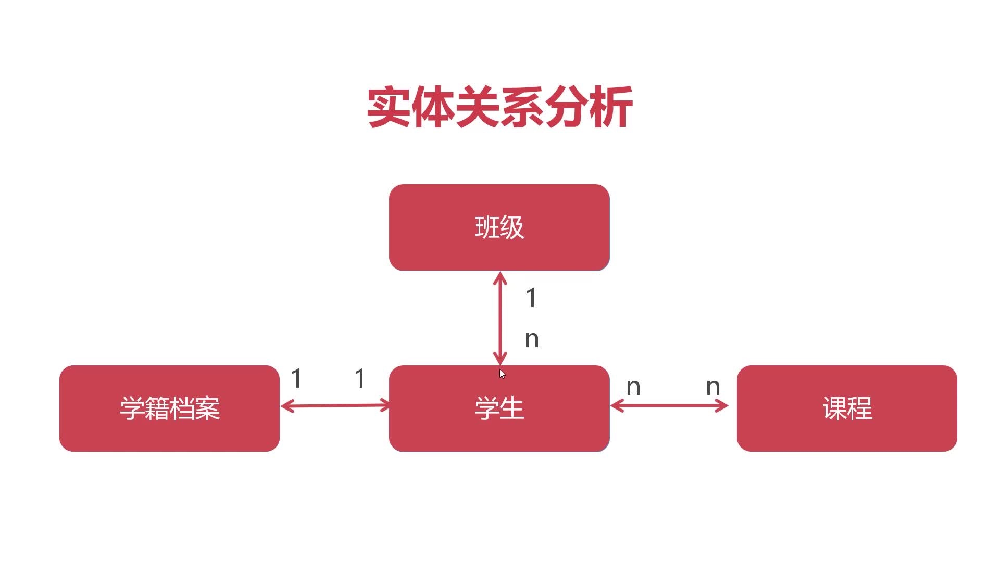
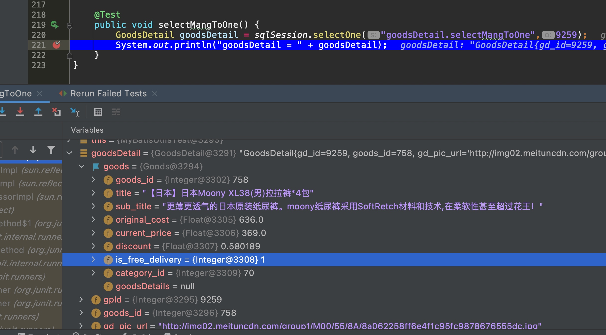
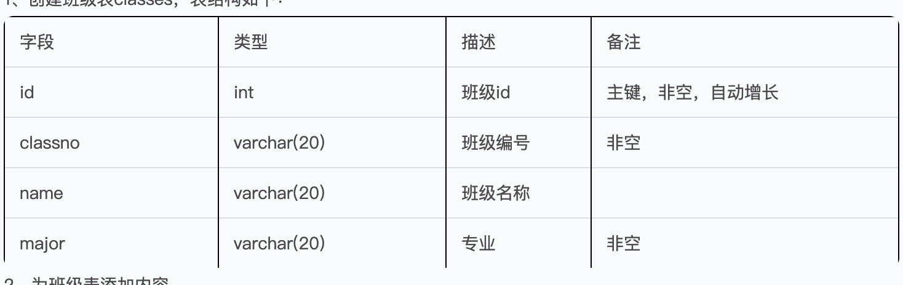
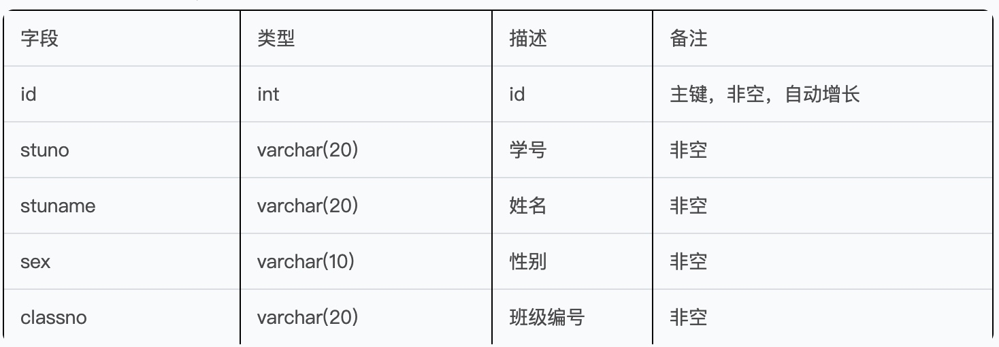
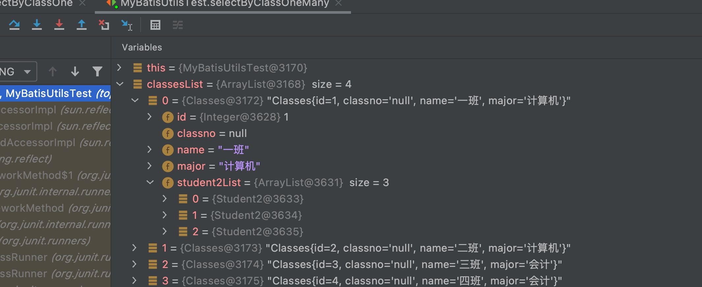
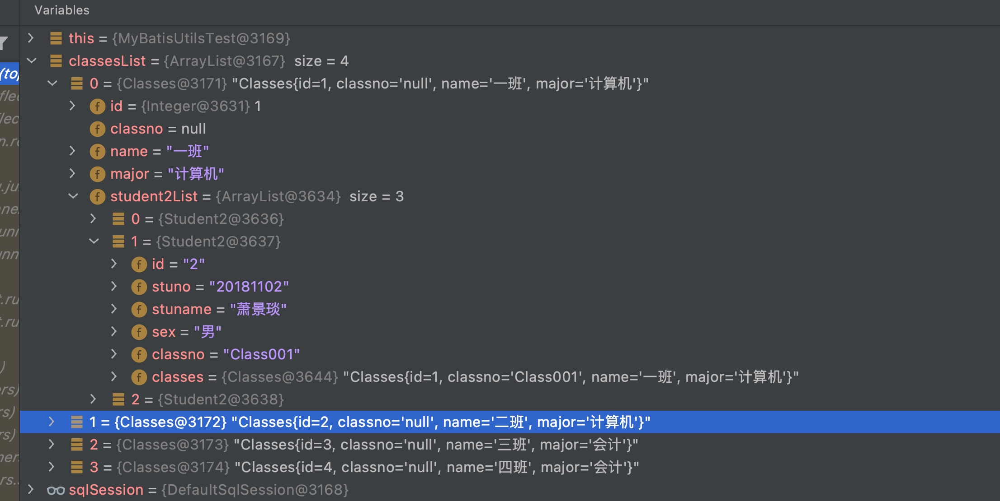

# MyBatis多表级联查询
关系：

* 1，班级和学生：班级1--n学生 （一对多关系）


1个班级--》n(多)个学生，，1个学生--》(同一时间)1个班级

这样，多对一的学生表需要持有班级的 外键

1. 2，学生和学籍档案（一对一关系）

1个学生--》1份档案，，1份档案--》1个学生

这样，1对1的关系通常通过主键进行关联（1号学生-对应-》1号档案）

* 3，学生和课程的关系（多对多关系）

1个学生--》n课程，，1个课程--》你个学生

这样多对多的关系--》设计数据表时需要出现出一个 中间表 ，中间表持有课程和学生的编号，学生表与中间表关联，课程表与中间表关联，这样三张表就构建起一个多对多关系。

#### 使用场景案例：（一对多）
使用场景案例：（一对多）

1、一个商品基本信息表：t_goods，主键是good_id

2、一个商品图片表：t_goods_detail，外键是good_id

3、一个商品有多个商品图片

4、我们希望在查询这个商品的信息的同时，把该商品的商品图片也查询出来，

5、商品与商品图片是一对多的关系，商品可以有多个商品图片，而一个商品图片只能有一个对应的商品。

##### 步骤：1、创建商品实体类Goods、创建商品图片表实体类GoodsDetail

```java
public class Goods {
    .....
    private List<GoodsDetail> goodsDetails;
    .....
}    
```
#####  步骤：2、创建Goods mappers文件goods.xml、创建GoodsDetail mappers文件goods_detail.xml


```xml
<?xml version="1.0" encoding="UTF-8" ?>
<!DOCTYPE mapper
        PUBLIC "-//mybatis.org//DTD Config 3.0//EN"
        "http://mybatis.org/dtd/mybatis-3-mapper.dtd">
<mapper namespace="goods">
     <!--resultMap结果映射，说明GoodsDetail List集合数据从哪来的-->
    <resultMap id="rmGoods2" type="top.xiongmingcai.entity.Goods">
        <!--设置主键字段：属性名、字段名-->
        <id property="goods_id" column="goods_id"></id>
        <!--设置collection：集合属性名、生成集合的SQL、关联主键-->
        <collection property="goodsDetails" select="goodsDetail.selectByGoodsId" column="goods_id"/>
    </resultMap>    <!--关联查询，resultMap结果映射到rmGoods-->
    <select id="selectOneToMany" resultMap="rmGoods2">
        select * from t_goods limit 0,3
    </select>
</mapper>
```
```xml goods_detail.xml
<?xml version="1.0" encoding="UTF-8" ?>
<!DOCTYPE mapper
        PUBLIC "-//mybatis.org//DTD Mapper 3.0//EN"
        "http://mybatis.org/dtd/mybatis-3-mapper.dtd">
<mapper namespace="goodsDetail">

    <select id="selectByGoodsId" parameterType="Integer" resultType="top.xiongmingcai.entity.GoodsDetail">
        select *
        from t_goods_detail
        where goods_id = #{value}
    </select>
</mapper>
```

##### 3、在SqlSession执行select语句：
```java
public class MyBatisUtilsTest {
    static SqlSession sqlSession = null;

    @AfterClass
    public static void afterClass() throws Exception {
        MyBatisUtils.closeSession(sqlSession);
    }

    @BeforeClass
    public static void beforeClass() throws Exception {
        sqlSession = MyBatisUtils.openSession();
    }
    @Test
    public void selectOneToMany() {
        List<Goods> list = sqlSession.selectList("goods.selectOneToMany");
        for (Goods goods:list){
            System.out.println(goods.getTitle()+":"+goods.getGoodsDetails().size());
        }
    }
}    
```

output

```sql
914  [main] DEBUG goods.selectOneToMany - ==>  Preparing: select * from t_goods limit 0,3  
971  [main] DEBUG goods.selectOneToMany - ==> Parameters:  
1028 [main] DEBUG goodsDetail.selectByGoodsId - ====>  Preparing: select * from t_goods_detail where goods_id = ?  
1033 [main] DEBUG goodsDetail.selectByGoodsId - ====> Parameters: 741(Integer) 
1056 [main] DEBUG goodsDetail.selectByGoodsId - <====      Total: 6 
1060 [main] DEBUG goodsDetail.selectByGoodsId - ====>  Preparing: select * from t_goods_detail where goods_id = ?  
1061 [main] DEBUG goodsDetail.selectByGoodsId - ====> Parameters: 742(Integer) 
1074 [main] DEBUG goodsDetail.selectByGoodsId - <====      Total: 22 
1075 [main] DEBUG goodsDetail.selectByGoodsId - ====>  Preparing: select * from t_goods_detail where goods_id = ?  
1075 [main] DEBUG goodsDetail.selectByGoodsId - ====> Parameters: 743(Integer) 
1086 [main] DEBUG goodsDetail.selectByGoodsId - <====      Total: 14 
1086 [main] DEBUG goods.selectOneToMany - <==      Total: 3 
斯利安 孕妈专用 洗发水 氨基酸表面活性剂 舒缓头皮 滋养发根 让你的秀发会喝水 品质孕妈:6
亲恩 孕妇护肤品 燕窝补水保湿6件套 孕期安全温和 补水保湿套装:22
优美孕 补水保湿 黄金果水润嫩肤三件套(中样装 洁面乳50g 水50ml 乳液50ml):14
```
#### 使用场景案例：（多对一）

```java
public class Goods {
    .....
        private Goods goods;//对多持有实体类
    .....
}    
```


```xml
<?xml version="1.0" encoding="UTF-8" ?>
<!DOCTYPE mapper
        PUBLIC "-//mybatis.org//DTD Mapper 3.0//EN"
        "http://mybatis.org/dtd/mybatis-3-mapper.dtd">
<mapper namespace="goodsDetail">
<resultMap id="rmGoodsDetail" type="top.xiongmingcai.entity.GoodsDetail">
        <id property="gpId" column="gd_id"/>
        <result property="goods_id" column="goods_id"/>
        <!--        因为原有的goodsId会作为参数传给联动的SQL，所以这里需要手动为GoodsDetail 的goodsId属性赋值。-->
        <association property="goods" column="goods_id" select="goods.selectById"/>
    </resultMap>
    <select id="selectMangToOne" resultMap="rmGoodsDetail" parameterType="Integer">
        select *
        from t_goods_detail
        where gd_id = #{value } limit 0,1
    </select>
</mapper>
```

```java
    @Test
    public void selectMangToOne() {
        GoodsDetail goodsDetail = sqlSession.selectOne("goodsDetail.selectMangToOne",9259);
        System.out.println("goodsDetail = " + goodsDetail);
    }
```

#### 作业
参照MyBatis对象关联查询案例，完成如下功能：

1、创建班级表classes，表结构如下：


2、为班级表添加内容

```sql
create table classes
(
    id      int auto_increment
        primary key,
    classno varchar(20) not null,
    name    varchar(20) null,
    major   varchar(20) null
);

insert into babytun.classes (id, classno, name, major)
values  (1, 'Class001', '一班', '计算机'),
        (2, 'Class002', '二班', '计算机'),
        (3, 'Class003', '三班', '会计'),
        (4, 'Class004', '四班', '会计');
```
3、创建学生表student，表结构如下：


4、为学生表添加如下内容

```sql
create table student2
(
    id      int auto_increment
        primary key,
    stuno   varchar(20) not null,
    stuname varchar(20) null,
    sex     varchar(10) not null,
    classno varchar(20) not null
);

insert into babytun.student2 (id, stuno, stuname, sex, classno)
values  (1, '20181101', '梅长苏', '男', 'Class001'),
        (2, '20181102', '萧景琰', '男', 'Class001'),
        (3, '20181103', '宫羽', '女', 'Class001'),
        (4, '20181201', '霓凰', '女', 'Class003');
```
5、定义实体类和Mapper xml文件，在测试类中查询一班的学生信息并显示（使用一对多关联查询完成）

```xml
<?xml version="1.0" encoding="UTF-8" ?>
<!DOCTYPE mapper
        PUBLIC "-//mybatis.org//DTD Config 3.0//EN"
        "http://mybatis.org/dtd/mybatis-3-mapper.dtd">
<mapper namespace="classes">

    <select id="selectByClassOne"  resultType="top.xiongmingcai.entity.Classes" parameterType="String">
        select * from classes where trim(classno) =   #{value }
    </select>
    <!--resultMap结果映射，说明GoodsDetail List集合数据从哪来的-->
    <resultMap id="rmClasses" type="top.xiongmingcai.entity.Classes">
        <!--设置主键字段：属性名、字段名-->
        <id property="id" column="id"/>
        <!--设置collection：集合属性名、生成集合的SQL、关联主键-->
        <collection property="student2List" select="student2.selectByClassOne" column="classno"/>
    </resultMap>

    <!--关联查询，resultMap结果映射到rmGoods-->
    <select id="selectByClassOneMany" resultMap="rmClasses">
        select * from classes limit 0,4
    </select>
</mapper>
```

```xml
<?xml version="1.0" encoding="UTF-8" ?>
<!DOCTYPE mapper
        PUBLIC "-//mybatis.org//DTD Config 3.0//EN"
        "http://mybatis.org/dtd/mybatis-3-mapper.dtd">
<mapper namespace="student2">
    <resultMap id="rmGoodsDetail" type="top.xiongmingcai.entity.Student2">
        <id property="classno" column="classno"/>
        <result property="classno" column="classno"/>
        <!--        因为原有的goodsId会作为参数传给联动的SQL，所以这里需要手动为GoodsDetail 的goodsId属性赋值。-->
        <association property="classes" column="classno" select="classes.selectByClassOne"/>
    </resultMap>
    <select id="selectByClassOne"  resultMap="rmGoodsDetail"  parameterType="String">
        select * from student2 where classno  =   #{value }
    </select>
</mapper>
```


6、继续完善实体类和Mapper xml文件，在测试类中查询，根据学生查询到班级信息并显示（使用多对一关联查询完成）

```java
   @Test
    public void selectByClassOneMany() {
        List<Classes> classesList = sqlSession.selectList("classes.selectByClassOneMany");
        classesList.forEach(System.out::println);
    }
```



```java
  @Test
    public void selectByClassOneMany() {
        List<Classes> classesList = sqlSession.selectList("classes.selectByClassOneMany");
        classesList.forEach(System.out::println);
    }

```

