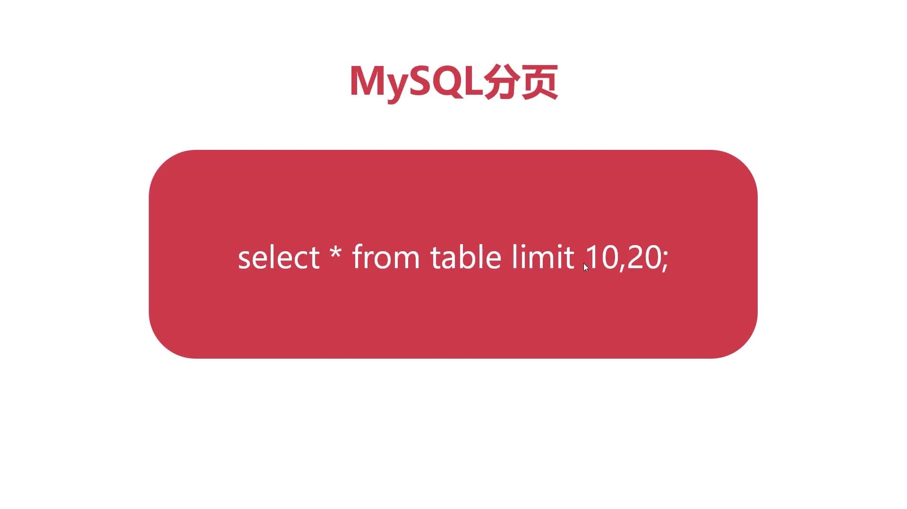
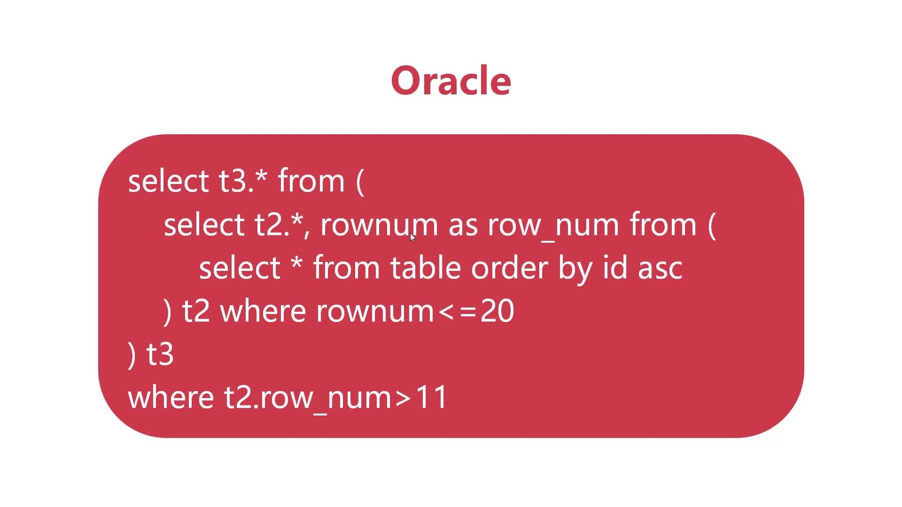
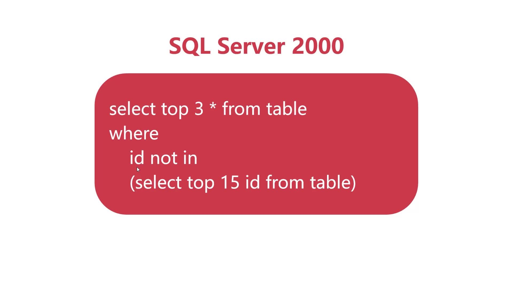
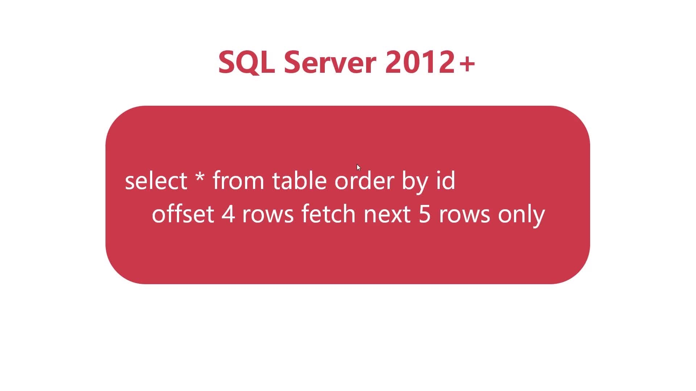

# 不同数据库分页的实现原理：（面试经常问到）. 
## MySQL分页：
limit 10,20 --10代表 起始行号，20表示从起始行之后（起始行不算在内）向后取多少条数据。

## Oracal中的
 伪列--无需声明可以直接使用功能的隐藏列（rownum就是伪列）

## SQL Server 2000 旧版 (微软公司)

## SQL Server 2012+
offset 4 rows-->偏移4行。。起始行号从第5行开始
fetch next 5 rows--向后取多少行

