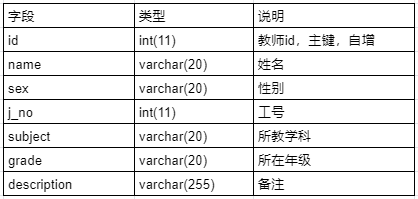

# MyBatis Plungin PageHelper 原理：  
在执行原有要sql的基础上进行分析，自动生成分页以及select count(*)这样的语句，因为涉及对原始sql的分析和解析，所以交给了jsqlparser这个sql解释器组件，所有必须要对其进行引用，具体的sql执行过程在执行后即可查看。

##PageHelper使用流程
* 1，maven引入PageHelop和jsqlparser
> 注意：pagehelper5.1.10后，因为采用了新的api，jsqlparser版本必须是2.0及以上的才可以适配

```xml
<!--pom.xml-->
<dependency>
    <groupId>com.github.pagehelper</groupId>
    <artifactId>pagehelper</artifactId>
    <version>5.1.10</version>
</dependency>

<dependency>
    <groupId>com.github.jsqlparser</groupId>
    <artifactId>jsqlparser</artifactId>
    <version>2.0</version>
</dependency>
```
* 2，mybatis-config.xml增加Plungin配置


```xml
<plugins>
    <plugin interceptor="com.github.pagehelper.PageInterceptor">
        <!--指定对应的数据库，这个可以不写，插件会自动识别，但是严谨角度建议还是写一下-->
        <property name="helperDialect" value="mysql"/>
        <!--开启分页合理化（如输入第0页时，展示第一页数据，输入超过最大页数的数据时候，展示最大页数的数据）-->
        <property name="reasonable" value="true"/>
    </plugin>
</plugins>
```
```xml
<!--mapper文件配置-->
<select id="selectPage" resultType="com.imooc.mybatis.entity.Goods">
    select * from t_goods where current_price &lt;1000
</select>
```
* 3，代码中使用PageHelper.startPage()自动分页


```java
public void testSelectPage() {
    long st = new Date().getTime();
    SqlSession sqlSession = null;
    try {
        sqlSession = MyBatisUtils.openSession();
        PageHelper.startPage(2, 10);
        Page<Goods> page = (Page) sqlSession.selectList("goods.selectPage");
         System.out.println("当前页数：" + page.getPageNum());
        System.out.println("总条数：" + page.getTotal());
        System.out.println("总页数：" + page.getPages());
        System.out.println("开始页数：" + page.getStartRow());
        System.out.println("结束页数：" + page.getEndRow());
        List<Goods> goods = page.getResult();
        for (Goods goods1 : goods) {
            System.out.println(goods1.getTitle());
        }
         long gt = new Date().getTime();
            System.out.println("执行时间：" + (gt - st) + "毫秒。");
    } catch (Exception e) {
        throw e;
    } finally {
        MyBatisUtils.closeSqlSession(sqlSession);
    }
}
```
## 作业
使用MyBatis所学知识完成如下练习
* 1、使用c3p0的方式管理数据库连接
* 2、结合注解以及批处理方式向教师表（teacher）中添加500条数据
* 3、结合注解使用分页插件PageHelper进行分页查询，查询第3页的数据
教师表结构（参考）



```sql
create table teacher
(
    id          int auto_increment primary key,
    name        varchar(20)  not null,
    sex         varchar(20)  not null,
    j_no        int          not null comment '工号',
    subjects    varchar(20)  not null comment '所教学科',
    grade       varchar(20)  not null comment '所属年级',
    description varchar(255) not null
);
```