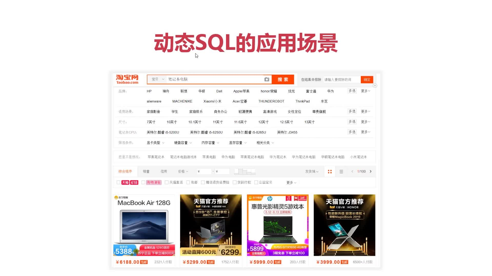
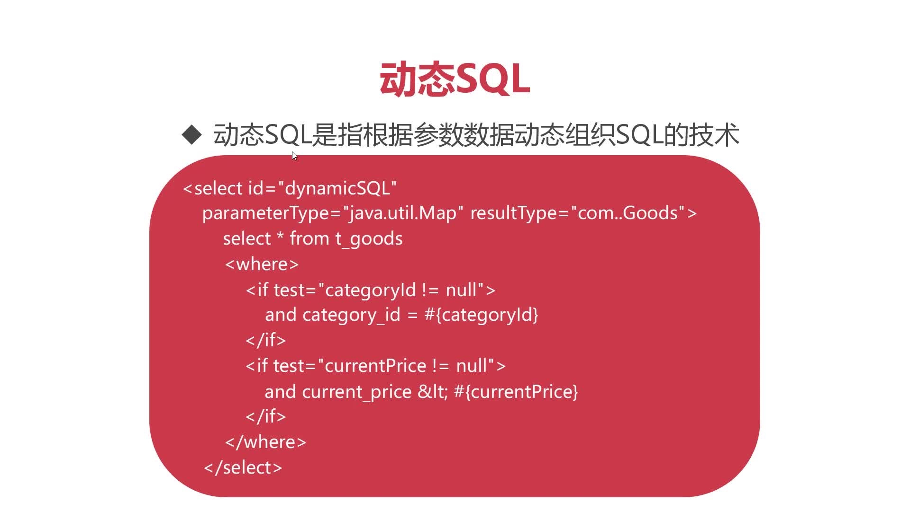
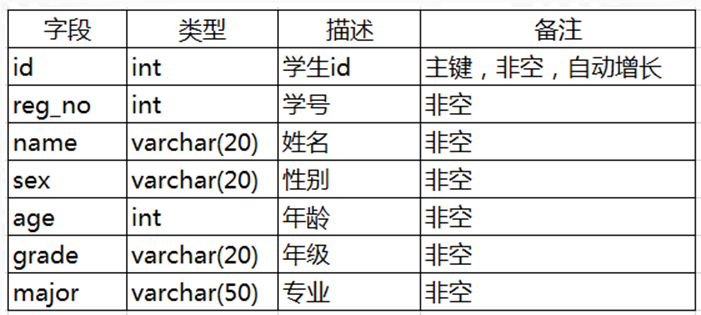

# MyBatis动态SQL
动态SQL：动态SQL是指根据参数数据动态组织SQL的技术。

动态SQL的应用场景：
比如淘宝搜索的时候，可以动态的选择比如品牌之类的选项



##配置

* `<where>`会自动判断后面的AND是否会影响sql语法正确，如果影响则自动去掉AND

```xml 
<?xml version="1.0" encoding="UTF-8" ?>
<!DOCTYPE mapper
        PUBLIC "-//mybatis.org//DTD Config 3.0//EN"
        "http://mybatis.org/dtd/mybatis-3-mapper.dtd">
<mapper namespace="goods">
<select id="dynamicSQL" parameterType="java.util.Map" resultType="com.imooc.mybatis.entity.Goods">
    select * from t_goods
    <where>
        <if test="categoryId!=null">
            and category_id=#{categoryId}>
        </if>
        <if test="currentPrice!=null">
            and current_price &lt; #{currentPrice}
        </if>
    </where>
</select>
</mapper>

```
* `where` 标签只能小写


## 测试
```java
  @Test
    public void testDynamic() {
        SqlSession sqlSession = null;
        try {
            sqlSession = MyBatisUtils.openSession();
            Map map = new HashMap();
            map.put("categoryId", 44);
            map.put("currentPrice", 100);
            List<Goods> list = sqlSession.selectList("goods.dynamicSQL", map);
            for (Goods goods:list){
                System.out.println(goods.getGoodsId()+"-"+goods.getTitle()+"-"+goods.getCurrentPrice());
            }
                sqlSession.commit();
        } catch (Exception e) {
            sqlSession.rollback();
        } finally {
            MyBatisUtils.closeSqlSession(sqlSession);
        }
    }
}
```  

我们可以随意更改配置参数，比如上面我们在xml文件里配置了2个查询约束条件，在测试的时候，我们可以对这2个参数进行赋值，也可以不进行赋值，使用十分灵活。
## 作业
1、创建学生表student，表结构如下：



2、为学生表添加内容 

| id | reg\_no | name | sex | age | grade | major |
| :--- | :--- | :--- | :--- | :--- | :--- | :--- |
| 1 | 20171201 | 梅长苏 | 男 | 31 | 2008 | 哲学系 |
| 2 | 20171202 | 萧景琰 | 男 | 30 | 2008 | 政治系 |
| 3 | 20171203 | 飞流 | 男 | 18 | 2016 | 人体系 |
| 4 | 20171204 | 萧景桓 | 男 | 35 | 2006 | 政治系 |
| 5 | 20171205 | 宫羽 | 女 | 25 | 2013 | 声学系 |
| 6 | 20171206 | 霓凰 | 女 | 31 | 2008 | 国际关系专业 |
| 7 | 20171207 | 秦般弱 | 女 | 30 | 2009 | 通讯专业 |

```sql
create table student
(
    id     int auto_increment
        primary key,
    reg_no int         not null,
    name   varchar(20) not null,
    sex    varchar(20) not null,
    age    int         not null,
    grade  varchar(50) not null,
    major  varchar(50) null
);

INSERT INTO babytun.student (reg_no, name, sex, age, grade, major) VALUES (20171201, '梅长苏', '男', 31, '2008', '哲学系');
INSERT INTO babytun.student (reg_no, name, sex, age, grade, major) VALUES (20171202, '萧景琰', '男', 30, '2008', '政治系');
INSERT INTO babytun.student (reg_no, name, sex, age, grade, major) VALUES (20171203, '飞流', '男', 18, '2016', '人体系');
INSERT INTO babytun.student (reg_no, name, sex, age, grade, major) VALUES (20171204, '萧景桓', '男', 35, '2006', '政治系');
INSERT INTO babytun.student (reg_no, name, sex, age, grade, major) VALUES (20171205, '宫羽', '女', 25, '2013', '声学系');
INSERT INTO babytun.student (reg_no, name, sex, age, grade, major) VALUES (20171206, '霓凰', '女', 31, '2008', '国际关系专业');
INSERT INTO babytun.student (reg_no, name, sex, age, grade, major) VALUES (20171207, '秦般弱', '女', 30, '2009', '通讯专业');
```
3、使用动态SQL，在xml文件中完成查询功能。可以查询年龄大于30，性别为男的学生信息。


```xml
<?xml version="1.0" encoding="UTF-8" ?>
<!DOCTYPE mapper
        PUBLIC "-//mybatis.org//DTD Config 3.0//EN"
        "http://mybatis.org/dtd/mybatis-3-mapper.dtd">
<mapper namespace="student">
    <select id="dynamicSQl"  resultType="top.xiongmingcai.entity.Student" parameterType="java.util.Map">
        select * from student
        <where>
            <if test="grade">
                and age &gt; #{age}
            </if>
            <if test="sex">
                and sex =  #{sex}
            </if>
        </where>
    </select>
</mapper>
```

4、在测试类中进行测试。分为三种情况：

* 1）查询所有学生信息

* 2）查询年龄大于30的学生信息

* 3）查询年龄大于30，并且性别为男的学生信息


```java
   @Test
    public void dynamicSQl2() {
        sqlSession = MyBatisUtils.openSession();
        Map<Object, Object> param = new HashMap<>();

        param.put("sex", "男");
        param.put("age", 30);

        List<Student> student = sqlSession.selectList("student.dynamicSQl", param);
        student.forEach(System.out::println);

    }
```

