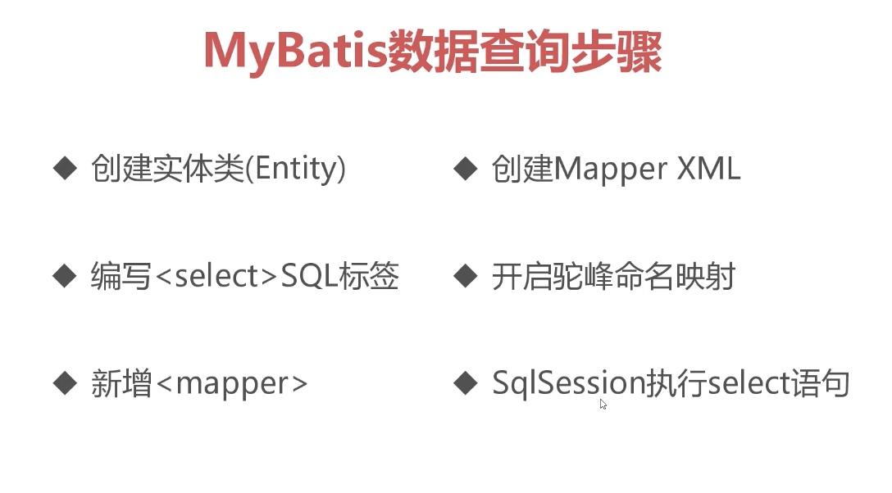
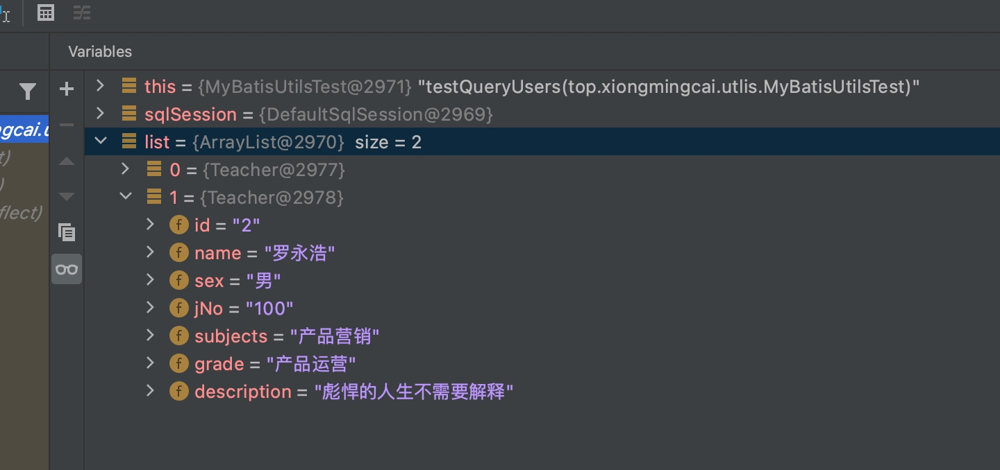
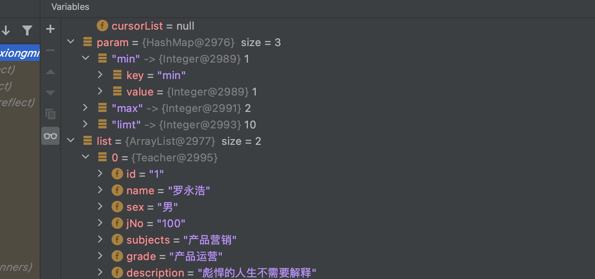
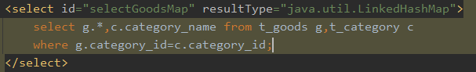
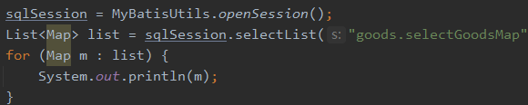
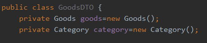
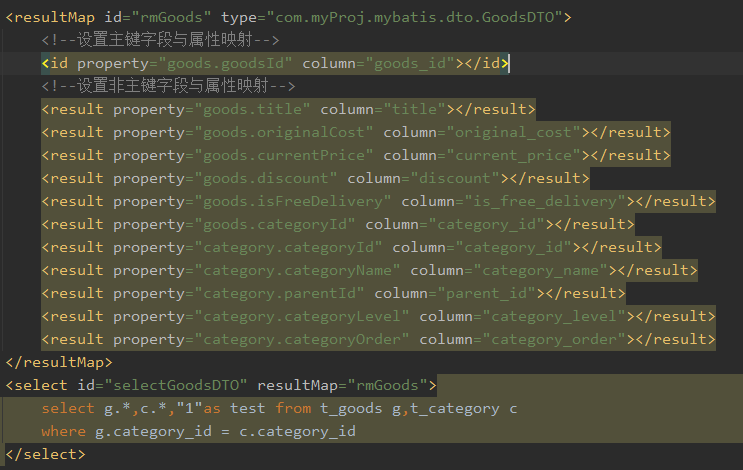
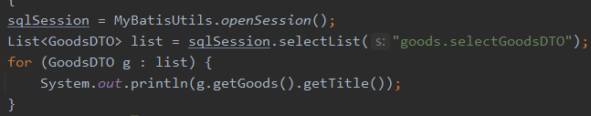

# MyBatis增删改查
## MyBatis环境配置
### 新建maven工程，导入必要的jar包
```xml
    <dependencies>      
        <dependency>
            <groupId>junit</groupId>
            <artifactId>junit</artifactId>
            <version>4.12</version>
        </dependency>
        <dependency>
            <groupId>org.mybatis</groupId>
            <artifactId>mybatis</artifactId>
            <version>3.5.1</version>
        </dependency>
        <dependency>
            <groupId>mysql</groupId>
            <artifactId>mysql-connector-java</artifactId>
            <version>8.0.23</version>
        </dependency>   
   </dependencies>
```
### 创建配置文件mybatis-config.xml（默认叫这个，可更改）
```xml
<?xml version="1.0" encoding="UTF-8" ?>
<!DOCTYPE configuration
        PUBLIC "-//mybatis.org//DTD Config 3.0//EN"
        "http://mybatis.org/dtd/mybatis-3-config.dtd">
<configuration>
    <environments default="development">
        <environment id="development">
            <transactionManager type="JDBC"/>
            <dataSource type="POOLED">
                <property name="driver" value="com.mysql.cj.jdbc.Driver"/>
                <property name="url" value="jdbc:mysql://localhost:3306/babytun"/>
                <property name="username" value="root"/>
                <property name="password" value="NewPassword"/>
            </dataSource>
        </environment>
    </environments>
</configuration>
```

- mybatis才有xml格式配置数据库环境信息

- mybatis环境配置标签<environment>

- environment包含数据库驱动，url，用户名，密码
## 配置SqlSessionFactory全局唯一工具类

1，SqlSessionFactory是mybatis的核心对象

2，用于初始化mybatis，创建SqlSession对象

3，保证SqlSessionFactory在应用中全局唯一，通常我们通过静态类方式对它进行初始化，SqlSessionFactory本质就是通过加载配置文件，来完成mybatis框架的初始化工作


```java
public class MyBatisUtils {
    // 利用static属于类不属于对象，且全局唯一
    private static SqlSessionFactory sqlSessionFactory = null;
    // 利用静态块在初始化类时实例化sqlSessionFactory
    static {
        Reader reader = null;
        try {
            reader = Resources.getResourceAsReader("mybatis-config.xml");
            sqlSessionFactory = new SqlSessionFactoryBuilder().build(reader);
        } catch (IOException e) {
            e.printStackTrace();
            // 初始化错误时抛出异常ExceptionInInitializerError通知调用者
            throw new ExceptionInInitializerError();
        }
    }

    //创建一个新的SqlSession对象
    public static SqlSession openSession() {
        return sqlSessionFactory.openSession();
    }

    //关闭SqlSession对象
    public static void closeSqlSession(SqlSession sqlSession) {
        if (sqlSession != null) {
            sqlSession.close();
        }
    }
}

```


1，SqlSession是mybatis操作数据库的核心对象

2，SqlSession使用jdbc方式与数据库交互，不那么严谨的我们可以把一个SqlSession是一个扩展过的connection数据库连接对象，在原有的connection基础上封装了大量实用方法

3，SqlSession对象提供了数据表CRUD对应方法

> [MyBaits 使用Lambda方式连接MySQL](mweblib://16172477916883)

## 测试连接

```java
package top.xiongmingcai.utlis;

import junit.framework.TestCase;
import org.apache.ibatis.session.SqlSession;

public class MyBatisUtilsTest extends TestCase {
    public void testOpenSession() {
        SqlSession sqlSession = MyBatisUtils.openSession();
        MyBatisUtils.closeSqlSession(sqlSession);
    }

}
```
## MyBatis数据查询


### 1.  创建实体类（Entity）

```java
package top.xiongmingcai.entity;

public class Teacher {
    private String id;
    private String name;
    private String sex;
    private String jNo;
    private String subjects;
    private String grade;
    private String description;

    public String getId() {
        return id;
    }

    public void setId(String id) {
        this.id = id;
    }

    public String getName() {
        return name;
    }

    public void setName(String name) {
        this.name = name;
    }

    public String getSex() {
        return sex;
    }

    public void setSex(String sex) {
        this.sex = sex;
    }

    public String getjNo() {
        return jNo;
    }

    public void setjNo(String jNo) {
        this.jNo = jNo;
    }

    public String getSubjects() {
        return subjects;
    }

    public void setSubjects(String subjects) {
        this.subjects = subjects;
    }

    public String getGrade() {
        return grade;
    }

    public void setGrade(String grade) {
        this.grade = grade;
    }

    public String getDescription() {
        return description;
    }

    public void setDescription(String description) {
        this.description = description;
    }
}

```

### 2. 创建Mapper XML ：说明实体类和哪个表，属性和表里哪个字段对应

```xml
<?xml version="1.0" encoding="utf-8" ?>
<!DOCTYPE configuration
        PUBLIC "-//mybatis.org//DTD Config 3.0//EN"
        "http://mybatis.org/dtd/mybatis-3-config.dtd">
<configuration>
    <!--默认环境配置-->
    <environments default="dev">
        <!--支持配置多套环境-->
        <environment id="dev">
            <transactionManager type="JDBC"></transactionManager>
            <!--采用连接池方式管理数据库连接-->
            <dataSource type="POOLED">
                <!--配置数据库连接信息-->
                <property name="driver" value="com.mysql.cj.jdbc.Driver"/>
                <property name="url" value="jdbc:mysql://localhost:3306/babytun"/>
                <property name="username" value="root"/>
                <property name="password" value="NewPassword"/>
            </dataSource>
        </environment>
    </environments>
</configuration>
```

### 3.  在Mapper XML中编写`<select>`sql标签，书写sql语句

```xml
<?xml version="1.0" encoding="UTF-8"?>
<!DOCTYPE mapper
        PUBLIC "-//mybatis.org//DTD Mapper 3.0//EN"
        "http://mybatis.org/dtd/mybatis-3-mapper.dtd">
<mapper namespace="teacher">
    <!-- 查询全部用户 -->
    <select id="queryUsers" resultType="top.xiongmingcai.entity.Teacher">
        select * from teacher ;
    </select>
</mapper>
```
### 4.  在mabatis-config.xml配置文件中设置驼峰命名映射

```xml
   <!--设置成支持驼峰命名-->
    <settings>
        <setting name="mapUnderscoreToCamelCase" value="true"/>
    </settings>
```

### 5.  在mabatis-config.xml中新增<mapper>文件声明
```xml
  <!-- 映射文件 -->
    <mappers>
        <mapper resource="mappers/Teacher.xml"/>
        <!-- <mapper class="top.xiongmingcai.dao.StudentDao"/>-->
        <!-- <package name="top.xiongmingcai.dao"/> -->
    </mappers>
```
### 6.  在SqlSession执行select语句

```java
    public void testQueryUsers() {
        SqlSession sqlSession = null;

        try {
            sqlSession = MyBatisUtils.openSession();
            List<Teacher> list = sqlSession.selectList("teacher.queryUsers");
            System.out.println("size:" + list.size());

        } catch (Exception e) {
            e.printStackTrace();
        } finally {
            MyBatisUtils.closeSqlSession(sqlSession);
        }
    }

```


##
 SQL传参
需要动态传入参数的过程，Sql语句配置文件中的select语句中使用parameterType属性指定参数类。

### 一、单参数
在Sql语句配置文件中新增查询标签，增加了parameterType属性，其他地方输入的一个参数，会自动匹配到#{value}的位置，从而形成一条完整的sql语句。

```xml
<select id="queryUserById" resultType="top.xiongmingcai.entity.Teacher" parameterType="Integer">
        select * from teacher where id = #{value };
</select>t>
```
```java
Teacher teacher= sqlSession.selectOne("teacher.queryUserById", 2);
```
> parameterType指定参数类型(需要是类名)，如Integer。

### 二、多参数
parameterType值为:java.util.Map
 配置文件中书写查询语句，注意到这里写了三个参数，这三个参数对应着传入的Map的键，sql语句会把这三个键对应的值匹配到相应位置，从而形成一条完整的sql语句。


```xml
<select id="queryUserRangeId" resultType="top.xiongmingcai.entity.Teacher" parameterType="java.util.Map">
    select * from teacher where id between #{min} and #{max} limit #{limt}
</select>
```
> parameterType值为:java.util.Map



## 多表关联查询 LinkedHashMap方案
之前的查询都是返回固定的Goods对象，这是因为查询语句只返回了t_goods表中的一条条数据，有实体类与之对应，但是如果我们进行多表级联查询时，返回的字段就无法用一个确定的实体对应，这时，resultType就要设置为**`java.util.Map,但是我们想让返回的结果字段是按照插入顺序，那就要设置为java.util.LinkedHashMap.`**
在配置文件中的sql语句:

Java程序语句:

总结：

多表查询时配置xml文件，resultType要使用map类型，最好是使用LinkedHashMap，因为直接使用map时产生的结果是无序的。

使用LinkedHashMap时，Mybatis会将每一条记录包装为LinkedHashMap对象，key是字段名，value是字段对应的值，字段类型根据表结构进行自动判断
*  优点：易于扩展，易于使用。
*  缺点：太过灵活，无法进行编译时检查 


## 多表关联查询 ResultMap GTO方案
Map虽然灵活，扩展强大，但是开发的时候体验不好，但是如果不使用map，会衍生出新的问题，那么如何使用对象的方式保存关联查询的结果呢，这个时候我们可以使用ResultMap结果映射来解决这个问题。

* ResultMap可以将查询结果映射为复杂类型的java对象

* ResultMap适用于java对象保存多表关联结果

* ResultMap支持对象关联查询等高级特性

通常约定：（Data Transfer Object--数据传输对象）DTO结尾的类--承载Mybatis表链接查询的结果（优点是结果在编译和阅读代码时即可确定，缺点是需要手动设置大量标签）。

案例
1. 已有实体类Goods和Category，分别对应t_goods表和t_category表,创建GoodDTO类如图,并添加相应get和set方法:


1. 在goods.xml中设置sql语句配置

1. java程序:

## 多表联查
[MyBatis多表级联查询](mweblib://16174290208241)

## MyBatis 插入数据

```xml
<?xml version="1.0" encoding="UTF-8" ?>
<!DOCTYPE mapper
        PUBLIC "-//mybatis.org//DTD Mapper 3.0//EN"
        "http://mybatis.org/dtd/mybatis-3-mapper.dtd">
<mapper namespace="goods">
    <insert id="insert" parameterType="com.imooc.mybatis.entity.Goods">
        insert into t_goods(title,sub_title,original_cost,current_price,discount,is_free_delivery,category_id)
        values (#{title},#{subTitle},#{originalCost},#{currentPrice},#{discount},#{isFreeDelivery},#{categoryId})
        <!--order：after 表示在上面语句执行后操作。resultType：设置的函数的返回值类型，keyProperty：要设置的
         上面语句执行完毕后，执行下面的sql语句，将得到的值回添到goodsid属性中-->
        <selectKey resultType="integer" keyProperty="id" order="AFTER">
           <!-- 获取当前连接最后产生的id号,并自动填充给goods里面的id主键属性-->
            select last_insert_id()
        </selectKey>
    </insert>
</mapper>

```

```xml
<insert id="insert" parameterType="top.xiongmingcai.entity.Goods"
    useGeneratedKeys="true"
    keyProperty="goodsId" keyColumn="goods_id">
        INSERT INTO ......
</insert>
```

## MyBatis 批量插入数据
[ MyBatis 批量插入和批量删除](mweblib://16174294104179)

## MyBatis 删除数据
因为大多数删除操作是根据主键来进行的，因此在xml文件配置的时候，parameterType只需要声明主键类型是integer即可。


```xml

<delete id="delete" parameterType="Integer">
        DELETE from table  where  id = ......
</delete>
```
## MyBatis 批量删除数据
[ MyBatis 批量插入和批量删除](mweblib://16174294104179)

## MyBatis 更新数据
更新是对已有数据进行处理，不建议通过手动set来组织原始数据，推荐先获取原有数据，再对原有数据进行更新操作，保证数据的影响是最小的


```xml
<update id="update" parameterType="top.xiongmingcai.entity.Goods">
        update t_goods
        set title = #{title}
        where goods_id = #{goods_id};
</update>
```


```java
   @Test
    public void update() {
        Goods goods = null;
        try {
            goods = sqlSession.selectOne("goods.selectById", 740);
            goods.setTitle("测试商品3");

            sqlSession.update("goods.update", goods);
            sqlSession.commit();
        } catch (Exception e) {
            if (sqlSession != null) {
                sqlSession.rollback();
            }
            e.printStackTrace();
        }
    }

```
> 更新不建议set获取实体，建议使用selectbyid进行数据筛选 确保影响最少行数  

## MyBatis
${ }-->传递参数时，不会经过任何转译，直接放在SQL语句对应的位置

但是通常在一些高级和复杂SQL条件查询时，不得不进行SQL子句拼接，此时可以使用（注意使用时，需要人为控制需要拼接的SQL子句，而不是把拼写子句的功能开放给用户）

\#{ }-->传递参数时，系统会自动将传入的SQL语句，作为完整的条件进行查询，而不是直接拼接到系统底部原有的SQL语句中。


```xml
<select id="orderBySql" parameterType="java.util.Map" resultType="top.xiongmingcai.entity.Goods">
        select * from TABLE where tag = #{tag}
        order by ${order} 
</select>
```
数据排序灵活性示例
```java
  Map<Object, Object> param = new HashMap<>();
  param.put("tag", "手机");
  param.put("order", "销量 desc");
  .......
```