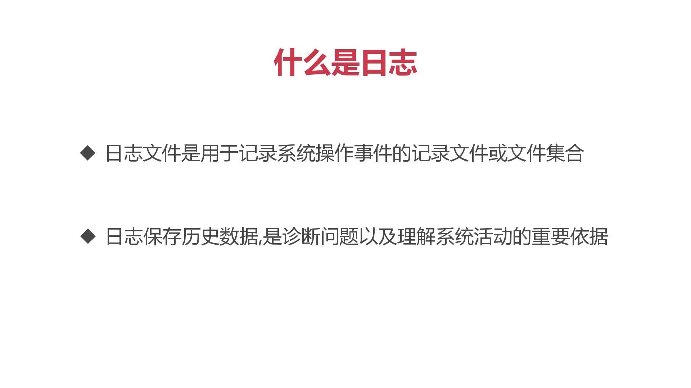
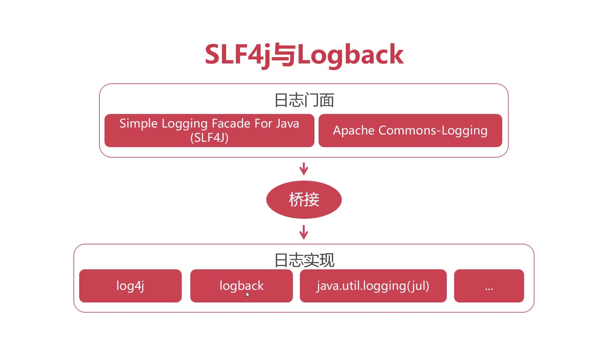

# MyBatis日志管理
什么是日志：
- 日志是用于记录系统操作事件的记录文件或文件的集合
- 日志保存历史数据，是诊断问题以及理解系统优化活动的重要依据

市面上主流的日志工具，本次主要使用SLF4J和logback进行演示
日志门面：为java提供了统一的调用接口。相对于插排的规格，插孔设计
日志实现：logback相当于log4j的升级版。相当于排查的内部实现，不同品牌设计不一致





## MyBatis 配置logback  
### 导入对应依赖
```xml
<dependency>
       <groupId>ch.qos.logback</groupId>
       <artifactId>logback-classic</artifactId>
         <version>1.2.3</version>
 </dependency>
```

### 添加配置文件 
src/main/resources/logback.xml
```xml
<?xml version="1.0" encoding="UTF-8" ?>
<configuration >
    <appender name="console" class="ch.qos.logback.core.ConsoleAppender">
        <encoder>
            　<pattern>%-4relative [%thread] %-5level %logger{35} - %msg %n</pattern>
        </encoder>
    </appender>

    <root level="debug">
        <appender-ref ref="console"/>
    </root>
</configuration>
```
* appender 日志向什么位置输出
* pattern 日志输出格式
    * %d{HH:mm:ss.SSS}-->时间的格式
    
    * [%thread]-->输出的线程的名字
    
    * %-5level-->(-5 -->按5个字符进行右对齐)日志的级别
    
    * %logger{36}-->产生日志的类（最多允许36个字符，超过则使用简写对类路径进行压缩 o.a.i.t.jdbc.JdbcTransaction）
    
    * %msg-->具体的日志输出内容

    * %n-->表示换行
* level 日志级别
    * error：错误--系统的故障日志
    
    * warn：警告--存在风险或使用不当的日志
    * info：一般性消息//建议在此以上
    * debug：程序内部用于调试信息
    * trace：程序运行的跟踪信息