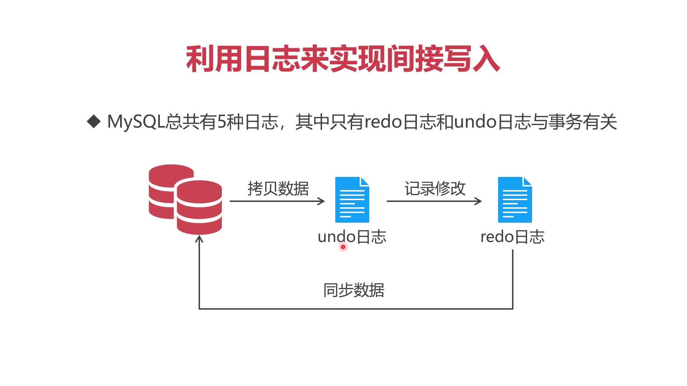
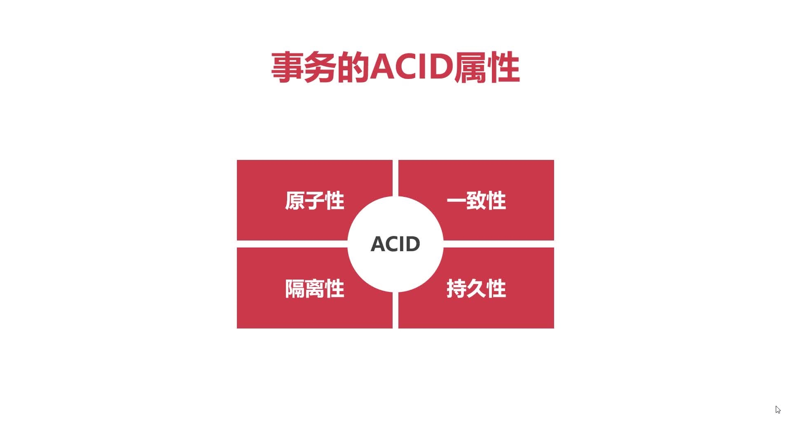
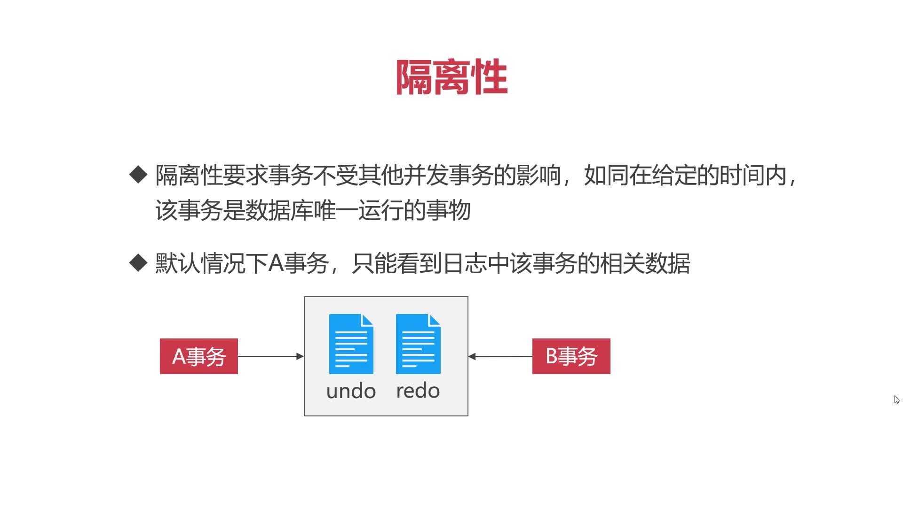
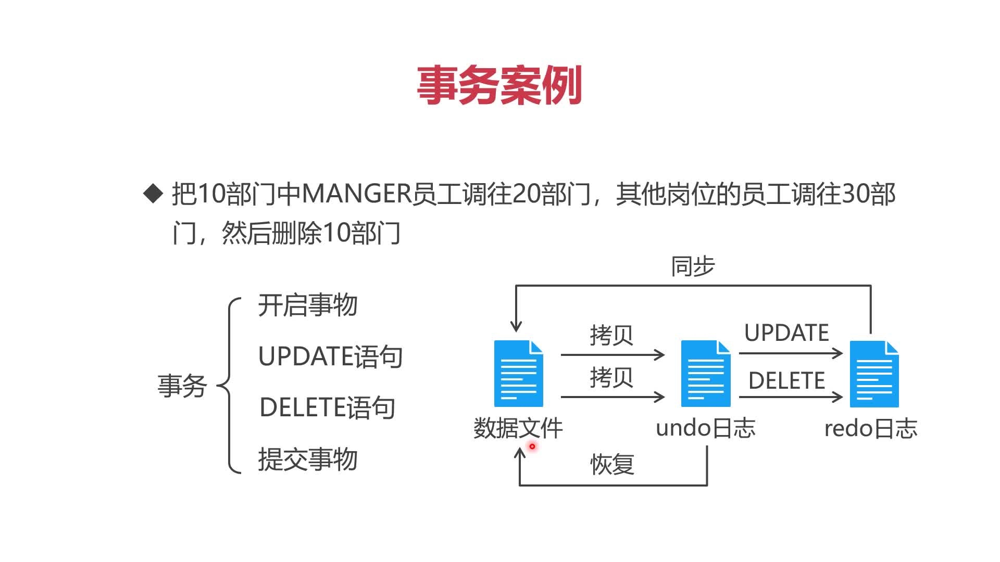

# MySQL事务机制




默认情况下，MySQL执行每条SQL语句都会自动开启和提交事务

为了让多条SQL语句纳入到一个事务之下，可以手动管理事务
```sql
START TANSACTION;
SQL语句
[COMMIT|ROLLBACK];
```

* COMMIT  提交
* ROLLBACK  回滚    


## 事务的ACID四种属性      

           

1. 事务的原子性，一个事务中的所有操作要么全部完成，要么全部失败。事务执行后，不允许停留在中间某个状态。
2. 事务的一致性，不管在任何给定的时间、并发的事务有多少，事务必须保证运行结果的一致性。


1. 事务的隔离性，要求事务不受其他并发事务的影响，如同在给定的时间内，该事务是数据库唯一运行的事务。

2. 事务的持久性，事物一旦提交，结果便是永久性的。即使发生宕机，仍然可以依靠事务日志完成数据的持久化

MySQL事务案例

