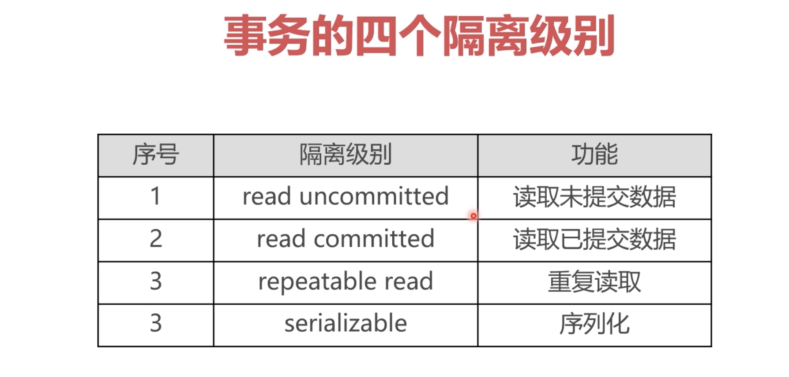

# MySQL事务隔离

默认情况下，MySQL是不允许事务之间相互读取临时数据的，但是可以通过设置事务的隔离级别来打破这种限制。

sqlSession会话事务的四个隔离级别:

* read uncommitted：代表一个sqlSession（ps 会话）可以读取其他sqlSession（ps 会话）事务未提交的数据（买票案例）。

* read committed：当前sqlSession只能读取另外sqlSession已提交的数据（转账案例）。

* repetable read:重复读取，设置该级别的事务只会读取事务执行之前的数据，无论其他事务是否提交，在实现上就是只读取undo日志里的数据（商品涨价案例），也是**_MySQL的默认事务隔离级别_**，什么都不写就是这个级别。

* serializable:序列化，当前会话如果设置了这个隔离级别，那么这个事务就必须等待其他事务执行完成后才能执行，也就不是并发执行了，而是逐一执行，很少使用，会让事务并发性下降。