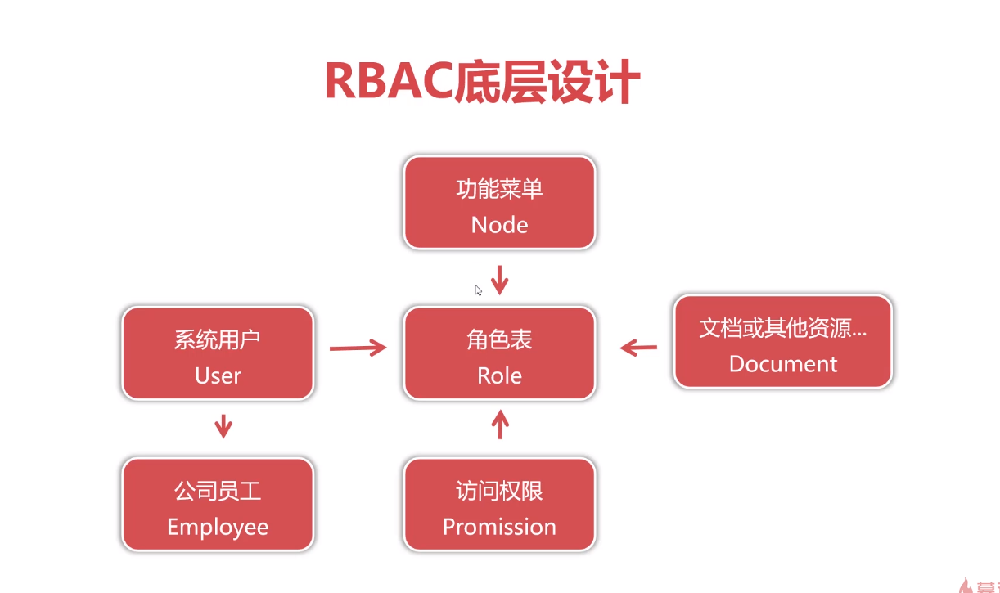

# 开发基于RBAC的权限控制模块：(Role-Based Access Control)
* 基于角色控制(RBAC)是面向企业安全策略的访问控制方式。

* RBAC核心思想是将控制访问的资源与角色(Role)进行绑定。

* 系统的用户(User)与角色(Role)再进行绑定，用户便拥有对应权限。


##  核心角色表
| 字段 | 类型 | 描述 | 备注|
| :--- | :--- | :--- | :--- |
|  role_id |   bigint |  角色编号 | 主键，非空，自动增长 |
|  role_description |   varchar(32) |  角色描述 | 非空 |

```sql
-- auto-generated definition
create table sys_role
(
    role_id          bigint auto_increment comment '角色编号' primary key,
    role_description varchar(32) not null comment '角色描述'
);


insert into oa.sys_role (role_id, role_description)
values  (1, '业务岗角色'),
        (2, '管理岗角色');
```


| role\_id | role\_description |
| :--- | :--- |
| 1 | 业务岗角色 |
| 2 | 管理岗角色 |

## 系统功能表

```sql
-- auto-generated definition
create table sys_node
(
    node_id   bigint auto_increment comment '节点编号'primary key,
    node_type int          not null comment '节点类型 1-模块 2-功能',
    node_name varchar(32)  not null comment '节点名称',
    url       varchar(255) null comment '功能地址',
    node_code int          not null comment '节点编码,用于排序',
    parent_id bigint       null comment '上级节点编号'
);

insert into oa.sys_node (node_id, node_type, node_name, url, node_code, parent_id)
values  (1, 1, '行政审批', null, 1000000, null),
        (2, 2, '通知公告', ' ', 1000001, 1),
        (3, 2, '请假申请', null, 1000002, 1),
        (4, 2, '请假审批', null, 1000003, 1);
```
| node\_id | node\_type | node\_name | url | node\_code | parent\_id |
| :--- | :--- | :--- | :--- | :--- | :--- |
| 1 | 1 | 行政审批 | NULL | 1000000 | NULL |
| 2 | 2 | 通知公告 |   | 1000001 | 1 |
| 3 | 2 | 请假申请 | NULL | 1000002 | 1 |
| 4 | 2 | 请假审批 | NULL | 1000003 | 1 |

## 部门表：

```sql
-- auto-generated definition
create table adm_department
(
    department_id   bigint auto_increment
        primary key,
    department_name varchar(32) not null
);


insert into oa.adm_department (department_id, department_name)
values  (1, '总裁办'),
        (2, '研发部'),
        (3, '市场部');
```
| department\_id | department\_name |
| :--- | :--- |
| 1 | 总裁办 |
| 2 | 研发部 |
| 3 | 市场部 |

## 人员表
```sql 
-- auto-generated definition
create table adm_employee
(
    employee_id   bigint auto_increment
        primary key,
    name          varchar(32) not null,
    department_id bigint      not null,
    title         varchar(32) not null,
    level         int         not null
);
insert into oa.adm_employee (employee_id, name, department_id, title, level)
values  (1, '张晓涛', 1, '总经理', 8),
        (2, '齐紫陌', 2, '部门经理', 7),
        (3, '王美美', 2, '高级研发工程师', 6),
        (4, '宋彩妮', 2, '研发工程师', 5),
        (5, '欧阳峰', 2, '初级研发工程师', 4),
        (6, '张世豪', 3, '部门经理', 7),
        (7, '王子豪', 3, '大客户经理', 6),
        (8, '段峰', 3, '客户经理', 5),
        (9, '章雪峰', 3, '客户经理', 4),
        (10, '李莉', 3, '见习客户经理', 3);

```
| employee\_id | name | department\_id | title | level |
| :--- | :--- | :--- | :--- | :--- |
| 1 | 张晓涛 | 1 | 总经理 | 8 |
| 2 | 齐紫陌 | 2 | 部门经理 | 7 |
| 3 | 王美美 | 2 | 高级研发工程师 | 6 |
| 4 | 宋彩妮 | 2 | 研发工程师 | 5 |
| 5 | 欧阳峰 | 2 | 初级研发工程师 | 4 |
| 6 | 张世豪 | 3 | 部门经理 | 7 |
| 7 | 王子豪 | 3 | 大客户经理 | 6 |
| 8 | 段峰 | 3 | 客户经理 | 5 |
| 9 | 章雪峰 | 3 | 客户经理 | 4 |
| 10 | 李莉 | 3 | 见习客户经理 | 3 |

## 用户表

```sql
-- auto-generated definition
create table sys_user
(
    user_id     bigint auto_increment comment '用户编号'
        primary key,
    username    varchar(32) not null comment '用户名',
    password    varchar(64) not null comment '密码',
    employee_id bigint      not null comment '员工编号',
    salt        int         not null comment '盐值'
);


insert into oa.sys_user (user_id, username, password, employee_id, salt)
values  (1, 'm8', 'f57e762e3fb7e1e3ec8ec4db6a1248e1', 1, 188),
        (2, 't7', 'dcfa022748271dccf5532c834e98ad08', 2, 189),
        (3, 't6', '76ce11f8b004e8bdc8b0976b177c620d', 3, 190),
        (4, 't5', '11f04f04054772bc1a8fdc41e70c7977', 4, 191),
        (5, 't4', '8d7713848189a8d5c224f94f65d18b06', 5, 192),
        (6, 's7', '044214e86e07d96c97de79a2222188cd', 6, 193),
        (7, 's6', 'ecbd2f592ee65838328236d06ce35252', 7, 194),
        (8, 's5', '846ecc83bba8fe420adc38b39f897201', 8, 195),
        (9, 's4', 'c1e523cd2daa02f6cf4b98b2f26585fd', 9, 196),
        (10, 's3', '89e89f369e07634fbb2286efffb9492b', 10, 197);
```
| user\_id | username | password | employee\_id | salt |
| :--- | :--- | :--- | :--- | :--- |
| 1 | m8 | f57e762e3fb7e1e3ec8ec4db6a1248e1 | 1 | 188 |
| 2 | t7 | dcfa022748271dccf5532c834e98ad08 | 2 | 189 |
| 3 | t6 | 76ce11f8b004e8bdc8b0976b177c620d | 3 | 190 |
| 4 | t5 | 11f04f04054772bc1a8fdc41e70c7977 | 4 | 191 |
| 5 | t4 | 8d7713848189a8d5c224f94f65d18b06 | 5 | 192 |
| 6 | s7 | 044214e86e07d96c97de79a2222188cd | 6 | 193 |
| 7 | s6 | ecbd2f592ee65838328236d06ce35252 | 7 | 194 |
| 8 | s5 | 846ecc83bba8fe420adc38b39f897201 | 8 | 195 |
| 9 | s4 | c1e523cd2daa02f6cf4b98b2f26585fd | 9 | 196 |
| 10 | s3 | 89e89f369e07634fbb2286efffb9492b | 10 | 197 |

## 创建角色和系统功能连接的中间表：sys_role_node
```sql
-- auto-generated definition
create table sys_role_node
(
    rn_id   bigint auto_increment
        primary key,
    role_id bigint not null,
    node_id bigint not null
);


insert into oa.sys_role_node (rn_id, role_id, node_id)
values  (1, 1, 1),
        (2, 1, 2),
        (3, 1, 3),
        (4, 2, 1),
        (5, 2, 2),
        (6, 2, 3),
        (7, 2, 4);
```


