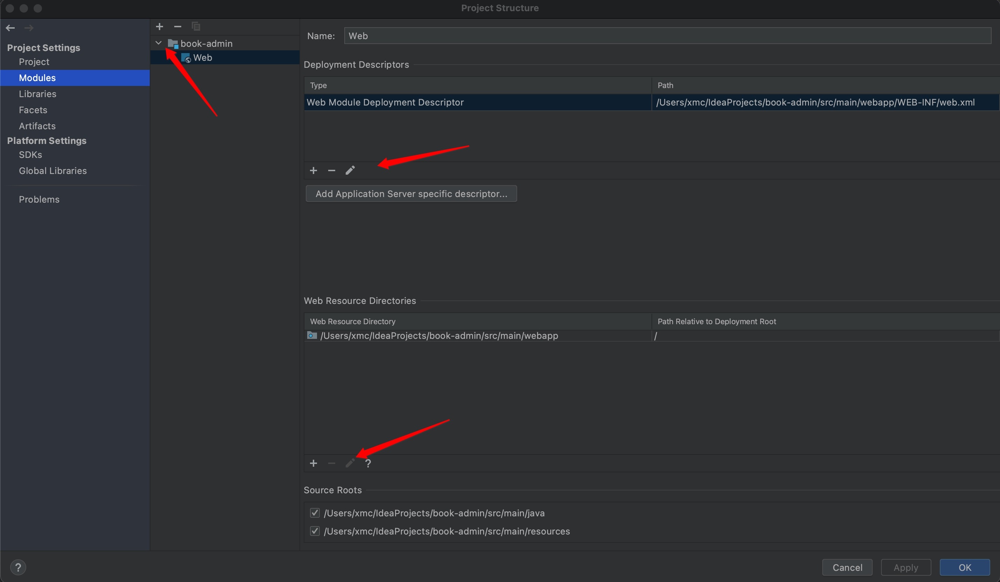
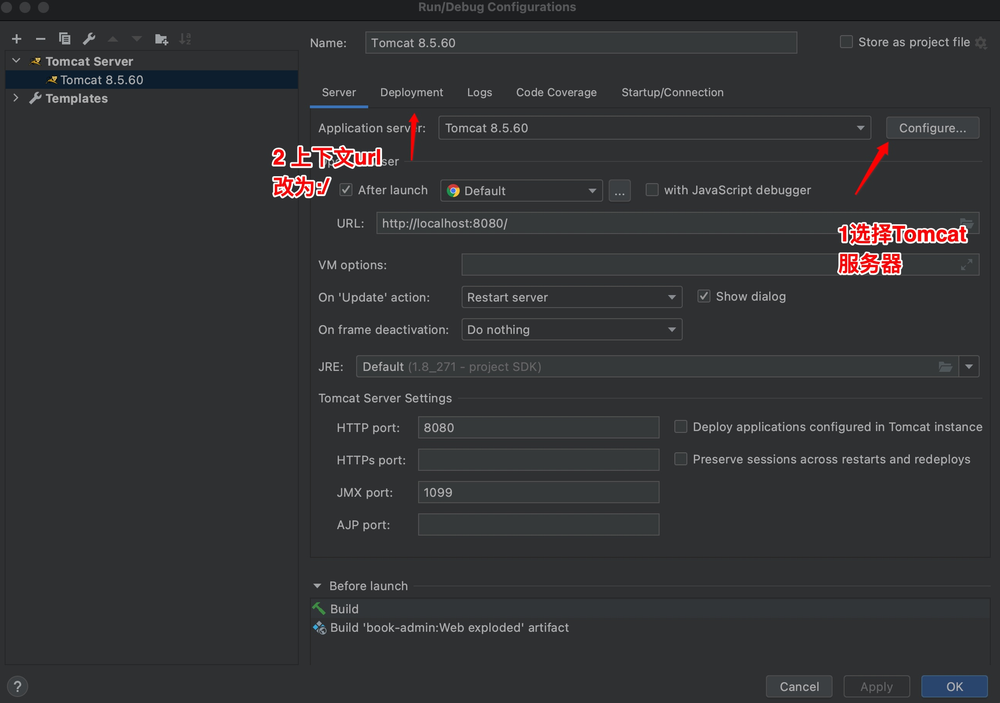
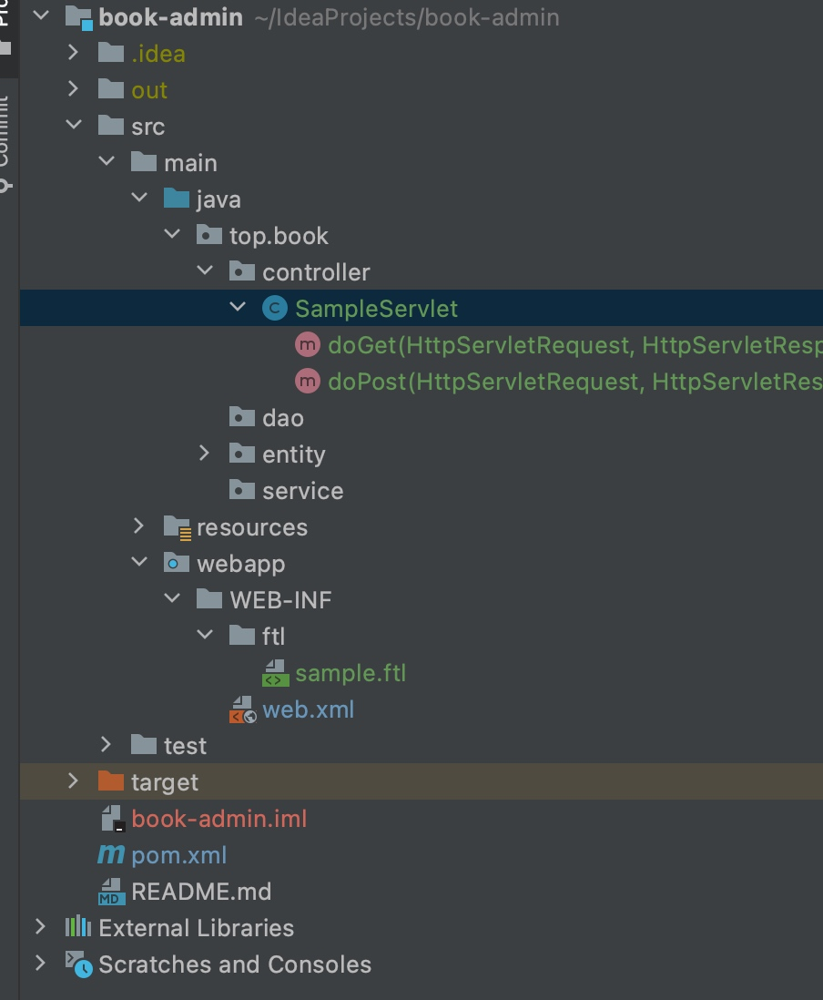

# freemarker+servlet整合
## idea 添加modules 更该目录



## 配置Tomcat 启动项



## pom.xml中添加freemarker的依赖、servelt-api(开发servlet应用)
```xml
 <dependency>
            <groupId>javax.servlet</groupId>
            <artifactId>javax.servlet-api</artifactId>
            <version>3.1.0</version>
            <!--依赖只参与编译测试，不进行发布，因为tomcat已经自带了-->
            <scope>provided</scope>
        </dependency>
        <dependency>
            <groupId>org.freemarker</groupId>
            <artifactId>freemarker</artifactId>
            <version>2.3.29</version>
        </dependency>
```
## web.xml文件中对freemarker进行配置

```xml
<?xml version="1.0" encoding="UTF-8"?>
<web-app xmlns="http://xmlns.jcp.org/xml/ns/javaee"
         xmlns:xsi="http://www.w3.org/2001/XMLSchema-instance"
         xsi:schemaLocation="http://xmlns.jcp.org/xml/ns/javaee http://xmlns.jcp.org/xml/ns/javaee/web-app_3_1.xsd"
         version="3.1">
    <servlet>
        <!--FreemarkerServlet用于解析ftl文件-->
        <servlet-name>freemarker</servlet-name>
        <servlet-class>freemarker.ext.servlet.FreemarkerServlet</servlet-class>
        <!--定义模板的存储路径-->
        <init-param>
            <param-name>TemplatePath</param-name>
            <param-value>/WEB-INF/ftl</param-value>
        </init-param>
        <!--用于设置读取ftl文件时采用的字符集，从而避免中文乱码问题-->
        <init-param>
            <param-name>default_encoding</param-name>
            <param-value>UTF-8</param-value>
        </init-param>
    </servlet>
    <!--servlet映射：当我们访问的url以ftl结尾时，会自动截取前面的文件名，再在/WEB-INF/ftl目录中找到对应的文件，
    进行解析和加载-->
    <servlet-mapping>
        <servlet-name>freemarker</servlet-name>
        <url-pattern>*.ftl</url-pattern>
    </servlet-mapping>
</web-app>
```
## 编写测试SampleServlet

```java
package top.book.controller;
.......

@WebServlet(name = "SampleServlet", urlPatterns = "/sample")
public class SampleServlet extends HttpServlet {
    @Override
    protected void doGet(HttpServletRequest request, HttpServletResponse response) throws ServletException, IOException {
        request.setAttribute("world","World !");
        request.getRequestDispatcher("/sample.ftl").forward(request, response);
    }

    @Override
    protected void doPost(HttpServletRequest request, HttpServletResponse response) throws ServletException, IOException {

    }
}

```

## 目标文件准备


