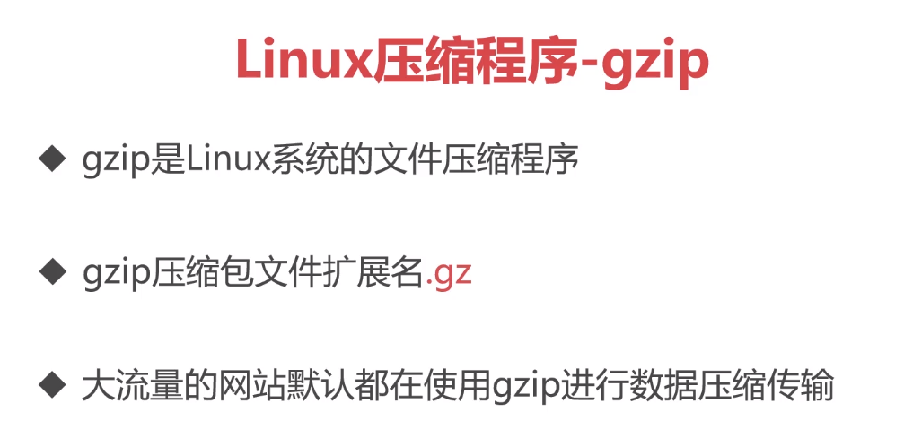
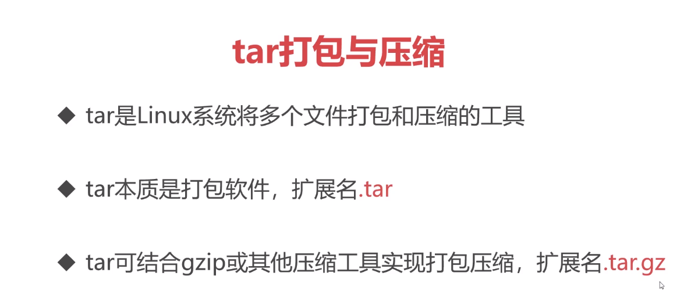
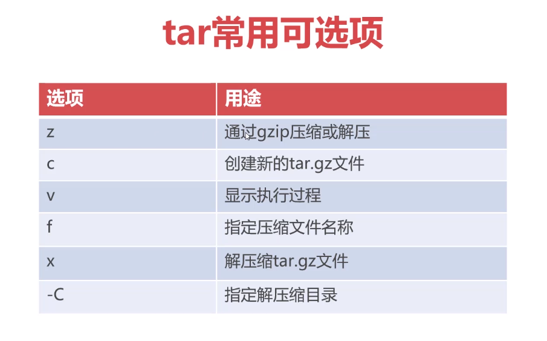

# linux压缩程序-gzip

## gzip是Linux系统的文件压缩程序

gzip压缩包文件扩展名.gz

大流量的网站默认都在使用gzip进行数据压缩传输。

但我们不是直接使用这个进行压缩，而是使用tar工具。
## tar打包与压缩



tar是Linux系统将多个文件打包和压缩的工具。

tar本质是打包软件，扩展名.tar

tar可结合gzip或其他压缩工具实现打包压缩，扩展名.tar.gz

压缩命令：
```terminal
tar zcvf tomcat.tar.gz /usr/local/tomcat 
```
前面是压缩后的文件名称，后面是要压缩的目录。




解压缩命令：
```terminal
tar zxvf tomcat.tar.gz -C /ust/local/tomcat
```
-C是选择后的文件存放路径，不写则默认解压缩至当前目录。
v 显示执行，如果shell脚本不需要例如：`tar zxf  `

