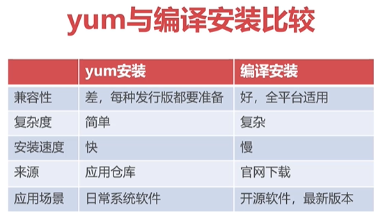

# 编译方式安装应用程序：
* 如yum仓库未提供rpm，往往需要采用编译安装方式。

* 编译安装是指从应用官网下载源码后，对源码进行编译后使用。

* 编译命令：make 使用对应编译器对源码编译生成可执行文件

注意：如果我们在使用“make”命令编译程序时，如果此时没有安装第三方的编译工具（gcc）,除系统报错外，会在安装应用程序的源代码包中形成一些更改和残留，导致安装包不能正常使用。需要重新解压安装包。

1. 通过yum 命令安装程序，会自动安装到 /usr/bin/ --> 目录下，而通过 make 命令编译安装应用程序的方式会自动将安装好的软件放在，当前的编译目录中。

2. 另外，启动Redis 时需要加载配置文件“redis.conf”，启动Redis : ./src/redis-server redis.conf

