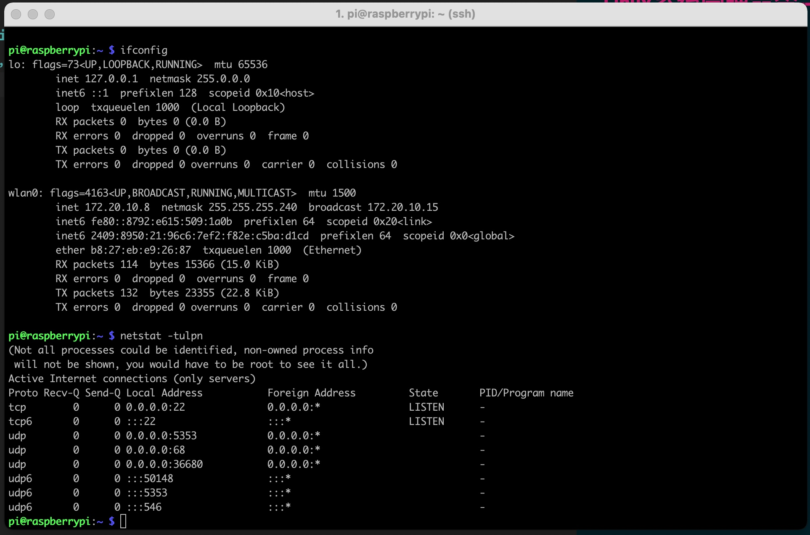
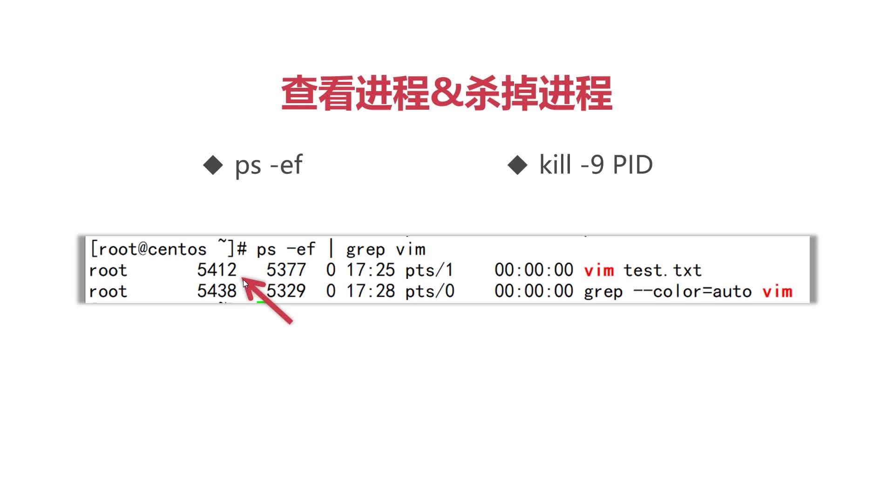

# Linux系统管理命令--常用核心命令
## 1，ifconfig--查看网卡ip


##2, netstat 查看网络端口号
tcp/tcp6 : (IPv4/IPv6 tcp版本)

Recv-Q | Send-Q(接收队列/发送队列--表示等待处理的数据包的数量，“0”表示当前网络消息队列中没有等待处理的数据包。当长期出现大量数字，且数值不断增加则说明系统应用处理不过来，造成网络堵塞)

Local Address/Foreign Address （本地地址/网络远程地址）

State--网络当前状态（LISTEN 表示正在被监听）

PID/Program name(程序进程编号/程序名称)

netstat--常用选项，（netstat -tulpn/metstat -ano）

```terminal
netstat -tulpn 
```
or 
```terminal
netstat -ano
```
日常使用时更推荐，tulpn--现实的网络连接数量最少，提供的信息价值更高
## 查看进行&杀掉进行
```terminal
ps -ef 
```
or
```terminal
 kill -9 PID
```

kill -9 PID 在进程中，将我们的应该用程序进行删除。
引申问题：netstat -tulpn 命令也可以获取PID 为什么还要使用“ps -ef”来获取进程的PID呢？

因为：应为某些应用不需要进行网络通讯，因此netstat 命令就无法获取这些程序的PID..而 ps -ef 可以显示出所有应用进程的PID


ps -ef | grep vim --> 表示使用“ps -ef”获取到所有的进程列表后，使用“通道”（“|”）将数据传递给 grep 命令筛选，只留下包含 vim 的程序


“kill -9 PID”--> 通常情况下不推荐直接使用“kill”命令杀进程，因为通常程序都自带退出命令，最好使用退出命令进行退出。使用“kill”强制杀掉进程可能会造成数据的丢失甚至一些无法预料的情况。