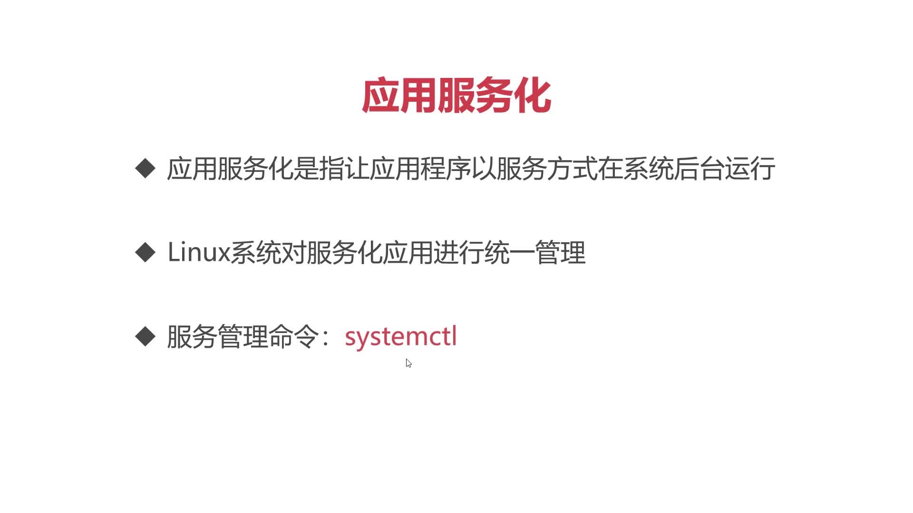
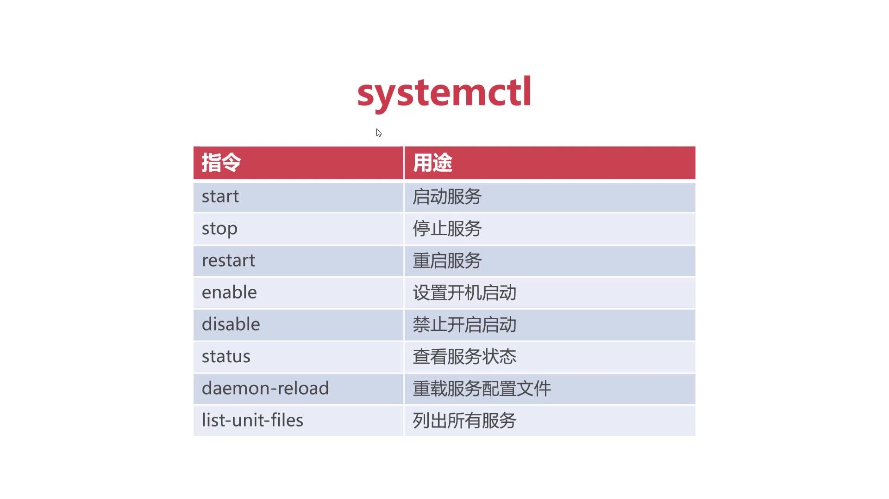

# 应用服务化systemctl


## systemctl--常用命令



## 将redis服务化，开机自动启动：
### 确认PID文件的存在，命令#：find / -name *.pid

通常第一个 pid 文件就是我们甚至开机自启程序的 PID编码保存位置，通常设置redis服务化后，系统通过读取这个文件的PID编号进行停止或重启操作
### 创建服务描述文件


```terminal
cd /usr/lib/systemd/
```
```
[Unit]
Description=Redis
After=syslog.target network.target remote-fs.target nss-lookup.target

[Service]
Type=forking
PIDFile=/run/redis_6379.pid
ExecStart=/usr/local/redis-4.0.14/src/redis-server /usr/local/redis-4.0.14/redis.conf
ExecStop=/bin/kill -s QUIT $MAINPID
PrivateTmp=true

[Install]
WantedBy=multi-user.target 
```

Description=Redis --> 描述信息

After = syslog.target network.target...等等 -->表示服务启动过程中的前后顺序，意思是这些服务启动后，才能启动Redis服务。


[Service]-->服务描述

Type=forking --> 描述服务的类型，forking代表后台运行

PIDFile=/run/redis_6379.pid --> 步骤一中查找到的文件

ExecStart=/usr/local/redis-4.0.14/src/redis-server /usr/local/redis-4.0.14/redis.conf --->表示启动时，要调用redis-server 加载 redis.conf文件

ExecStop=/bin/kill -s QUIT $MAINPID-->表示利用“kill”命令对指定进程进行关闭

kill -9 PID --> 强制删除程序进行

kill -s QUIT PID --> 通知进行采用正常流程退出

PrivateTmp=true -->表示，为每一个服务设置私有的Tmp临时文件目录


WantedBy=multi-user.target --> 表示，将当前redis 服务分配到 multi-user.target 服务组中，（multi-user--系统默认服务组，系统允许此服务组中所有的服务可以随系统自动启动。）

### 对所有service 进行重载
```terminal
systemctl deamon-reload
```
### 启动服务 命令
```terminal
systemctl start redis
```

```terminal
systemctl status redis
```


```terminal
systemctl stop redis
```


```terminal
systemctl restart redis
``` 


### 设置开机启动

```terminal
systemctl enable redis
``` 
```terminal
systemctl disable redis
``` 
* 1，disable-->不会开机自动启动

* 2，enable-->开机自动启动

* 3，static --> 服务本身不能随系统独立启动，当别的服务启动关联到此项服务时，才会启动
* `shutdown -r now` 表示立即重启计算机


### 查看系统每一个服务当前状态 


```terminal
 systemctl list-unit-files
```
