# Linux用户权限管理
总结：
* 用户组就是将用户分组，隶属用户自动拥有组权限。

* 一个用户可隶属于多个组，用户可任意切换当前组。

* 用户组的出现让用户权限管理变更轻松。  


```
（1）useradd zhangsan

（2）passwd @qazwsx

（3）groupadd ga

（4）usermod -g ga zhangsan
useradd 添加用户命令 

passwd 设置用户密码

groupadd 添加分组

usermod -g ga zhangsan 将用户张三分配到ga组
```
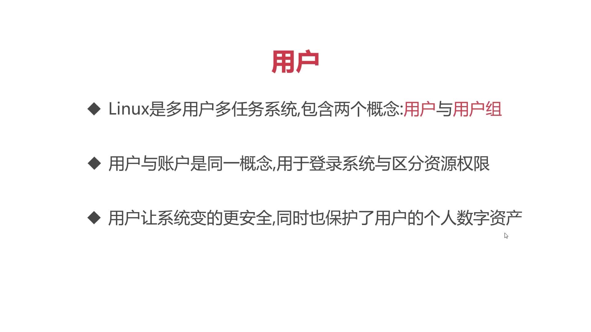

用户组--》为了更方便挂历用户权限

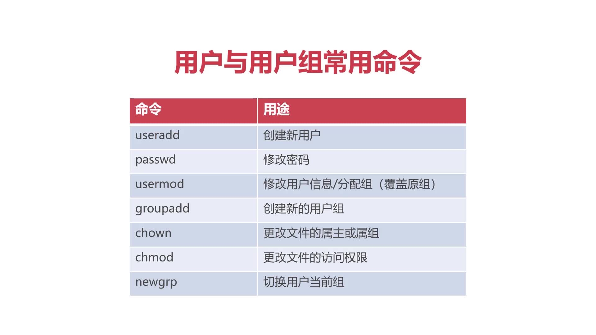

模拟项目组，包含研发员工和测试员工，这两个岗位的权限是不同的，如何实现？
### 创建用户--》adduser 

设置密码--》passwd 用户名 （centOS对密码强度是有要求的，建议最少8位，数字和字母混合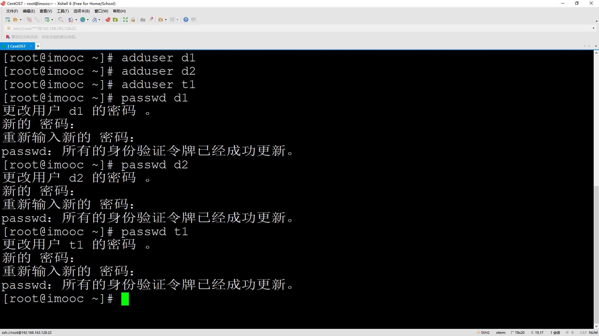

### 创建分组--》groupadd 组名
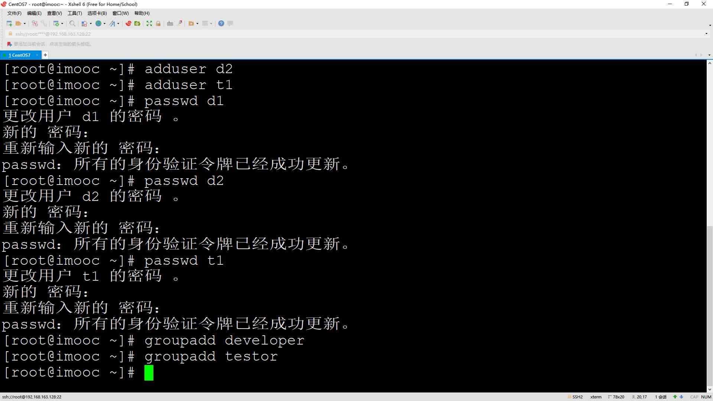

### 分组命令：# usermod -g 组名 用户名
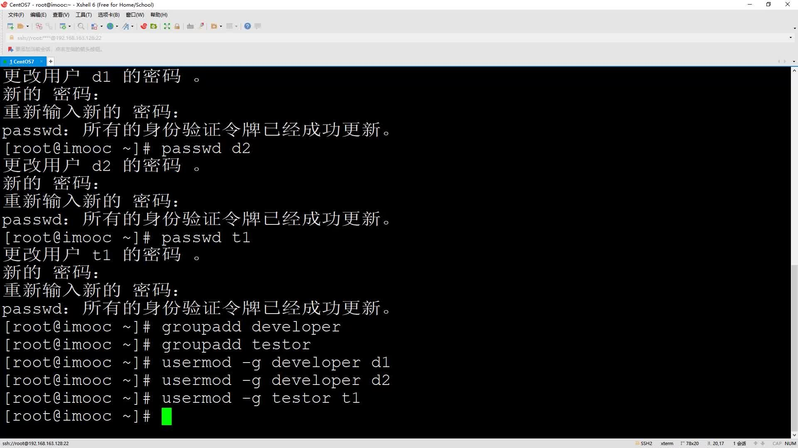
命令:  groups-->查看当前登录用户所在分组
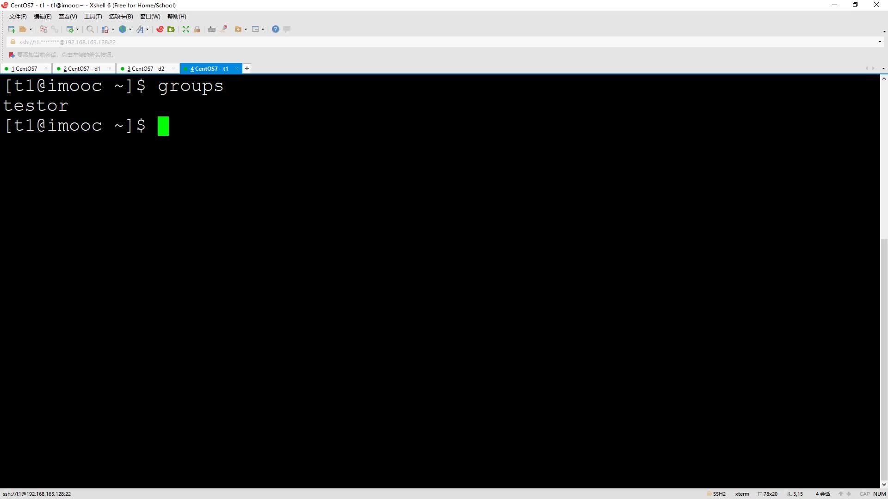


## root 分配权限
关于ll展示的信息:
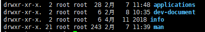
第一列是权限代码：
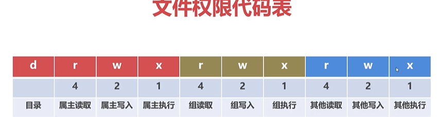

* 属主也即文件的所有者，即文件创建人，对应ll展示信息的第三列，也就是第一个root，这个root是用户root。

* 组也就是文件用户组所有的权限，文件用户组对应ll展示信息第四列，也即第二个root，这个root是root组的意思。

* 其他也即其他用户的权限，第二行数字是权限的权重，对修改权限时使用，比如`chmod 750 dev-document/`,第一个数字是7，也即属主的权限权重加起来为7，那么只有三个权限都有才行，所以属主三个权限都有，第二个数字和第三个数字类似。

### 分配权限
chown：修改文件的属主和组
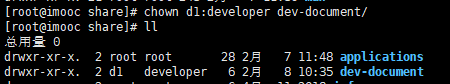


```terminal
chown [用户]:[用户组] 目录
```

### chomod：修改对应文件和目录的权限

表示所属主和所属组以及其他用户拥有可读、可写、可执行权限
```terminal
chmod 777 目录
```
组用户可读写，其他用户不允许读写
```terminal
chmod 750 目录
```

只有属主拥有完整权限
```terminal
chmod 700 目录
```

### 分配对个组
让一个用户拥有两个以上用户组的方法：
```terminal
 usermod -G developer,testor d1
```
* 修改用户组时会先将之前的用户组删掉，重新分

* 注意，修改用户的用户组后，需要退出重新登录。

* 切换用户组命令：newgrp testor，从developer切换到testor组

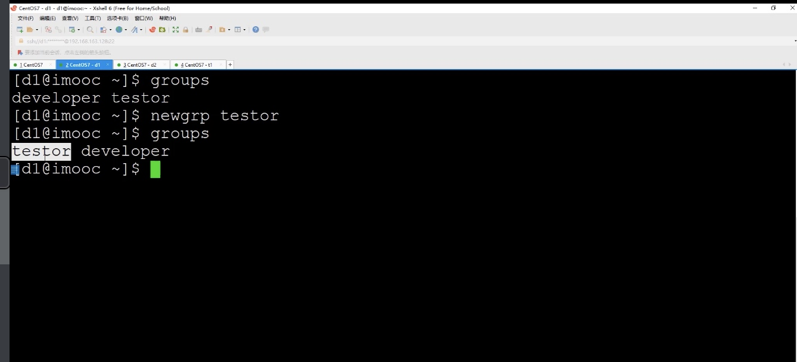


## 分配临时sudo超级管理员命令

sudo超级管理员命令：
sudo命令 --> 让普通用户拥有超级管理员的执行权限

sudo 应用从场景--》因为 root 的唯一性，导致很多系统管理都要依赖root账号，但当root账号或其所有者无法操作时，需要委托其他人员操作系统。而为了root账号安全--》sudo 就可以很好的解决这个问题
```terminal
visudo 
```
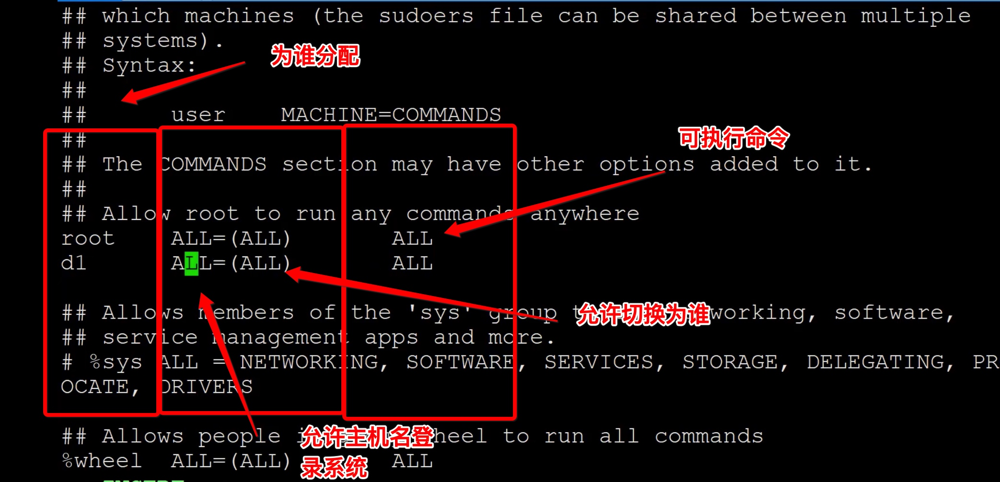

### 格式检测
```terminal
visudo -c 
```

> 建议 : sudo 命令 能少用就少用，因为实际工作中很多可能出现操作失误，造成服务器宕机。