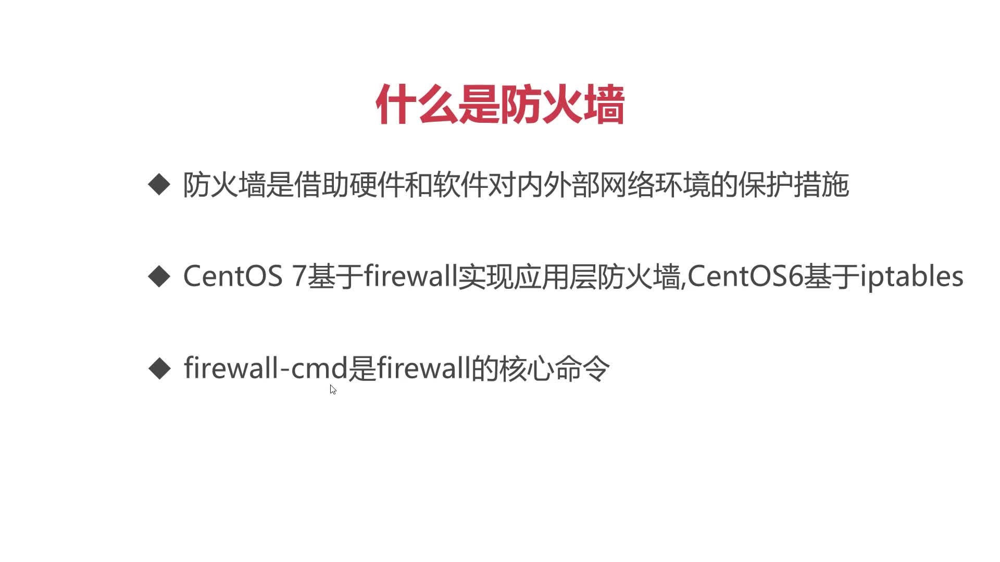

# CentOS7防火墙 firewall
通常，CentOS7系统中部署了网络应用程序，例如：tomcat、redis、mysql 等基于网络通信的应用，出安装设置程序外，还需在防火墙中对指定端口进行放行。

示例，以部署tomcat 为例，学习防火墙能起到的作用

* 1，部署安装Tomcat ,从本机储存中，将tomcat 压缩包移动到CentOS7并解压 安装。

* 2，使用命令 ./startup.sh --> 调用安装好的tomcat程序中的starup.sh文件启动程序

* 3，可通过命令确认tomcat是否启动成功，netstat -tulpn | grep 8080


firewall-cmd中间不能有空格


因为CentOS7 防火墙的存在，默认情况下虚拟机不对外开放8080端口，（CentOS7 中 tomcat 的链接端口）

所以要解决8080端口外部访问问题，我们在firewall 中对端口放行即

### 查看防火墙状态:

```
firewall-cmd --state
```

### 查看防火墙放行的端口: 
```
firewall-cmd --list-prots
```
### 添加防火墙放行端口 


```
firewarll-cmd --zone-public --permanent --add-port=8080/tcp
```

```
firewarll-cmd --zone-public --permanent --add-port-8000-9000/tcp  
```
```
 firewall-cmd --reload
```
> 注意： 别忘记重载 #firewall-cmd --reload 

* （permanent-->表示永久改变）