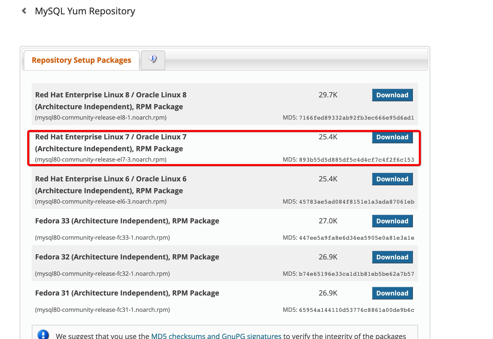
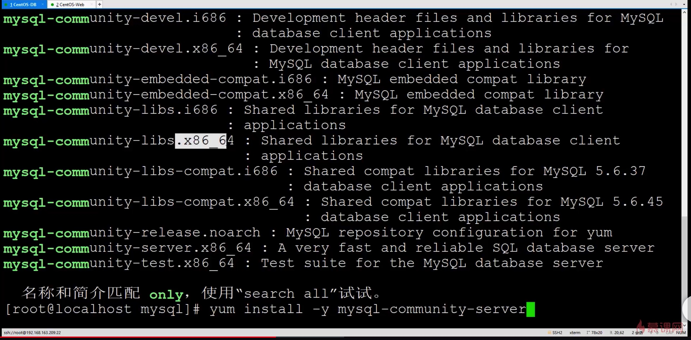
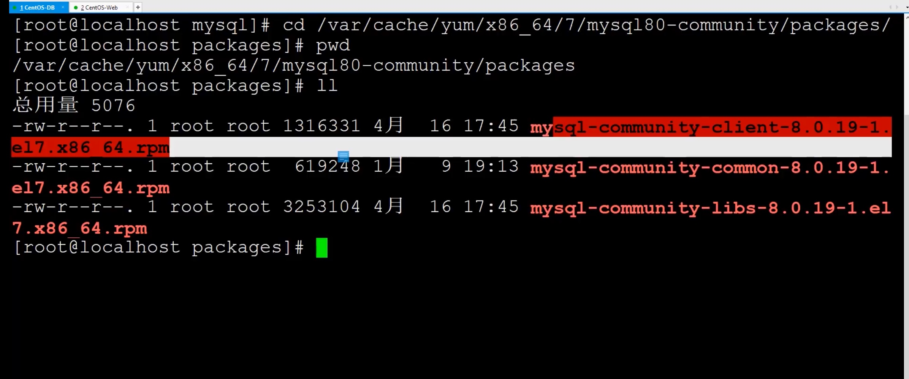
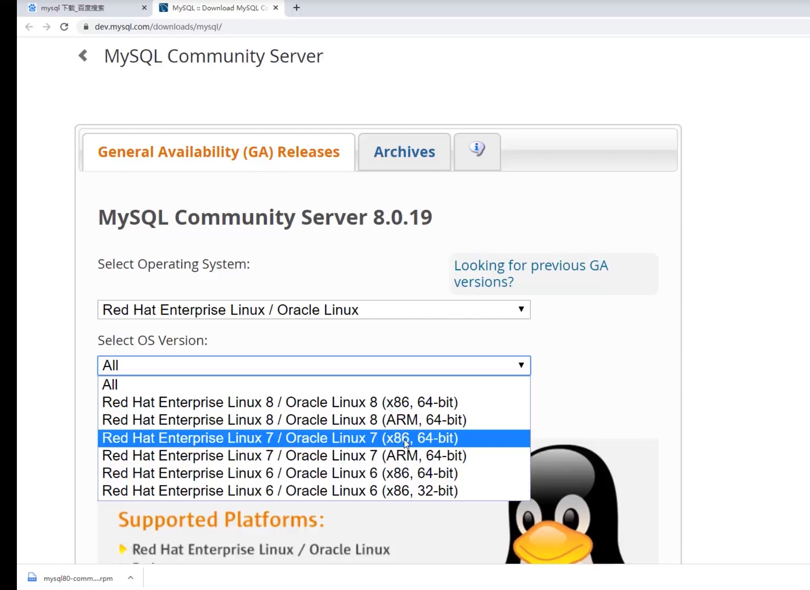
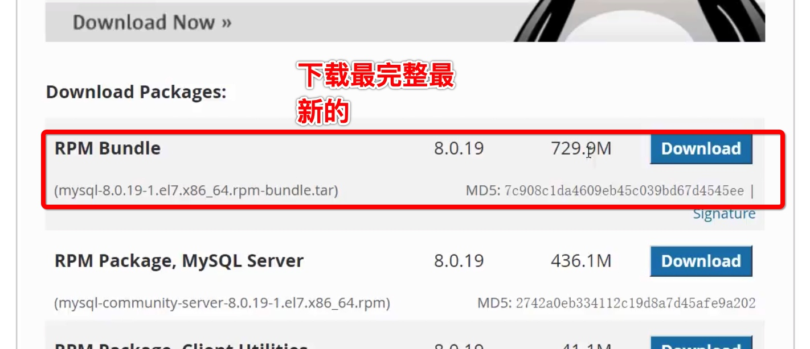
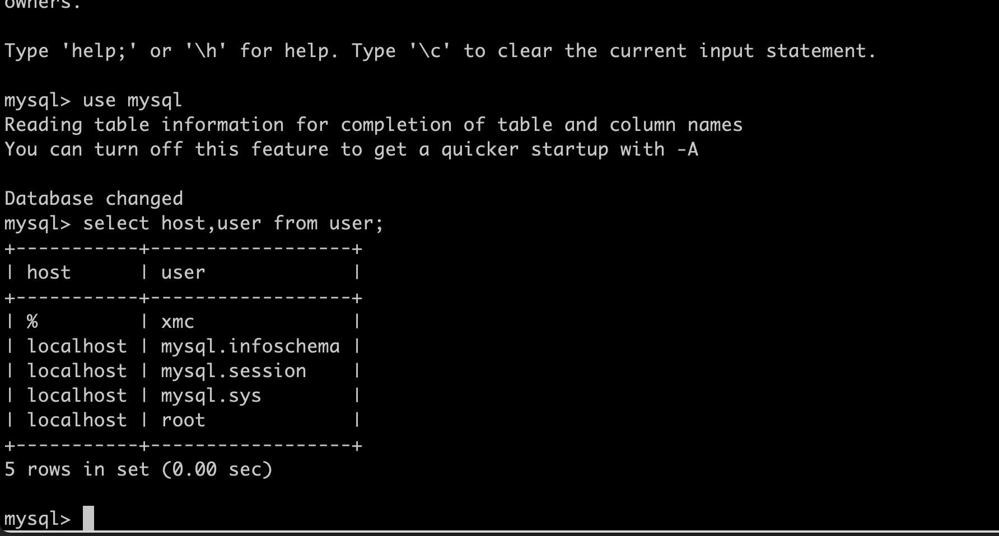

# mysql 安装配置及初始化

先看仓库有木有
```
yum search mysql-comm
```
## 下载
浏览器搜索MySQL Yum Repository


复制`No thanks, just start mydownload.`下载连接 
```terminal
cd /usr/local && mkdir mysql && cd mysql
```
```terminal
wget https://dev.mysql.com/get/mysql80-community-release-el7-3.noarch.rpm
```
## 安装mysql
安装rpm源
```terminal
yum localinstall -y mysql80-community-release-el7-3.noarch.rpm
```
验证
```terminal
yum search mysql-comm
```


```terminal
yum install -y mysql-community-server
```
### 加速下载过程




迅雷下载替换这些文件


```terminal
yum install -y mysql-community-server
```
## 启动MySQL 服务

```terminal
systemctl start mysqld
```
验证

```
netstat -tulpn 
```
## 设置开机启动
```terminal
systemctl enable mysqld
```

## 获取MySQL的登录密码 
显示最后30行MySQL日志
```terminal
tail -n 30 /var/log/mysqld.log
```


## 修改MySQL默认登录密码
登录
```terminal
mysql   -u root --password=日志中密码
```

```terminal
ALTER USER 'root'@'localhost' IDENTIFIED WITH mysql_native_password BY '自己的密码'
```
## 修改MySQL允许远程连接


```
use mysql;
```
```
select host,user from user;
```



```
update  user set host='%' where user='root';
```

使其生效
```
flush privileges ;
```

## 防火墙firewall-cmd 放行3306端口


```
firewall-cmd --zone=public --permanent --add-port=3306/tcp
```

```
firewall-cmd --reload
```