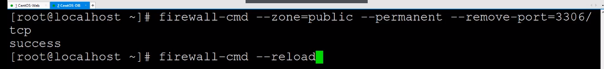
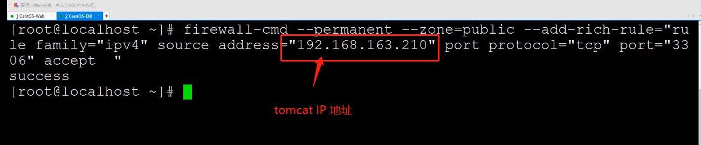

# 防火墙只放行指定IP的指定端口
我们在设置数据库时是 “3306”端口是完全对外开发的，安全性有很大隐患。

如何解决？--》只放行指定 IP的指定端口
首先，登录部署数据库的系统，并屏蔽掉3306端口
## 屏蔽端口
```terminal
firewall-cmd --zone=public --parmanent --remove-port=3306/tcp
```

```terminal
firewall-cmd --reload
```



## 为制定IP开放制定端口
添加更细例防火墙规则：

```terminal
fritewall-cmd --permanent --zone=public --add-rich-rule="rule family="ipv4" source address="192.168.163.210" port protocol="tcp" port="3306" accept"
```

