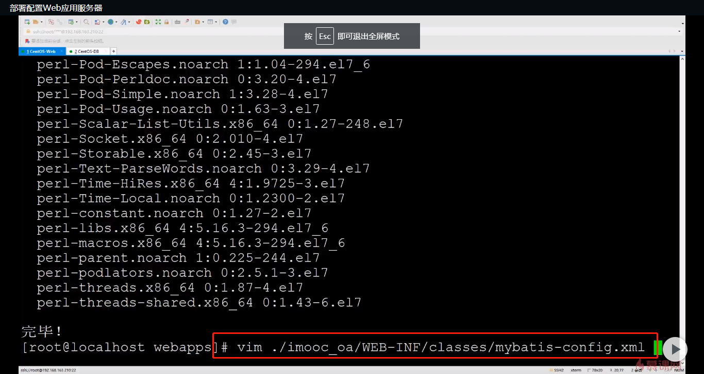
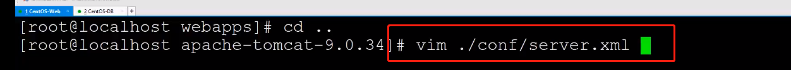
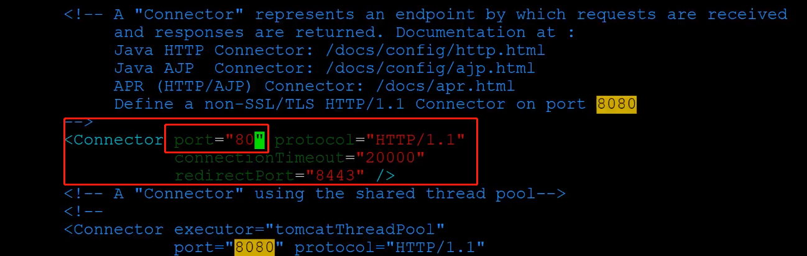
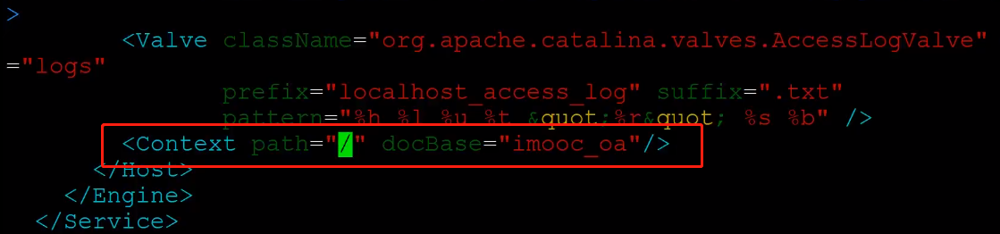
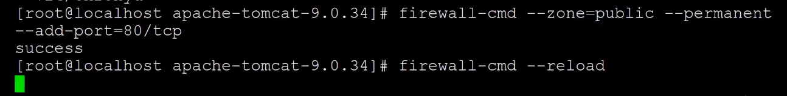

# Tomcat 部署网站

## Tomcat 需要依赖 Java来运行
[CentOS install java8](mweblib://16182815374331)

## 下载安装Tomcat
下载
```terminal
wget 
```
解压
```terminal
tar zxf 
```
## 应用war包上传服务器解压Tomcat` apache-tomcat/webapps/` 目录下


```terminal
mv book-admin ./apache-tomcat-9.034/webapps/
```

## 修改数据库配置文件



## 修改Tomcat端口号

需要修改，
* 1，端口号。 
* 2，imooc_oa设置默认的contextpass

1,8080--> 调整为 80 ；


## 应用映射的上下文路径

```xml
<Context path="/" dpcBase="imooc_oa">
```



## 启动Tomcat

```terminal
./bin/startup.sh
```

验证
```terminal
netstat -tulpn
```
## 防火墙开放80端口 



##  修改数据库放行端口只对应用服务器开放

我们在设置数据库时是 “3306”端口是完全对外开发的，安全性有很大隐患 如何解决？
[防火墙只放行指定IP的指定端口](mweblib://16182823101342)