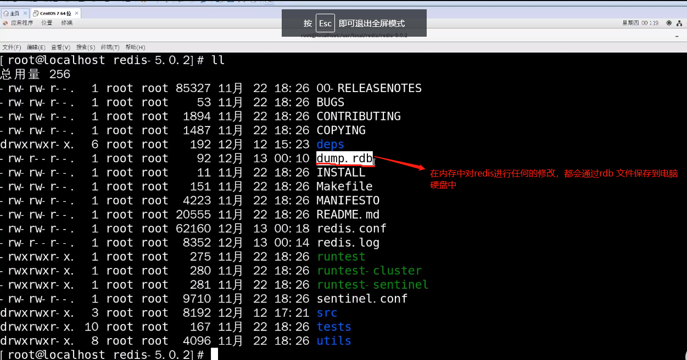

# Redis常用基本配置


## 启动 redis服务
首先我们先以后台进程方式运行了redis服务：
启动服务
```terminal
./src/redis-server redis.conf
```
启动交互工具
```terminal
redis-cli
```

## 停止 redis服务
可以使用kill -9 进程编号关闭redis进程，还可以使用
```terminal
./src/redis-cli shutdown 
```
平滑关闭Reids进程

## 启用后台运行


```
daemonize yes
```
当关闭redis终端，redis服务默认关闭，如果需要以守护线程的方式在后台运行，需要修改redis.conf配置文件中daemonize 为yes。
## 拓展redis数据库的数量
需要到redis.conf 配置文件中进行设置

```yaml
# 设置数据库数。默认数据库为DB 0，可以选择
# 使用SELECT <dbid>在每个连接的基础上不同
# dbid是介于0和'databases'-1之间的数字
databases 16
```
##  修改redis数据库日志级别

```yaml
# 指定服务器详细级别。
#这可以是以下之一：
# debug (很多信息，对开发测试很有用)
# verbose (许多很少有用的信息，但不会像调试级别那样混乱)
# notice (中等冗长，您可能想在生产中使用)
# warning (仅记录非常重要的关键消息)
loglevel notice

# 指定日志文件名。也可以使用空字符串强制
# Redis输出到标准输出。请注意，如果您使用标准
# 用于日志记录但要守护的输出，日志将发送到/dev/null
logfile ""
```

## 设置数据存储目录
```
# 请注意，您必须在此处指定目录，而不是文件名。
dir /usr/local/var/db/redis/
```
## 开启密码认证

```yaml
# 重要说明：从Redis 6开始，“ requirepass”只是新ACL系统之上的兼容性层。
#选项效果将只是为默认用户设置密码。客户端仍然可以像往常一样使用
# AUTH <password>进行身份验证，或者如果它们遵循新协议，则可以使用AUTH default 
# <password>进行更明确的身份验证：两者都可以使用。
#

 requirepass foobared
```


## redis--的硬盘备份文件，防止系统宕机时数据丢失

