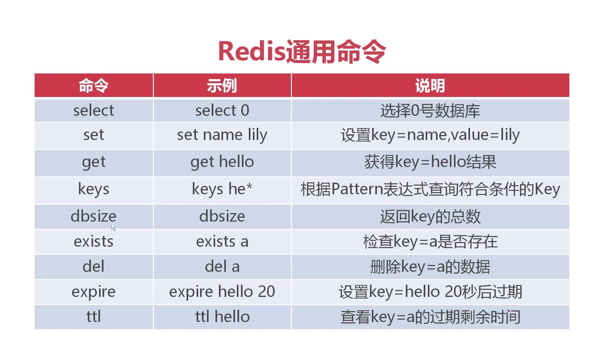

# Redis通用命令


## 向redis数据库中输入数据
 命令：set key value-->value-以字符串的形式进行的存贮

@@@--如果在同一个数据库中，使用相同的key存储数据，则会覆盖之前的value值。

不同数据之间，key值相同不影响value值的存储

如何提取数据呢？命令：get +key


## 查询当前数据库的key值
* 1,命令：keys * --> 查询当前数据库的所有key值

* 2，命令：keys he* --> 查询当前数据库中以“he”开头的key值. 

## 查询当前数据库中 key值的总数

```
dbsize
```


## 删除数据库数据

```
del key
```


## 查询某个key建是否存在的命令
```
exists key
```


## 设置有存在时效的key键

