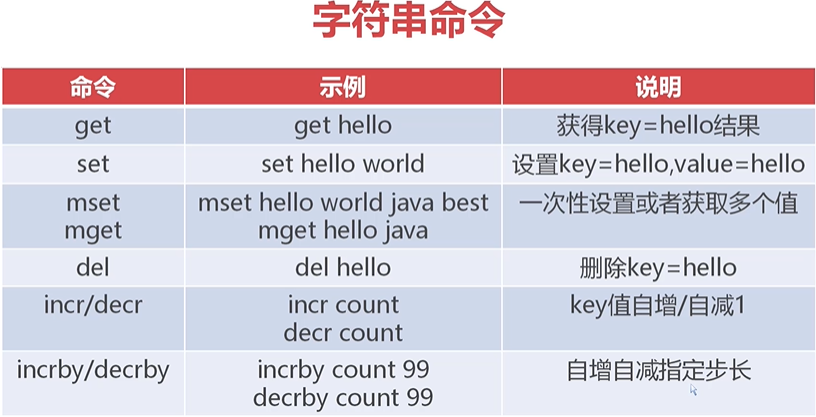
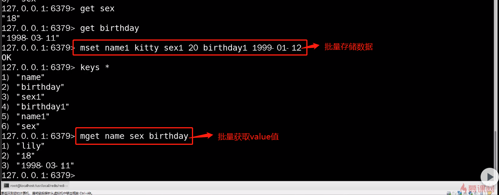
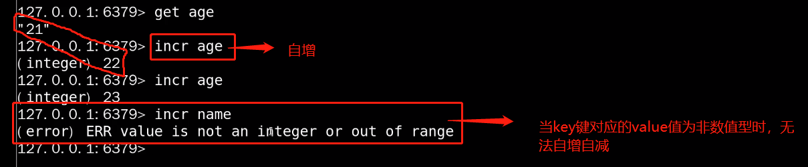
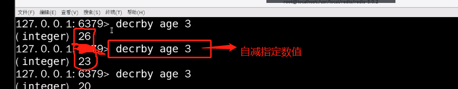

# Redis数据类型 String



* **String字符串类型：最重要也是最基础最常用最简单的类型。**

* Hash哈希类型。

* List列表类型。

* Set集合类型。

* Zset有序集合类型。   

## mset-mget 批量存储-获取键值对
* 格式：mset key1 value1 key2 value2 key3 value3

* 格式：mget key1 key2 key3




## value值自增自减
格式：

```
incr +key --> 自增
decr +key --> 自减
```


自增自减只适用于数字型，string类型不适用
## 自增自减指定步长：
格式：
```
incrby key +步长--> 自增指定步长

decrby key + 步长-->自减指定步长
```


