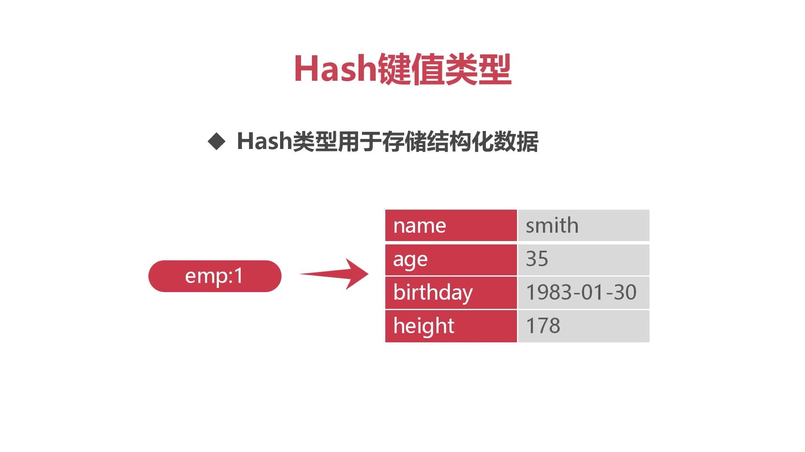
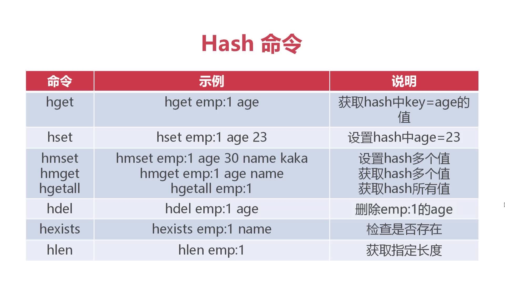
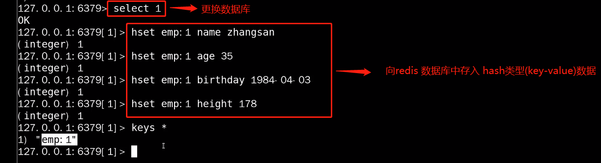
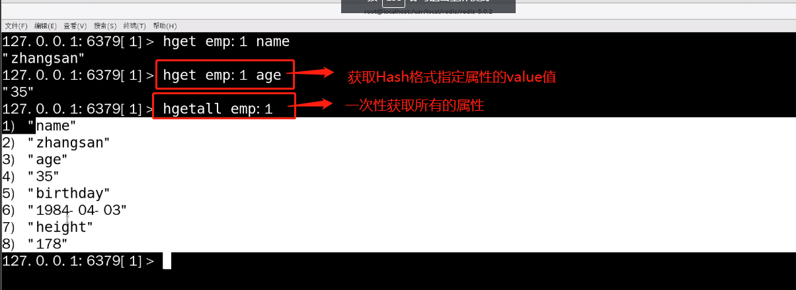
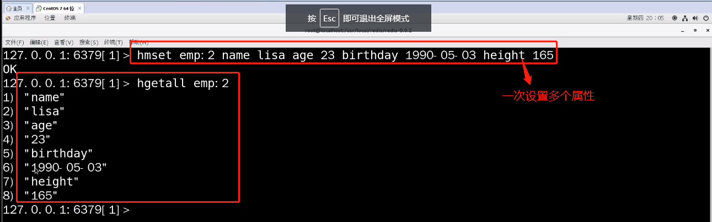
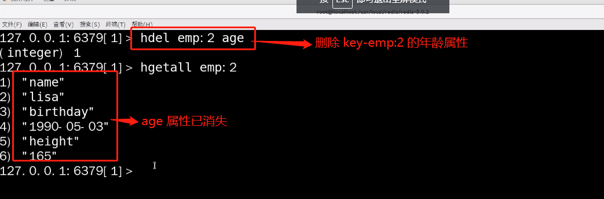
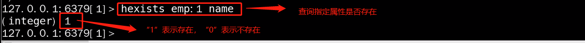
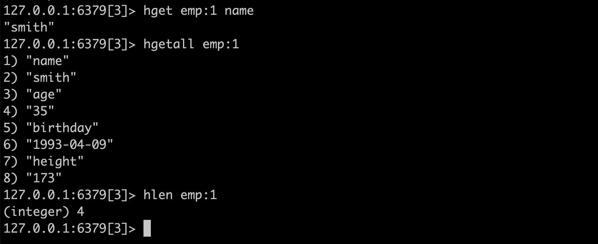

# Redis数据类型 Hash键值类型用于存储结构化数据

## hset-设置hash值

## hget -获取hash值
* 格式：1，获取指定属性 hget key 属性名

* 格式：2，获取所有属性 **hgetall key** (奇数行为属性名，偶数行为属性值,)

## 一次设置多个属性名-属性值的方法

* 格式：hmset--> key 属性名1 属性值1 属性名2 属性值2 属性名3 属性值3

## 命令：hdel-->删除指定key键的 某个指定属性
* 格式：hdel key 属性名. 

## hexists --> 判断指定属性是否存在
* 格式：hexists key 属性名 

## hlen代表获取指定长度

