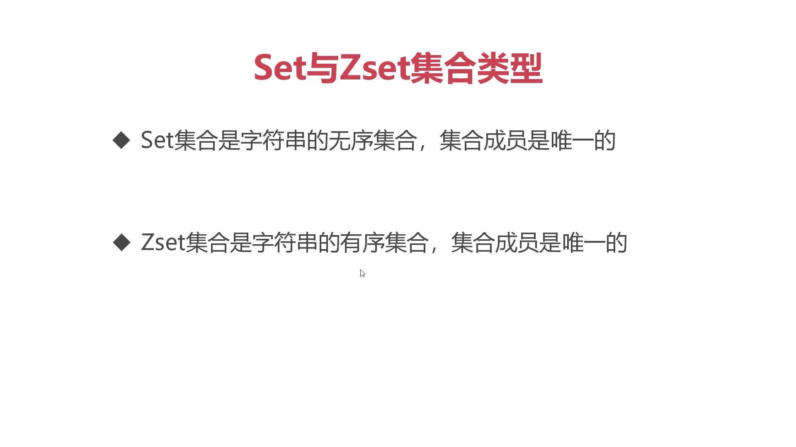
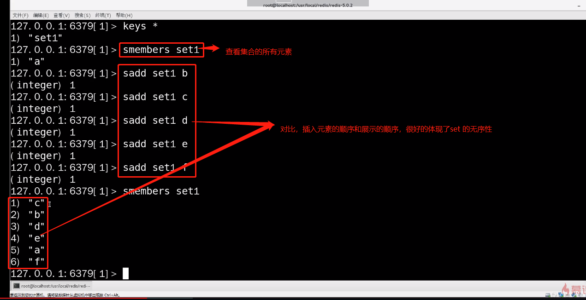
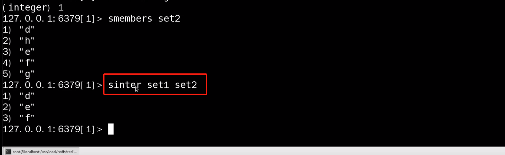
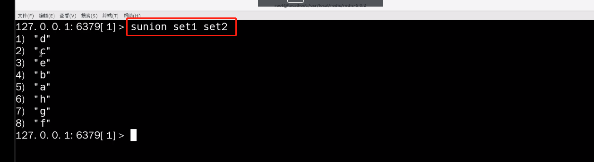
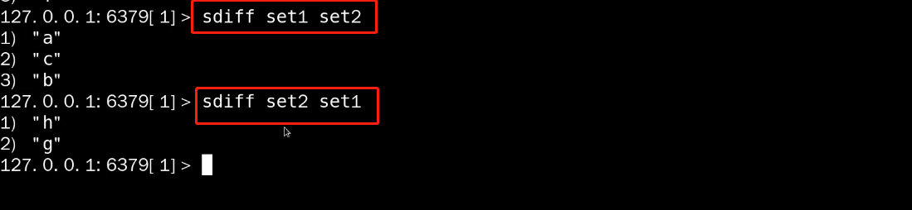
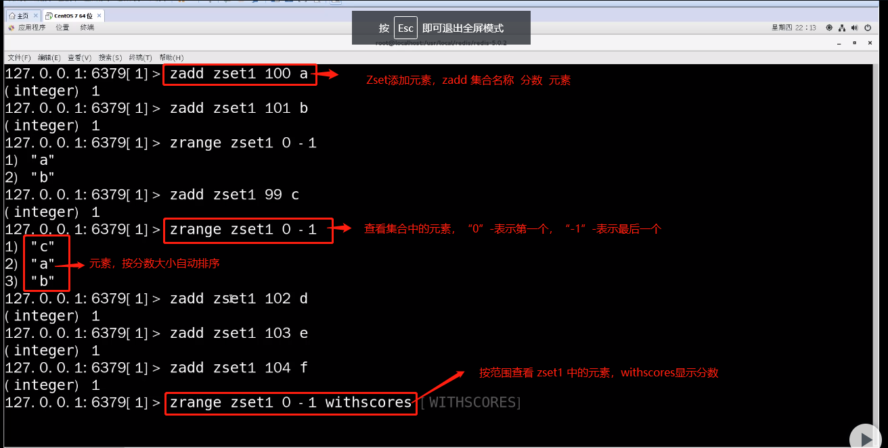
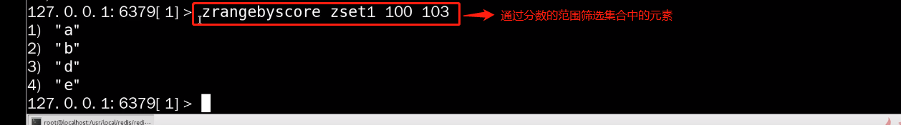

# Redis数据类型--Set与Zset集合类型

## Set--无序的且成员唯一的列表（set的成员必须是字符串）

* sadd--添加成员的命令

* smembers 集合名称 --> 查看集合的所有成员

## set 是支持运算的

### 获取两个集合的交集 命令：sinter set1 set2

### sunion--并集，将两个集合进行合并（将两个集合合并在一起，并将重复的元素去掉）

### sdiff--差集 set1 set2(差集的使用是有前后顺序的，表示前面集合中有，而后面集合中没有的元素)

## Zset--在set基础上则外增加了一个分数，使Zset成了按分数排列的有效集合
* zadd--添加元素 zass zset1 100 a  

## 通过“分数”筛选集合元素
命令：zrangebyscore zset1 100 103

