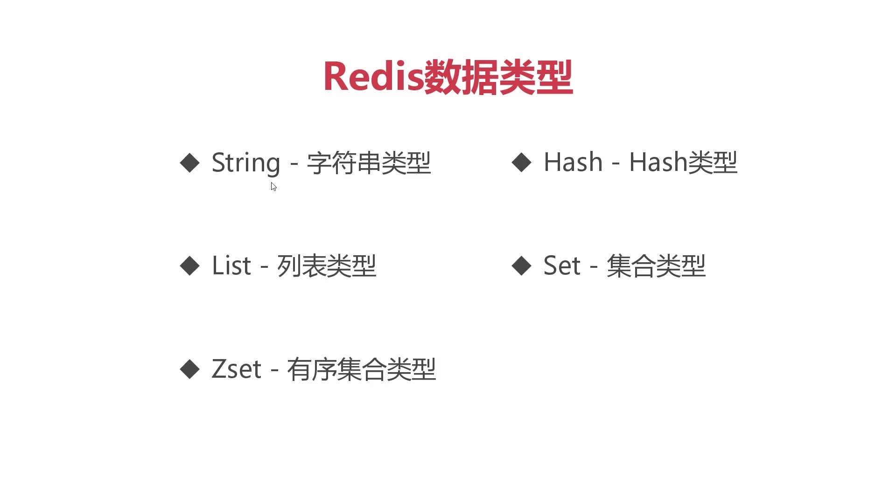

# Redis常用数据类型总结

* String--是Redis最基本也是最重要的类型，用来保存字符串

>（实际开发汇中使用最多，其次是Hash类型，其它类型使用较少） 

* Hash 原有Strint基础扩展可以保存**一组键值对** 通过一个key就可以保存一系列属性，简化Redis存储数量
* List--列表类型也是通常说的数组只能包含 **字符串** 它会按插入顺序排列 ，支持列表头和列表尾新增删除
* Set--ZSet 被称之为集合最大的**特点保存的字符串没有重复**， ZSet相对Set是一个有序集合，通过为**ZSet设置分数**ZSet会**自动排序**
