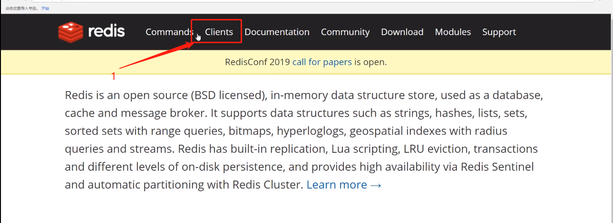
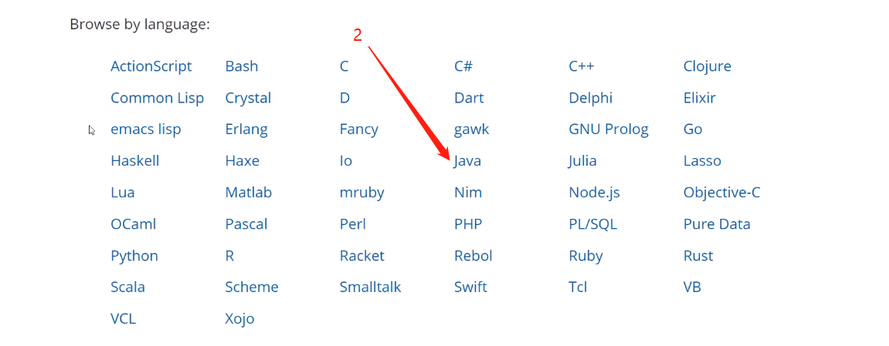
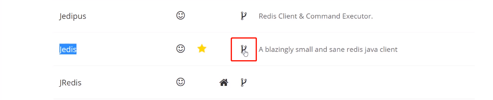

# jedis-下载




## jedis-->在国内使用最广，是最具人气的



## 在maven工程中可以使用依赖进行下载

```xml
 <dependencies>
        <dependency>
            <groupId>redis.clients</groupId>
            <artifactId>jedis</artifactId>
            <version>2.9.1</version>
        </dependency>
    </dependencies>
```

## java示例

```java
public class CacheSample {
    private static Jedis jedis = new Jedis();

    public static void main(String[] args) {
//        create();
        System.out.println("请输入要查询的商品编号:");
        String input = new Scanner(System.in).next();

        try {
            jedis.select(3);
            String key = "goods:" + input;

            if (jedis.exists(key)) {
                String json = jedis.get(key);
                Goods goods = JSON.parseObject(json, Goods.class);

                System.out.println("goods = " + goods);
            }else {
                System.out.println("输入商品编号不存在 !");
            }
        } catch (Exception e) {
            e.printStackTrace();
        } finally {
            jedis.close();
        }


    }

    private void create() {
        List<Goods> goodsList = new ArrayList<Goods>();
        goodsList.add(new Goods(1, "苹果", "lorem", 3.3f));
        goodsList.add(new Goods(2, "栗子", "lorem", 3.3f));
        goodsList.add(new Goods(3, "西瓜", "lorem", 3.3f));

        jedis.select(3);
        try {
            for (Goods goods : goodsList) {
                String jgoods = JSON.toJSONString(goods);
                System.out.println(jgoods);
                String key = "goods:" + goods.getGoodId();

                jedis.set(key, jgoods);
            }
        } catch (Exception e) {
            e.printStackTrace();
        } finally {
            jedis.close();
        }
    }
}
```