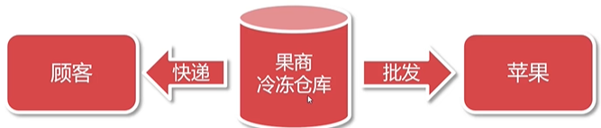

# Java高级阶段最最最重要的框架体系:Spring
## IoC控制反转:
* 将对象的控制权交由第三方管理，类似工厂模式。比如租房找房屋中介而不是自己找房东。是由中间人进行创建管理对象的一种理念。
* IoC控制反转，全程Inverse of Control，是一种设计理念。

* 由代理人(苹果摊老板)来创建与管理对象(苹果)，消费者(我)通过代理人(老板)来获取对象(苹果)。

* IoC的目的是降低对象之间直接耦合。

* 加入IoC容器将对象统一管理，让对象关联变为弱耦合。

## DI依赖注入:
IoC是设计理念，是现代程序设计遵循的标准，是宏观标准。

DI(Dependency injection)是具体技术实现，是微观实现，运行时来完成对象创建与绑定的操作。

DI在Java中利用反射技术实现对象注入(Injection)。

## 总结
IoC控制反转是指将对象的控制权由程序本身交给IoC容器（第三放）进行管理
