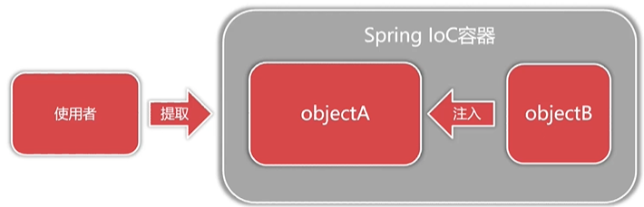

# Spring的含义
狭义的Spring是指Spring框架(Spring Fremework)

广义的Spring是指Spring生态体系。

## 狭义的Spring框架:

* 是企业开发复杂性的一站式解决方案。

* Spring框架的核心是Ioc容器与AOP面向切面编程。

* Spring IoC负责创建与管理系统对象，并在此基础上扩展功能。

## 广义的Spring生态体系:

* 分布式微服务:Microservices

* 响应式编程，基于异步的非阻塞的全新的开发理念和技术:Reactive。

## 云端自动扩展和自动连接:Cloud

* Web开发一站式解决方案，提供了Spring MVC让我们摆脱传统

* Servlet开发的方式:Web apps

* 无服务器编程:Serverless

* 事件驱动和批处理:Event Driven和Batch

## Spring IoC容器职责:

* 对象的控制权交由第三方统一管理(IoC控制反转)

* 利用Java反射技术实现运行时对象创建与关联(DI依赖注入)

* 基于配置提高应用程序的可维护性与扩展性。

* IoC是Spring生态的地基，用于统一创建与管理对象依赖  

