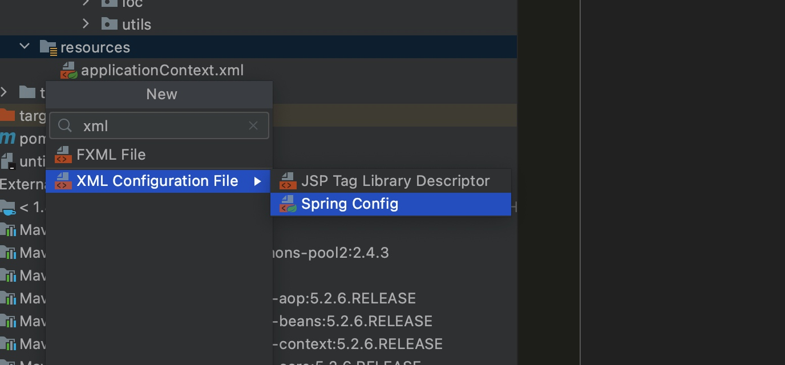

# Spring应用实例

## 对于Maven项目，使用spring必须先引入spring依赖。
```xml
<dependency>
    <groupId>org.springframework</groupId>
    <artifactId>spring-context</artifactId>
    <version>5.2.6.RELEASE</version>
</dependency>
```
## 在resources里创建SpringIoC的核心配置文件：applicationContext.xml

```xml
<?xml version="1.0" encoding="UTF-8"?>
<beans xmlns="http://www.springframework.org/schema/beans"
       xmlns:xsi="http://www.w3.org/2001/XMLSchema-instance"
       xsi:schemaLocation="http://www.springframework.org/schema/beans http://www.springframework.org/schema/beans/spring-beans.xsd">

</beans>
```

## 区别


在原始方案中所有对象都是new关键字生成，编译时就决定了依赖关系，对象的创建和依赖都是主动发起的，当使用spring IOC 容器后所有的对象创建不在是我们程序自己来做，而是通过spring IOC
在创建容器的时候自动对齐实例化，主动变被动
## 本质：
利用IOC容器让对象间进行有效解耦，对象关系从在代码中进行维护到通过配置时候进行书写，通过反射形式进行对象创建并贴上标签，设置里面属性。无需关心底层原理，对象关联工作由IOC容器进行，运行时IOC会主动进行对象注入，获取对象时直接从容器提取即可，这么操作更加灵活，便于扩展维护