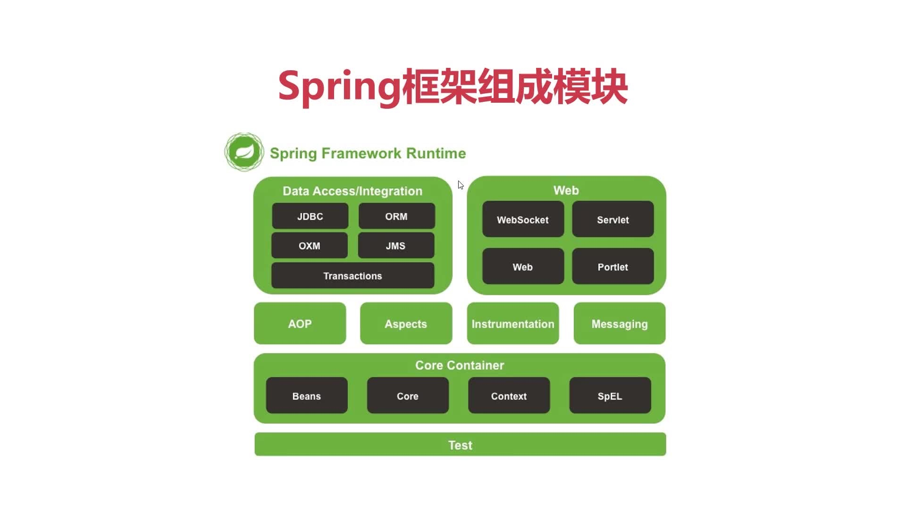
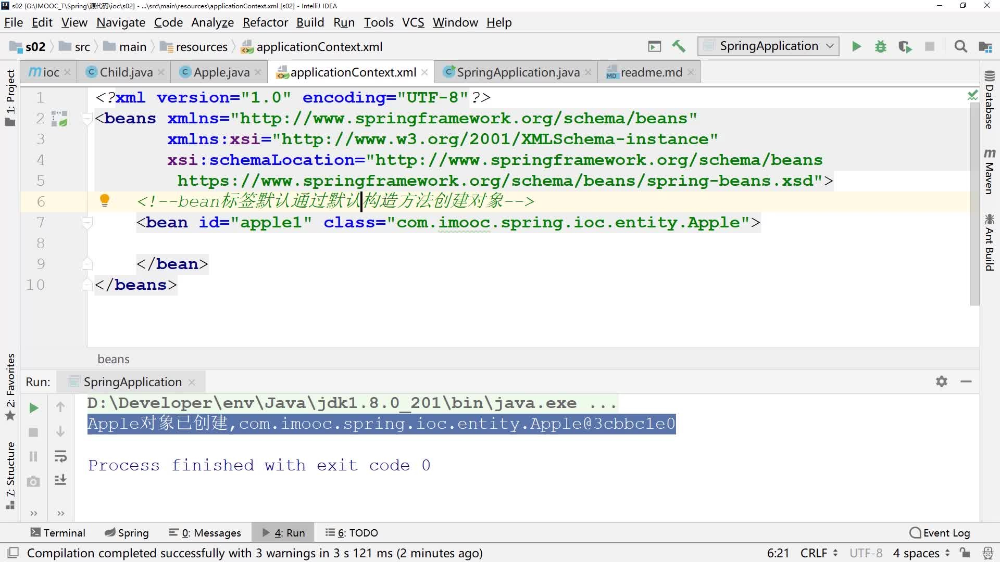

# Spring配置Bean的三种方式
1. 1，基于XML配置Bean

2. 2，基于注解配置Bean

3. 3，基于Java（conf文件）代码配置Bean

## Core Container：IOC容器，核心模块

Beans：对对象进行创建和装配

Core：核心代码实现

Context：

SpEL:spring的表达式语言

## Test：spring测试模块

AOP及以上模块是基于IOC容器来实现的，

Aspects：切面

Instrumentation：检测器，检测模块运行时的各个组件

Messaging：spring的消息处理功能

Data Access/Integration：数据访问与集成模块：

## Web：web应用

可以看出spring是完整的体系结构，提供从底层数据库访问，到前端web应用完整的支持服务

Bean标签的作用是通知Ioc容器实例化哪个对象

