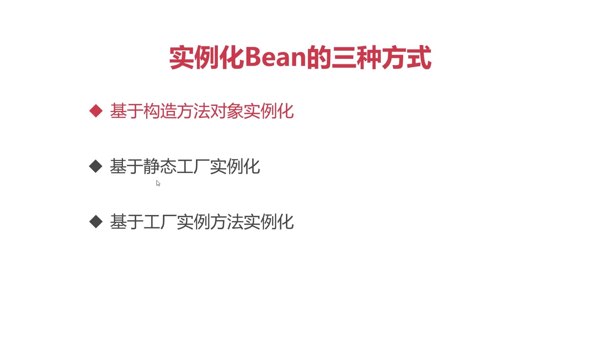
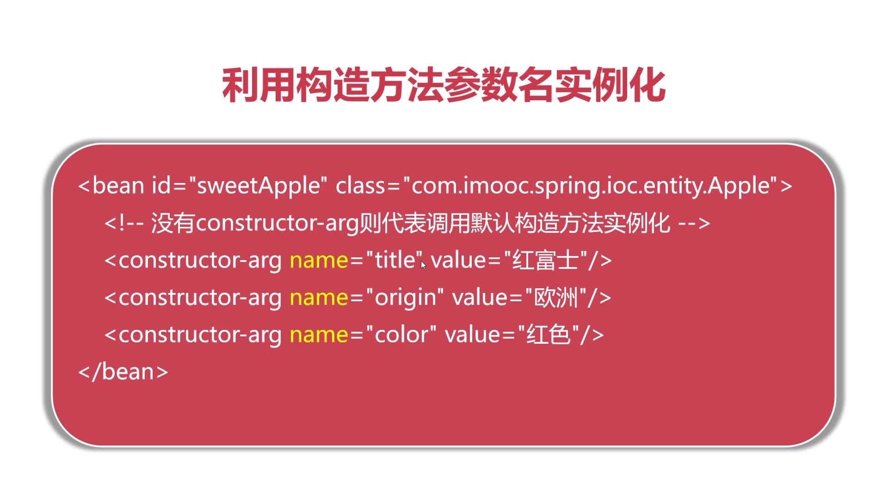

# 实例化Bean的三种方式



##` <constructor-arg>`  实现带参构造方法实例化




## 基于静态工厂（不太常用)

```xml
<!--静态工厂通过静态方法创建对象,隐藏创建对象的细节-->
<bean id="apple3" class="factory.AppleStaticFactory" factory-method="createSweetApple"/>
```


```java
/**
 * 静态工厂通过静态方法创建对象,隐藏创建对象的细节
 */
public class AppleStaticFactory {
    public static Apple createSweetApple(){
        System.out.println("基于静态工厂");
        //我们可以才创建对象中赋予额外行为
        Apple apple = new Apple();
        apple.setTitle("红富士");
        apple.setColor("红色");
        apple.setOrigin("美国");
        return apple;
    }
}
```
静态工厂创建对象，和工厂实例创建对象本质上没有区别。（随着Spring越来越强大，工厂方式创建对象的方式很少用了
## 工厂实例方法创建对象（不太常用)
```xml
<!--    工厂实例方法创建对象是指IOC容器对工厂类进行实例化并调用对应的实例方法创建对象的过程-->
<bean id="factoryInstance" class="factory.AppleFactoryInstance" />
<bean id="instance" factory-bean="factoryInstance" factory-method="createSweetApple"/>
```


```java
public class AppleFactoryInstance {
    public Apple createSweetApple(){
        System.out.println("基于静态工厂");
        //我们可以才创建对象中赋予额外行为
        Apple apple = new Apple();
        apple.setTitle("红富士");
        apple.setColor("红色");
        apple.setOrigin("美国");
        return apple;
    }
}
```

* 第一个 bean 用于实例工厂对象
* 第二个 bean 使用工厂对象构建实例方法

## 使用静态工厂实例化对象与基于构造方法实例化对象的区别：

SpringIoc容器里管理的不是某个特定的苹果，而是实例化这些苹果的工厂，这些实例化苹果的工厂再决定实例化哪个苹果，这种使用Java代码形式创建对象可以在创建对象时进行更多的额外操作。


> 静态工厂创建对象，和工厂实例创建对象本质上没有区别。（随着Spring越来越强大，工厂方式创建对象的方式很少用了