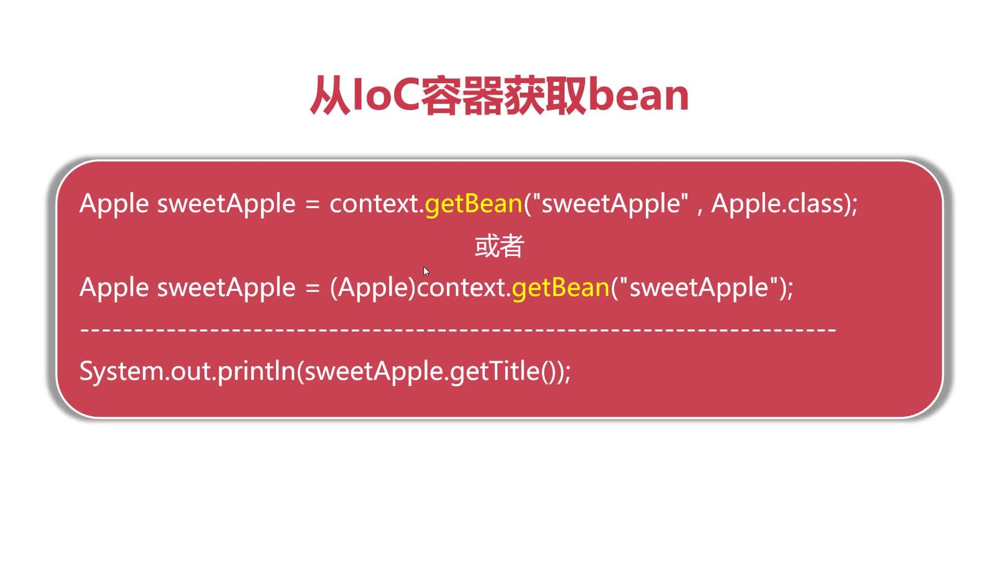
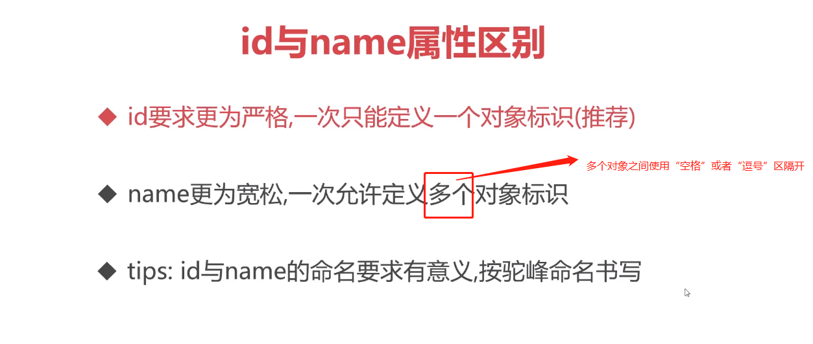
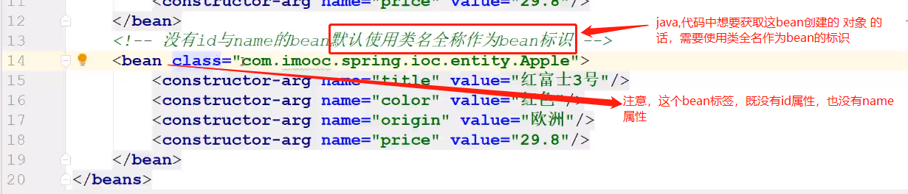
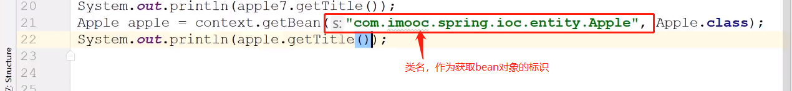

# 从IoC容器获取bean

正两种方式的本质是一样的，（推荐使用上面的形式）

>  注意：第二种方法的返回值为Object类，需要进行强制转换。

## id与name属性的异同点
* `<bean> ` id/name 都是为创建的对象赋予一个唯一的标识
* 两者在同一个配置文件中都不允许出现重复
* 两者允许在多个配置文件中出现重复，新对象覆盖旧对象




```xml
<!--name更为宽松一次允许定义多个对象标识-->
<bean name="apple2,apple,apple3 " class="factory.AppleStaticFactory" factory-method="createSweetApple"/>
```

特殊情况：（极少使用）



