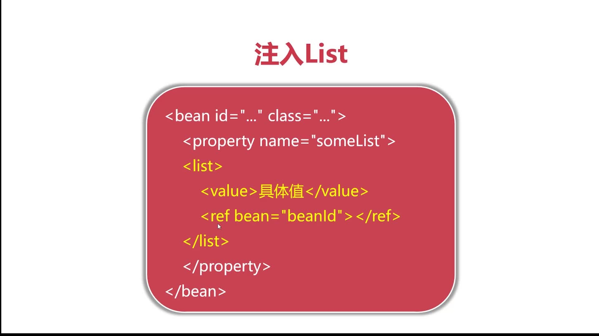
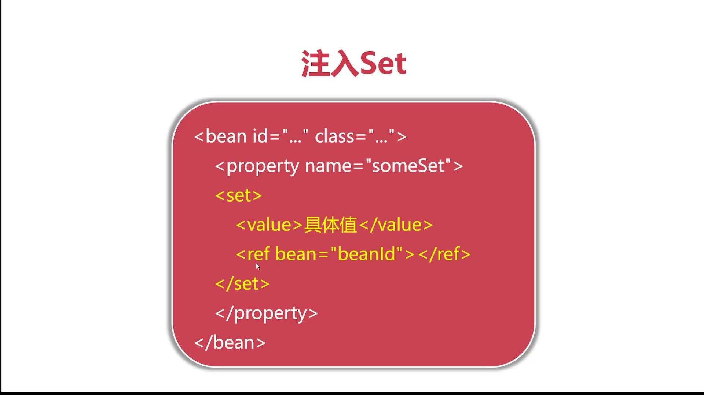
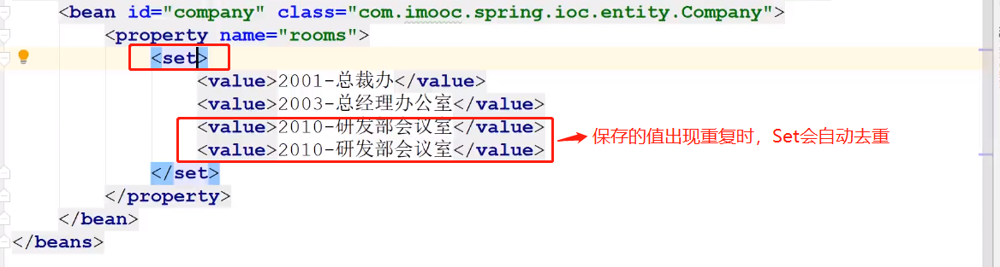
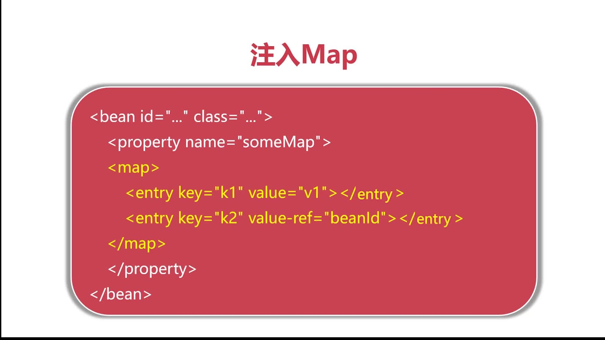
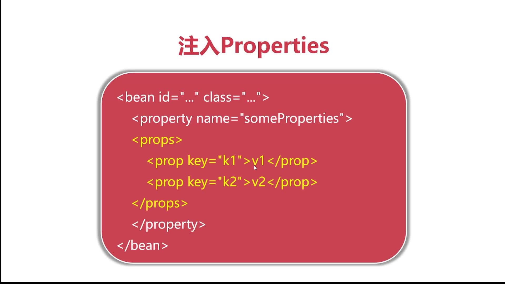

# 注入集合对象：保存多数据的类型，如何在SpringIoC中，进行动态注入




## List 和 Set的区别是：

* list-->允许元素重复

* Set-->不允许元素重复（自动去重）










## Map和Properties的区别是：

Properties-->key和value只能是**字符串类型数据**

Map--> value 可以应用其它对象


## 栗子


```java
public class Company {
    private Set<String> rooms;
    private Map<String,Calculator> calculatorMap;
    private Properties info;
}
public class Calculator {
    private  String brand;
    private  String type;
    private  String sn;
    private  Float price ;
}    
```

```xml
<?xml version="1.0" encoding="UTF-8"?>
<beans xmlns="http://www.springframework.org/schema/beans"
       xmlns:xsi="http://www.w3.org/2001/XMLSchema-instance"
       xsi:schemaLocation="http://www.springframework.org/schema/beans http://www.springframework.org/schema/beans/spring-beans.xsd">

<!--    <bean id="calculator" class="top.xiongmingcai.ioc.entity.Calculator">
        <constructor-arg name="brand" value="联想机"/>
        <constructor-arg name="type" value="台式机"/>
        <constructor-arg name="sn" value="234234"/>
        <constructor-arg name="price" value="3085"/>
    </bean>-->
    <bean id="company" class="top.xiongmingcai.ioc.entity.Company">
        <property name="rooms">
            <set>
                <value>2001-总裁办</value>
                <value>2002-总经理办公室</value>
                <value>2010-研发部会议室</value>
                <value>2010-研发部会议室</value>
            </set>
        </property>
        <property name="calculatorMap">
            <map>
                <entry key="dev-8848">
                    <bean class="top.xiongmingcai.ioc.entity.Calculator">
                        <constructor-arg name="brand" value="联想机"/>
                        <constructor-arg name="type" value="台式机"/>
                        <constructor-arg name="sn" value="234234"/>
                        <constructor-arg name="price" value="3085"/>
                    </bean>
                </entry>
            </map>
        </property>
        <property name="info">
            <props>
                <prop key="phone">010-12348848</prop>
                <prop key="address">长沙市芙蓉区</prop>
                <prop key="website">www.xiongmingcai.top</prop>
            </props>
        </property>
    </bean>
</beans>
```


```java
Company company = context.getBean("company", Company.class);
String website = company.getInfo().getProperty("website");
String jsonString = JSON.toJSONString(company);
```


```json 
{
	"calculatorMap": {
		"dev-8848": {
			"brand": "联想机",
			"price": 3085.0,
			"sn": "234234",
			"type": "台式机"
		}
	},
	"info": {
		"phone": "010-12348848",
		"address": "长沙市芙蓉区",
		"website": "www.xiongmingcai.top"
	},
	"rooms": ["2001-总裁办", "2002-总经理办公室", "2010-研发部会议室"]
}
```

https://github1s.com/MingCaiXiong/spring-learn/blob/6806814e8e81d006a1cc51ff9991d700e1815b6b/src/main/resources/applicationContext.xml