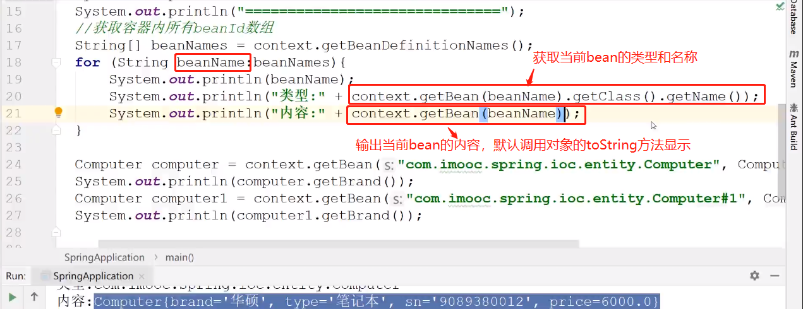

# 查看容器内有多少个对象:

```java
 context.getBeanDefinitionNames();
```
查看容器内有多少个对象:

context.getBeanDefinitionNames()返回一个配置文件中所有的beanid字符串数组（不包含内置bean）

如果非内部bean并未设置id或者name属性，那么会返回该类完整名称+#标识号（从0开始）。

有多个同类匿名bean的情况下，如果通过类名直接提取，默认选中#0；如果通过“类名+#编号”方式提取，则可以选中特定匿名bean。


