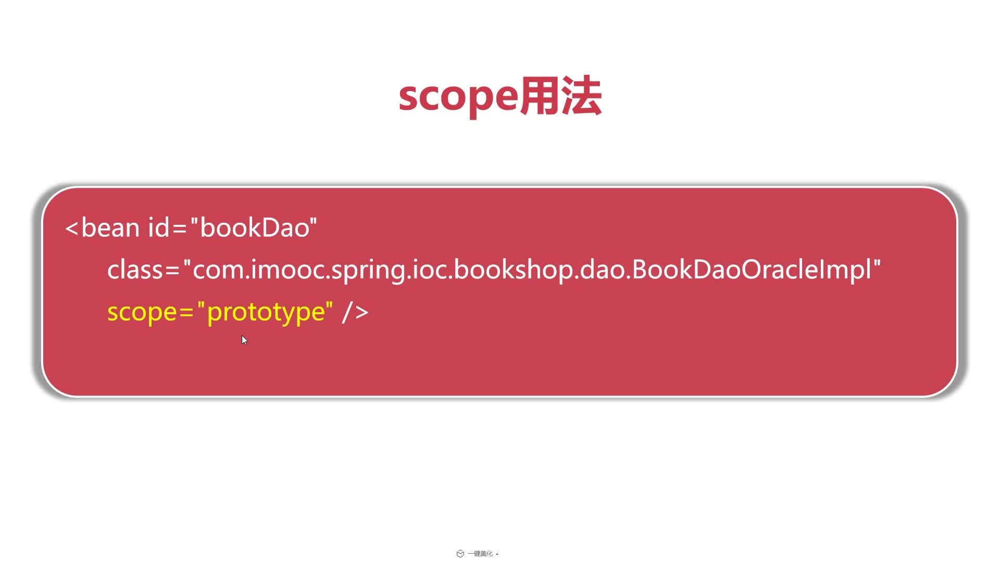
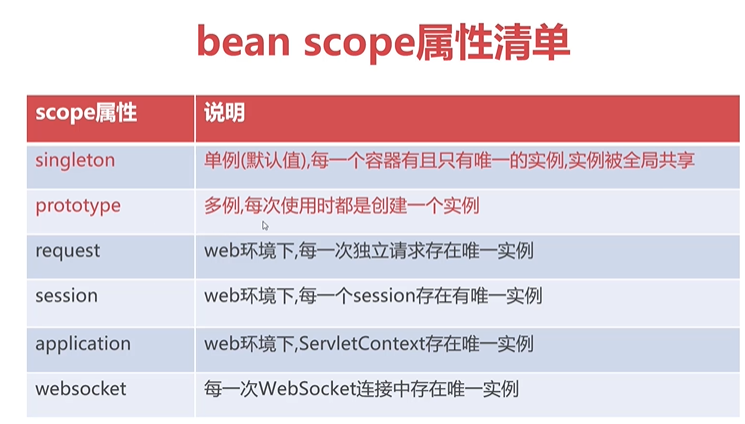
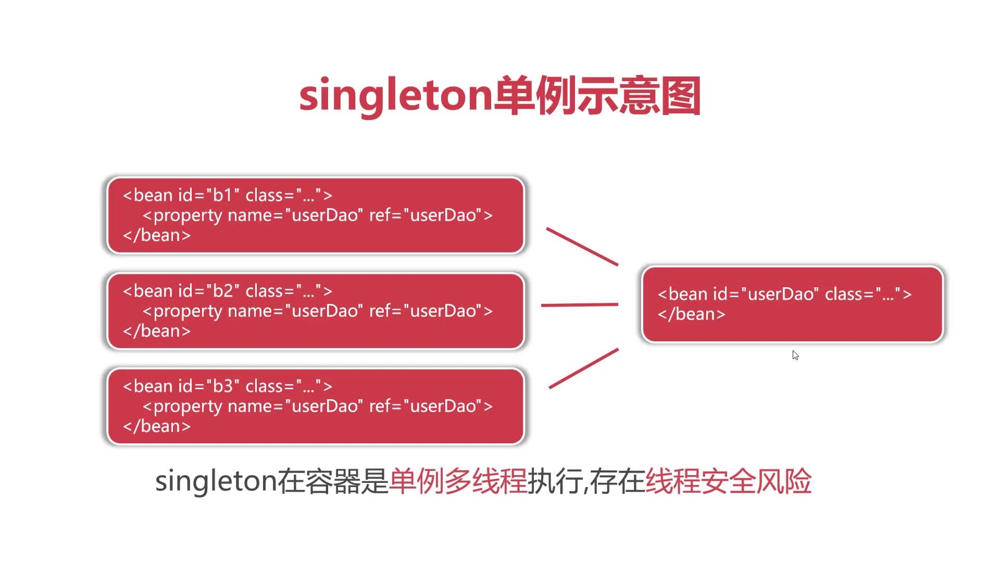
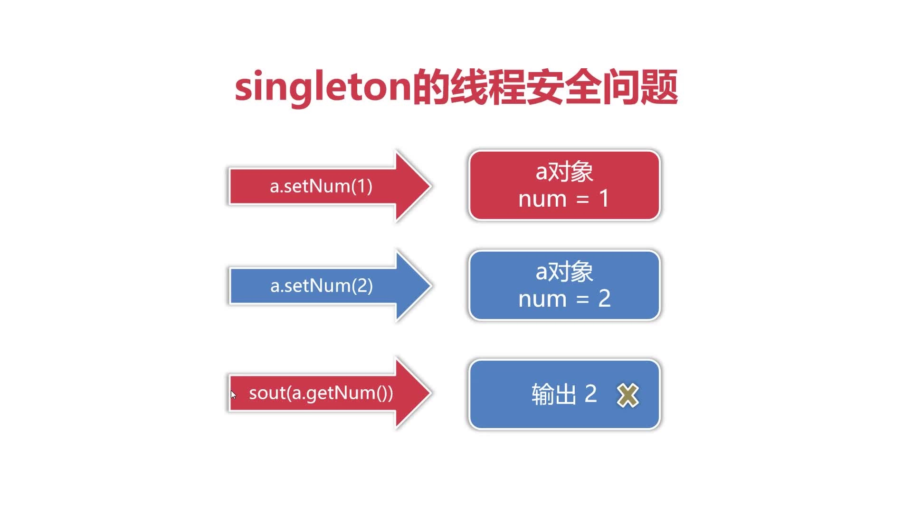
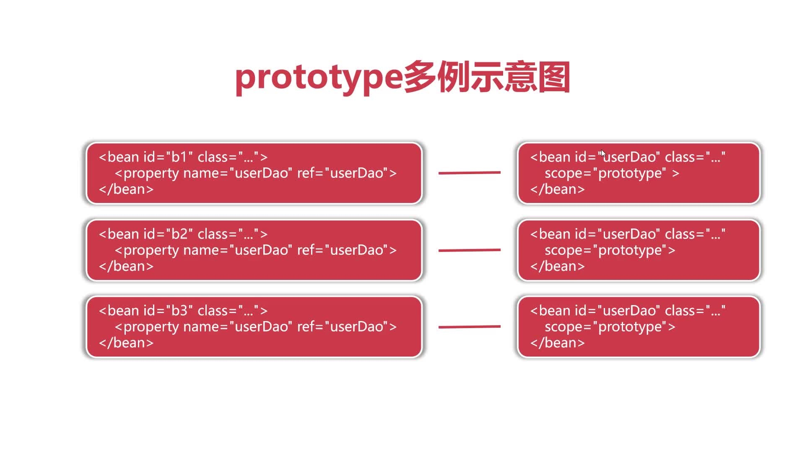
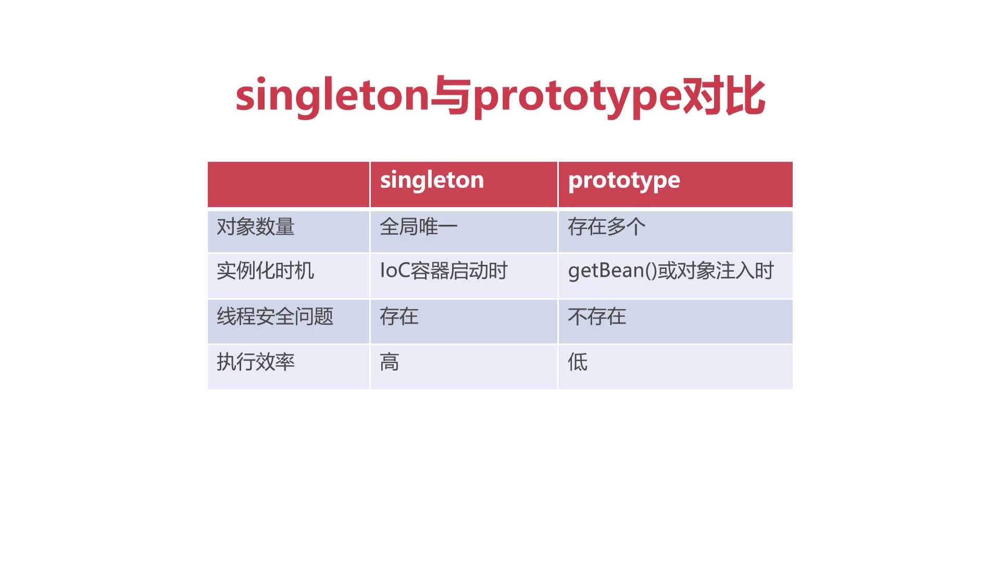
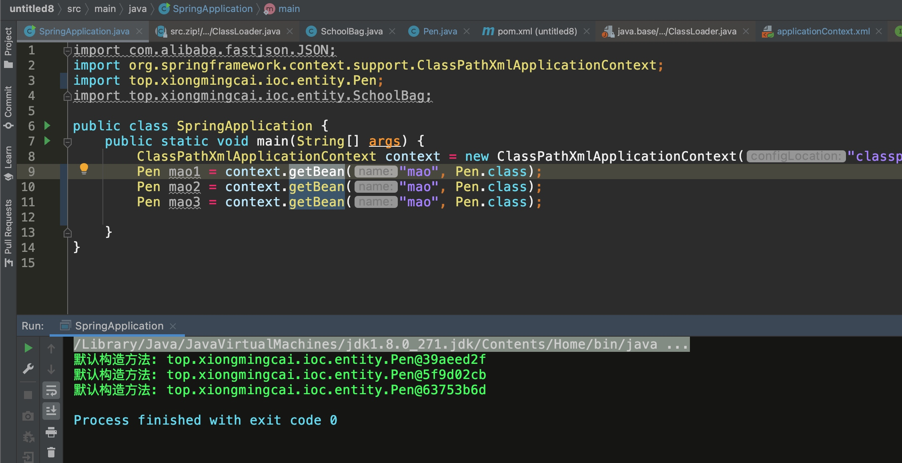
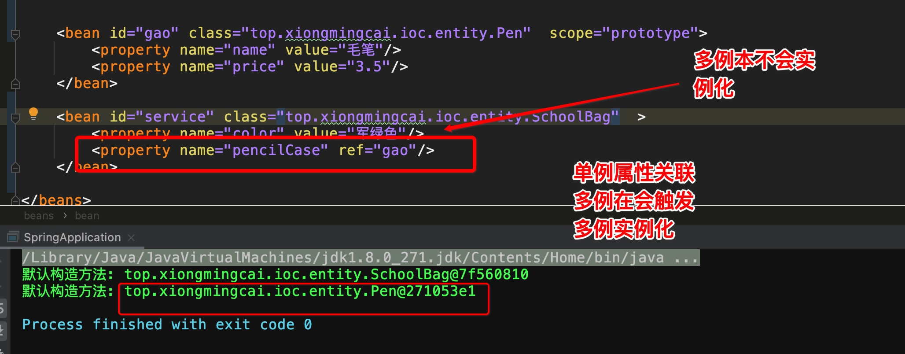

# bean scope属性
* bean scope属性用于决定对象何时被创建与作用范围。

* bean scope配置将影响容器内对象的数量。

* bean scope默认值为singleton(单例)，指全局共享同一个对象实例. 

## 单例模式 （singleton 默认）
唯一
scope=singleton的意思是，**每当我们使用context.getBean(beanId),获得都是同一个对象，也即单例模式**，不过在容器中是单例多线程执行，这样可以使得不同的对象同时ref同一个单例，但是存在线程安全风险。

优势：不占用资源，只适用于小型的项目

单线程安全问题解决方案：如在synchronized关键字上加锁，在设置和读取的过程中，让当前代码处于独占状态，让用户2只有在用户1处理完之后才能继续处理，把多线程并行改为串行排队执行。

或者为每一位用户分配单独的对象，各操作个的，互不影响，就是多例模（prototype）
## 多例模式
scope=prototype的意思是，每次使用时，需要创建一个新的实例对象，占用更多资源，不存在线程安全问题。

> 缺点：占用资源
多例模式下，在 bean 的获取时，才会创建对象。      

## singleton与prototype对比

如果用户少，访问少，两者性能差异忽略不计，如果是高并发的，性能差异就大了

多例模式下，在 bean 的获取时，才会创建对象。
      

# 实际项目里dao和service是应该单例还是多例呢？

答：都是单例，出现线程安全原因是因为对象在运行过程中会不断变化，实际项目里Dao不会被重新设置，是稳定不变的。所以如果某个程序是不会轻易变化的，推荐使用单例模式，属性在程序运行中不断变化，推荐使用多例模式

