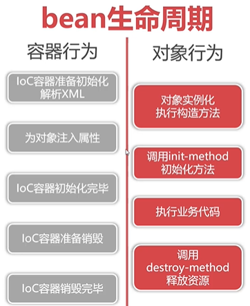

# bean的生命周期


* **init-method和destroy-method**是XML文件里bean标签里的一个属性，属性值是目标类里的方法名，在IOC容器初始化创建该bean的时候会执行init-method里指向的方法，destroy-method同理。

```java
 context.registerShutdownHook();
```

```xml
<bean id="order1" class="top.xiongmingcai.ioc.entity.Order"
      init-method="init" destroy-method="destroy">
    <property name="price" value="19.8"/>
    <property name="quantity" value="1000"/>
</bean>
```

```java
 public void init(){
        System.out.println("Order.init");
        this.total = price * quantity;
    }
public void  destroy(){
    System.out.println("Order.destroy");
}
```