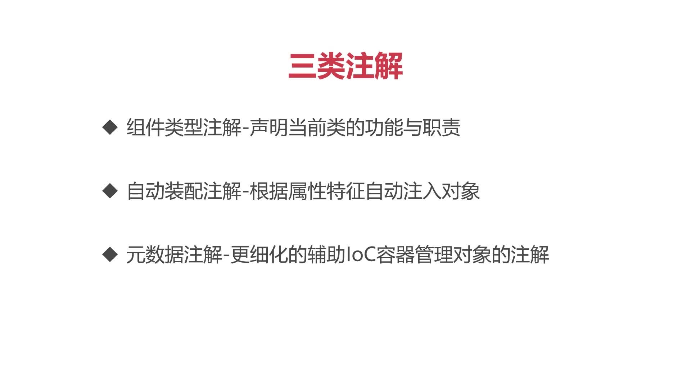
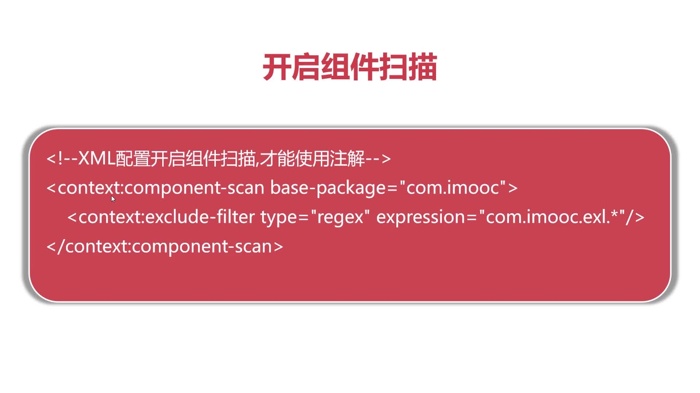

# Spring三类注解

## 四种组件类型注解
* @Component 组件注解，通用注解，被该注解描述的类将被IoC容器管理并实例化

* @Controller  语义注解，说明当前类是MVC应用中的控制器类

* @Service  语义注解，说明当前类是Service业务服务类

* @Repository  语义注解，说明当前类用于业务持久层，通常描述对应Dao类

## 开启组件扫描（在applicationContext中）

