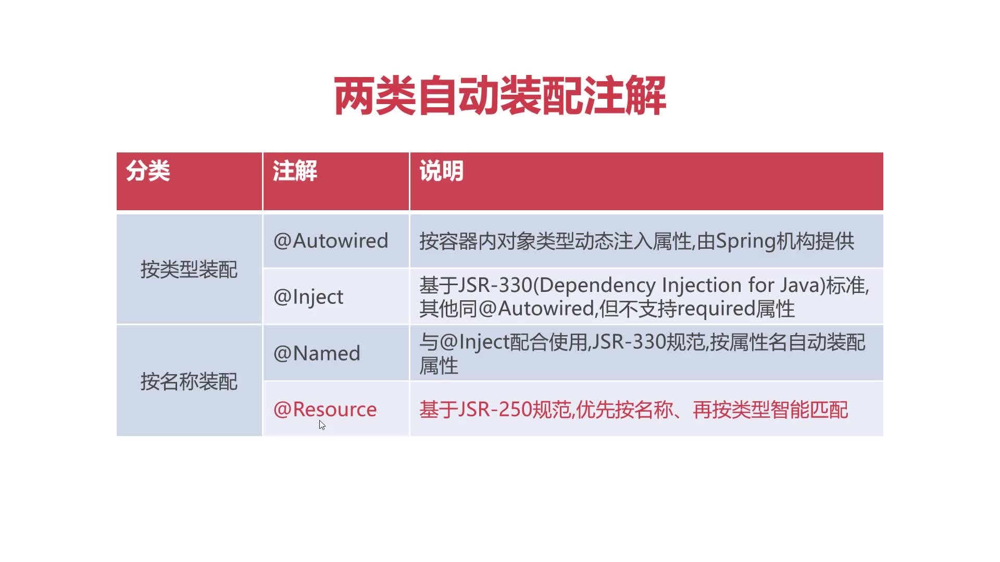
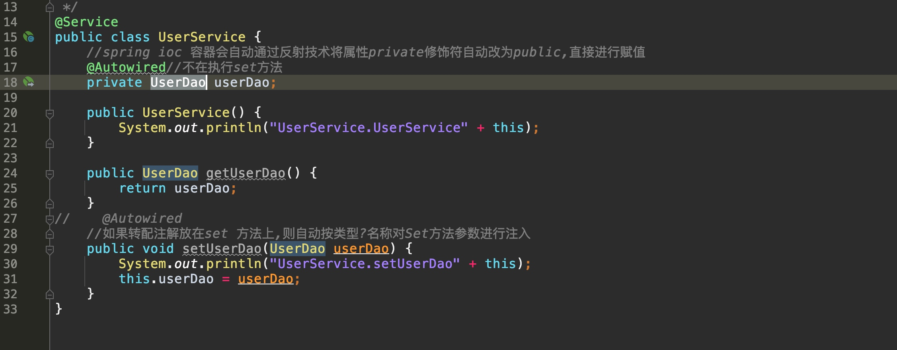
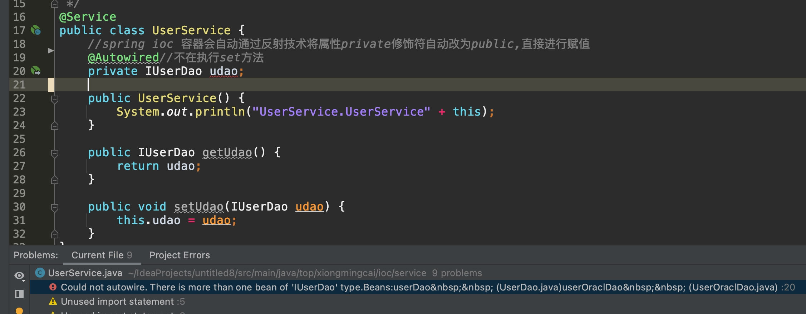
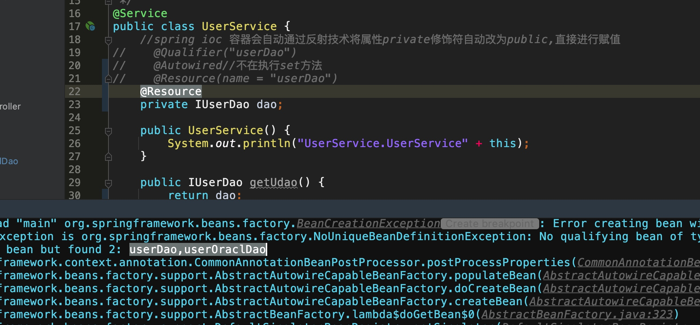

# 两类自动装配注解

## @Autowired说明：
按容器类型动态注入属性

* 在set方法上加上@Autowire注解，按类型/名称对set方法参数进行注入。2，当@Autowired注解直接放在属性名上时，不再执行set方法注入，而是使用反射技术注入，因为直接放属性名上后，运行时会动态的属性修饰符从private改查public，赋值完成后再将其改为private。虽然我们无法看到，这样就能直接调用了，无须使用set方法，所以我们通常也不需要生成set方法）

[代码示例](https://github1s.com/MingCaiXiong/spring-learn/blob/314a095af2e43171846381820687879f2adcc696/src/main/java/top/xiongmingcai/ioc/service/UserService.java)

## @Autowired装配冲突

* 解决方法1：去掉某个继承类的@Repository属性

* 解决方法2：其中一个继承类多引入一个@Primary注解
[两个类型一样Autowired装配就会犯迷糊：github](https://github1s.com/MingCaiXiong/spring-learn/tree/5db77d93705b45c322c6452e9829d9c8a8652db5/src/main/java/top/xiongmingcai/ioc/service)

## @Resource 装配冲突

https://github1s.com/MingCaiXiong/spring-learn/blob/5db77d93705b45c322c6452e9829d9c8a8652db5/src/main/java/top/xiongmingcai/ioc/service/UserService.java

* 解决方法1：@Resource设置name属性则按照name在ioc容器中将bean注入
* @Resource未设置bean，按照属性名作为bean name匹配
* 按属性名未匹配到，则需要假如@Primary解决类型冲突 
* 添加@ualifier注解

## 关于区分是直接赋值注入还是使用setter方法注入（面试经常问到）
* 无论是@Autowired和@Resource，注解在属性名上时，都是先把属性的private改为public，再按照注解的规则进行直接赋值，然后再改回private。

* 当注解在属性上时，是直接赋值注入，注解在setter方法上时，是通过set注入。

