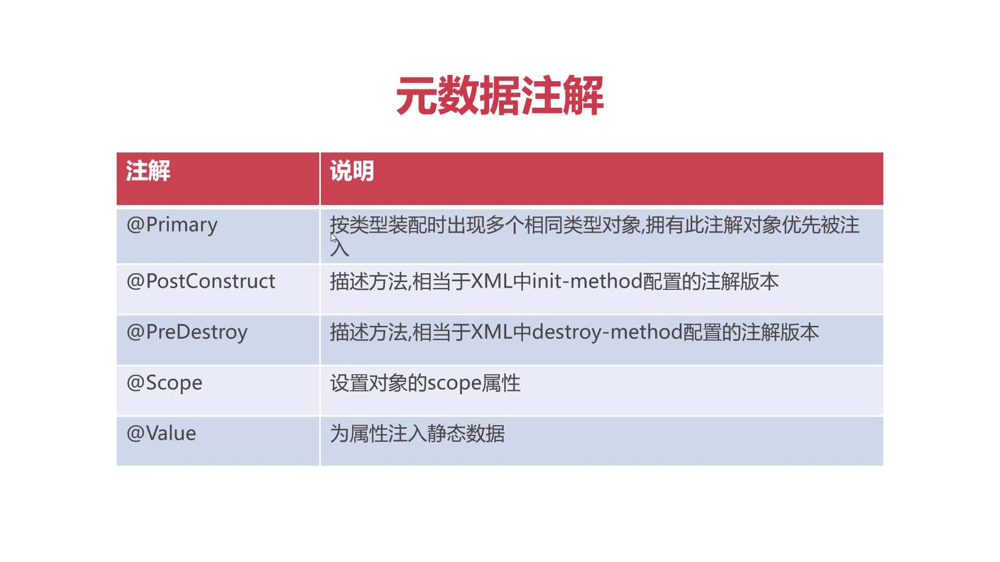

# 元数据注解
为spring ioc容器管理对象时提供辅助信息

* @Primary 按类型装配时出现多个相同类型对象，拥有此注解对象优先被注入

* @PostConstruct  描述方法，相当于XML中init-method配置的注解版本

* @PreDestroy  描述方法，相当于XML中destroy-method配置的注解版本

* @Scope("...")  设置对象的scope属性

* @Value("...")  为属性注入静态数据

## 通知Spring IoC容器初始化时加载属性文件

*  @Value 原理：运行时将private改查public，设置完后再将其改为private
* `<context:property-placeholder location = "classpath:config.properties"
`
* @Value("${...}")  读取config.properties文件中 ...的值

https://github1s.com/MingCaiXiong/spring-learn/blob/e496b04727ad1e879ff5898c35aa07f8ccd7e85a/src/main/java/top/xiongmingcai/ioc/service/UserService.java