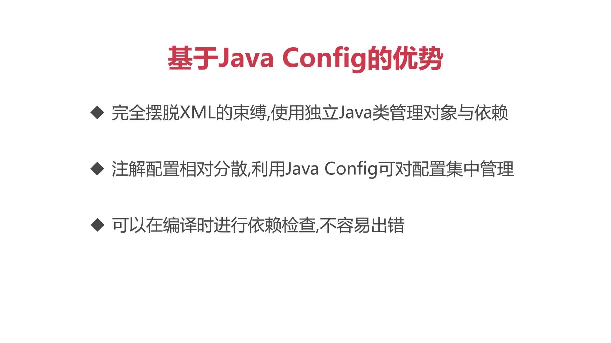
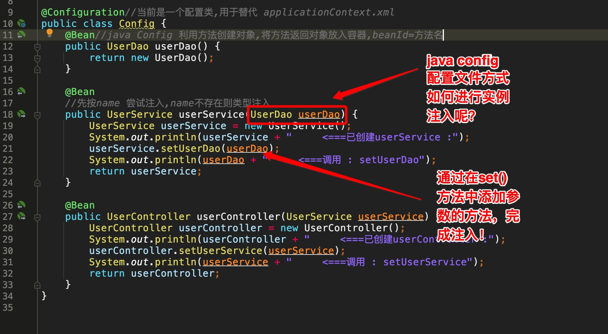
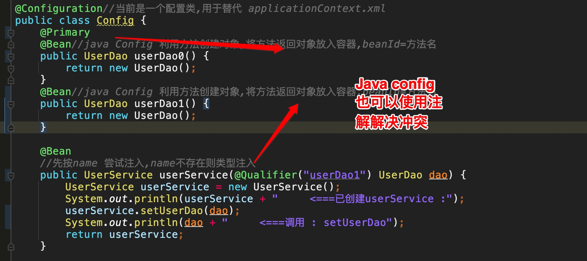
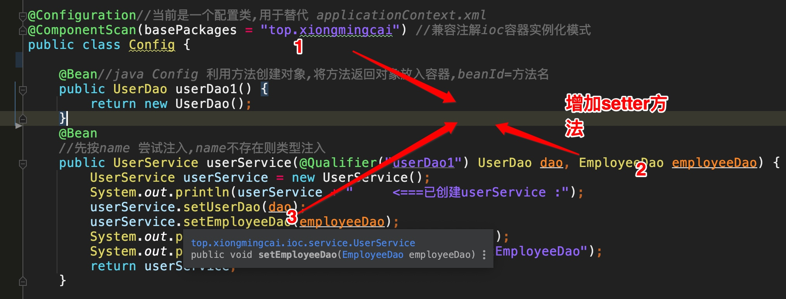

# 使用java config配置ioc容器实例化 
spring3.0新推出的配置方式，用java代码替代传统配置文件

基于Java Config的优势：
* 新人只需要记住：Java Config即是用Java类来替代XML文件。

* 完全摆脱XML的束缚，使用独立Java类管理对象与依赖。

* 注解配置相对分散，利用Java Config可对配置集中管理。

* 可以在编译时进行依赖检查，不容易出错。
 

## Java Config配置文件方式，如何进行注入：



为了更好的兼容Java注解类，引入@ComponentScan 注解
```java
@ComponentScan(basePackages = "top.xiongmingcai") //兼容注解ioc容器实例化模式
```
https://github1s.com/MingCaiXiong/spring-learn/blob/cf994baef5cc221facb5659adba31ec0fbe4deb6/src/main/java/top/xiongmingcai/ioc/Config.java

## Java Config配置文件方式注入冲突场景



## Java Config配置文件方式兼容 注解方式



```java
@Configuration//当前是一个配置类,用于替代 applicationContext.xml
@ComponentScan(basePackages = "top.xiongmingcai") //兼容注解ioc容器实例化模式
public class Config {
    @Primary
    @Bean//java Config 利用方法创建对象,将方法返回对象放入容器,beanId=方法名
    public UserDao userDao1() {
        return new UserDao();
    }

    @Bean
    //先按name 尝试注入,name不存在则类型注入
    public UserService userService(@Qualifier("userDao1") UserDao dao, EmployeeDao employeeDao) {
        UserService userService = new UserService();
        System.out.println(userService + "     <===已创建userService :");
        userService.setUserDao(dao);
        userService.setEmployeeDao(employeeDao);
        System.out.println(dao + "     <===调用 : setUserDao");
        System.out.println(employeeDao + "     <===调用 : setEmployeeDao");
        return userService;
    }
}

```

## Java Config配置文件，进行注入的好处

* 优势 ：直接在源代码中编译，使用方便，并且编译工具可以帮助对编译时异常进行检查。

* 劣势 ：代码写在源码中，后期维护繁琐

工作中，Java Config更多的用在了敏捷开发中（特别适合快速迭代，快速上线的工程。SpringBoot--Spring体系中的敏捷开发框架，默认基于Java Config进行配置）

XML文件配置方式，多用于大型项目的协作，通过配置文件将每一个团队的工作切分