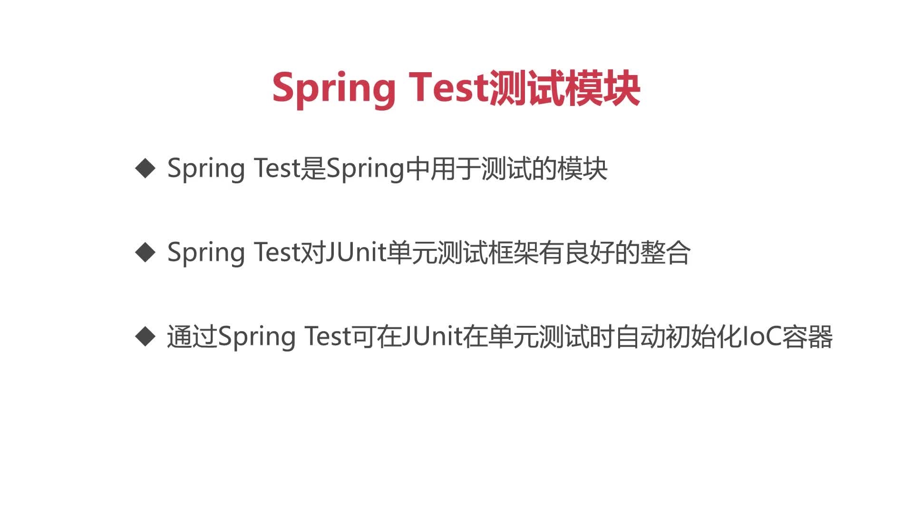

# Spring Test测试模块


## Spring JUnit4整合步骤

### maven工程依赖spring-test和JUnit

```xml
<dependencies>
    <dependency>
        <groupId>org.springframework</groupId>
        <artifactId>spring-context</artifactId>
        <version>5.2.6.RELEASE</version>
    </dependency>
    <dependency>
        <groupId>org.springframework</groupId>
        <artifactId>spring-test</artifactId>
        <version>5.2.6.RELEASE</version>
    </dependency>
    <dependency>
        <groupId>junit</groupId>
        <artifactId>junit</artifactId>
        <version>4.12</version>
    </dependency>
</dependencies>
```
###  利用@RunWith与@ContextConfiguration描述测试用例类

```java
//将Junit4的执行权交由Spring Test,在测试用例执行前自动初始化IoC容器
@RunWith(SpringJUnit4ClassRunner.class)
//声明配置文件的位置
@ContextConfiguration(locations = {"classpath:applicationContext.xml"})
public class UserServiceTest {
   
}
```
### 测试用例类从容器获取对象完成测试用例的执行

```java
@RunWith(SpringJUnit4ClassRunner.class)
@ContextConfiguration(locations = {"classpath:applicationContext.xml"})
public class UserServiceTest {
    @Resource
    private UserService userService;

    @Test
    public void insertOneUser() {
        userService.insertOneUser();
    }
}
```
* 用@resource注入需要的属性，并在测试用例方法验证是否正确  

https://github1s.com/MingCaiXiong/spring-learn/blob/a68be33bc299c58903e1db2b83a8b02507976aac/src/test/java/top/xiongmingcai/ioc/service/UserServiceTest.java