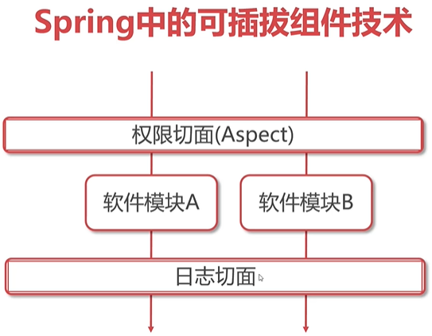

# Spring AOP(Aspect Oriented Programming)：

* 面向切面编程：在软件运行过程中，比如执行前后都可以额外增加相应扩展功能，我们把这个功能称为切面，如果不需要的话就从配置文件进行移除，软件可以回到最原始状态，效果类似于浏览器的插件。

* AOP的做法是将通用、与业务无关的功能抽象封装为切面类。

* 切面可配置在目标方法的执行前、后运行，真正做到即插即用。

* **最终目的：在不修改源码的情况下对程序进行扩展**

## 为什么要把扩展功能被称为切面？
* 正常软件业务流程是从上到下依次执行的，我们加的功能就像横切面一样穿加在原始软件的运行过程中

