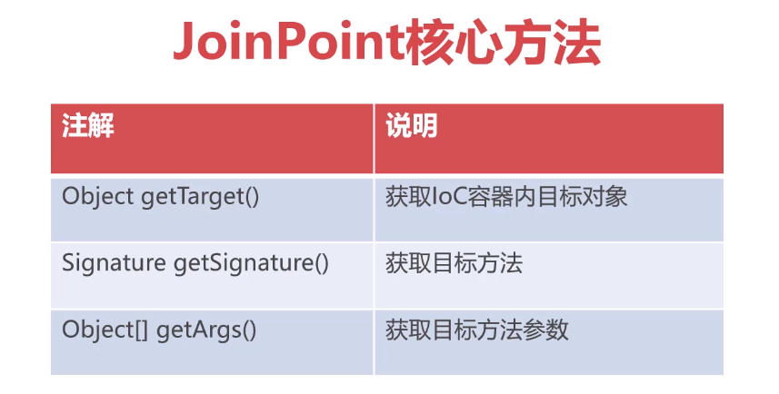

# Aop标准流程:

## 导入对应依赖:

准备：[标准IOC容器](https://github1s.com/MingCaiXiong/spring-learn/tree/d8da031931821653842010462531f5b9afb7d9a3)

```xml
<dependency>
    <groupId>org.springframework</groupId>
    <artifactId>spring-context</artifactId>
    <version>5.2.6.RELEASE</version>
</dependency>
<!--spring aop的底层依赖-->
<dependency>
    <groupId>org.aspectj</groupId>
    <artifactId>aspectjweaver</artifactId>
    <version>1.9.5</version>
</dependency>
```

## 定义切面类及其切面方法：
```java
//切面类
public class MethodAspect {
    //切面方法,用于扩展额外功能
    //JoinPoint 连接点 通过连接点可以获取目标类/方法的信息
    public void printExecutionTime(JoinPoint joinPoint) {
        SimpleDateFormat simpleDateFormat = new SimpleDateFormat("yyyy-MM-dd HH:mm:ss SSS");
        String now = simpleDateFormat.format(new Date());
        //获取目标类
        String targetClassName = joinPoint.getTarget().getClass().getName();
        //获取目标方法
        String targetMethodName = joinPoint.getSignature().getName();
        System.out.println("---->" + now + ":" + targetClassName + "." + targetMethodName);
    }
}

```
## 配置对应XML文件


```xml
<?xml version="1.0" encoding="UTF-8"?>
<beans xmlns="http://www.springframework.org/schema/beans"
       xmlns:xsi="http://www.w3.org/2001/XMLSchema-instance"
       xmlns:aop="http://www.springframework.org/schema/aop"
       xsi:schemaLocation="http://www.springframework.org/schema/beans
        https://www.springframework.org/schema/beans/spring-beans.xsd
        http://www.springframework.org/schema/context
        http://www.springframework.org/schema/context/spring-context.xsd
        http://www.springframework.org/schema/aop
        https://www.springframework.org/schema/aop/spring-aop.xsd">

    <bean class="top.xiongmingcai.aop.dao.UserDao" id="userDao"/>
    <bean class="top.xiongmingcai.aop.dao.EmployeeDao" id="employeeDao"/>

    <bean class="top.xiongmingcai.aop.service.UserService" id="userService">
        <property name="userDao" ref="userDao"/>
    </bean>

    <bean class="top.xiongmingcai.aop.service.EmployeeService" id="employeeService">
        <property name="employeeDao" ref="employeeDao"/>
    </bean>

    <!--Aop配置-->
    <bean class="top.xiongmingcai.aop.aspect.MethodAspect" id="methodAspect"/>
    <aop:config>
        <!--定义切点，使用execution表达式表示切面的拦截范围-->
        <!--execution(public * com.imooc..*.*(..))说明切面的作用com.imooc包下所有类的所有方法-->
        <aop:pointcut id="pointcut" expression="execution(public * top.xiongmingcai..*.*(..))"/>
        <!--定义切面类，刚才的bean只是告诉ioc容器这是一个对象，但是具体声明为切面类还需要再
        在aop:config中配置-->
        <aop:aspect ref="methodAspect">
            <!--before通知，代表在目标方法运行前运行methodAspect.printExecutionTime方法-->
            <aop:before method="printExecutionTime" pointcut-ref="pointcut"/>
        </aop:aspect>
    </aop:config>

</beans>
```

运行程序代码即可，相当于新增了一个输出时间的插件，每次执行方法前都需要打印时间。

https://github1s.com/MingCaiXiong/spring-learn/blob/2722a13023d1340fe78c79526ee7de77ac979e33/src/main/resources/applicationContext.xml

## AOP关键概念       


* **`Aspect 切面`**，具体的可插拔组件功能类，通常一个切面只能实现一个通用功能

* **`Target Class/Method `** 目标类、目标方法，指真正要执行与业务相关的方法

* **`PointCut  切入点`**，使用execution表达式说明切面要作用在系统的哪些类上

* **`JoinPoint  连接点`**，切面运行过程中是包含了目标类/方法元数据的对象

* **`Advice  通知`**，说明具体的切面的执行时机，Spring包含了五种不同类型的通知


## spring aop与AspectJ的关系：
1，Eclipse AspectJ，一种基于java平台的面向切面编程的语言，有一套完整体系，可以运行时实现aop面向切面编程的理念

2，但是spring aop并不是完全使用AspectJ来实现的，只是在底层依赖AspectJWeaver实现类与方法匹配

3，Spring AOP核心原理是利用代理模式实现对象运行时功能扩展

## JoinPoint核心方法：



* getTarget()获取ioc容器目标对象
* getSignature()获取目标方法
* getArgs() 获取目标方法参数       

https://github1s.com/MingCaiXiong/spring-learn/blob/a4607f9f3df94ae85a685cc7db9b881c1a0af40d/src/main/java/top/xiongmingcai/aop/aspect/MethodAspect.java
## 切点表达式
[PointCut切点表达式](mweblib://16185333550548)