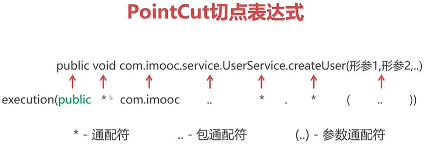

# PointCut切点表达式



- public可省略

- 返回值可以匹配任意的（*），也可以为void或者是String，object对象之类的

- 类名比如我要匹配包含service的，可以写成***service**，其他的同理
- 两个参数方法的是(*,*)


```java
expression="execution( * top.xiongmingcai..Em*.onBoa*(..))"
```

作用于两个参数函数
```java
expression="execution( * top.xiongmingcai..*.*(*,*))"
```

[Aop标准流程:](mweblib://16184837619624)
[PointCut切点表达式](mweblib://16185333550548)
[Spring AOP五种通知类型](mweblib://16185346440965)
[Spring 利用AOP进行方法性能筛查[环绕通知]](mweblib://16185605677769)
[Spring AOP(Aspect Oriented Programming)：](mweblib://16184815128666)