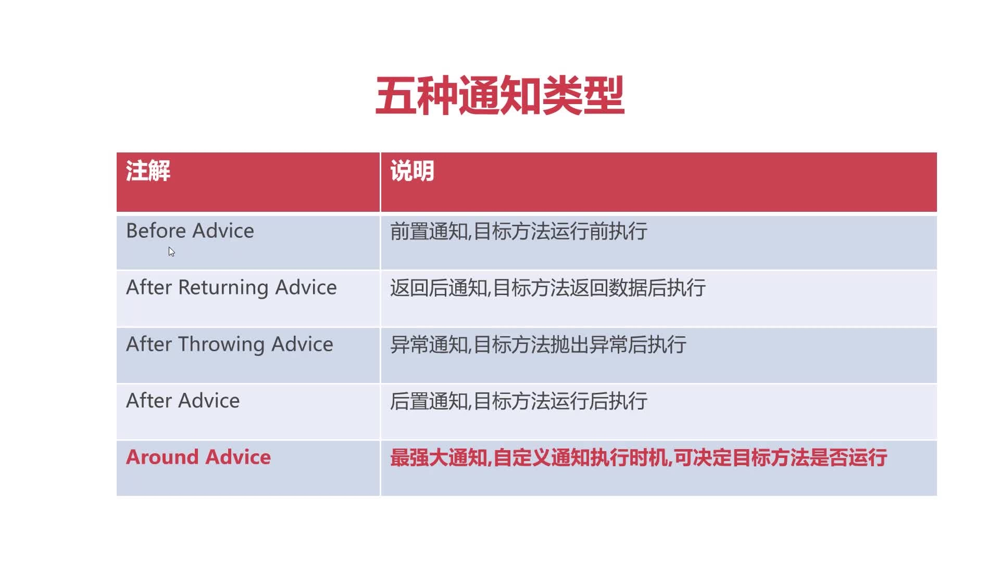

# Spring AOP五种通知类型
通知：在什么时机执行切面的方法
日常开发不常用，但是面试笔试会经常被问到


* Before Advice  前置通知，目标方法运行前执行

* After Advice  后置通知，目标方法运行后执行

* After Returning Advice  返回后通知，目标方法返回数据后执行

* After Throwing Advice  异常通知，目标方法抛出异常后执行

* Around Advice  最强大通知，自定义通知执行时机，可决定目标方法是否运行
* Around Advice：最强大通知，自定义通知执行时机，可决定目标方法是否运行。

* After Returning与After Throwing二者只能选其一，After Advice类似于Try-catch-finally里的finally无论是否异常，都会通知。

> 前4种做了解，知道触发时机即可，Around Advice做重点掌握
## After Advice 后置通知

```java
public void doAfter(JoinPoint joinPoint) {
    System.out.println("<----MethodAspect.doAfter");
}
```
After无法获取目标方法运行中产生的返回值或者是异常


## After Returning Advice  返回后通知，


```java
public void doAfterReturning(JoinPoint joinPoint, Object ret){
    System.out.println("返回后通知 <---" + ret);
}
```

https://github.com/MingCaiXiong/spring-learn/commit/6ba5478041eb334f457710eece1cd57a1c2fac3d


## After Throwing Advice 异常通知

```xml
<!--Aop配置-->
<bean class="top.xiongmingcai.aop.aspect.MethodAspect" id="methodAspect"/>
<aop:config>
<!--定义切点，使用execution表达式表示切面的拦截范围-->
<!--execution(public * com.imooc..*.*(..))说明切面的作用com.imooc包下所有类的所有方法-->
<aop:pointcut id="pointcut" expression="execution( * top.xiongmingcai..*.*(..))"/>
<!--定义切面类，刚才的bean只是告诉ioc容器这是一个对象，但是具体声明为切面类还需要再
在aop:config中配置-->
<aop:aspect ref="methodAspect">
    <!--before通知，代表在目标方法运行前运行methodAspect.printExecutionTime方法-->
    <aop:before method="printExecutionTime" pointcut-ref="pointcut"/>
    <aop:after method="doAfter" pointcut-ref="pointcut"/>
    <aop:after-returning method="doAfterReturning" pointcut-ref="pointcut" returning="ret"/>
    <aop:after-throwing method="doAfterThrowing" pointcut-ref="pointcut" throwing="th"/>
</aop:aspect>
</aop:config>
```
## After 顺序和配置的顺序一致
https://github.com/MingCaiXiong/spring-learn/commit/4eba271829958a5e5b7a82be28b657e8e8b19528

[Aop标准流程:](mweblib://16184837619624)
[PointCut切点表达式](mweblib://16185333550548)
[Spring AOP五种通知类型](mweblib://16185346440965)
[Spring 利用AOP进行方法性能筛查[环绕通知]](mweblib://16185605677769)
[Spring AOP(Aspect Oriented Programming)：](mweblib://16184815128666)