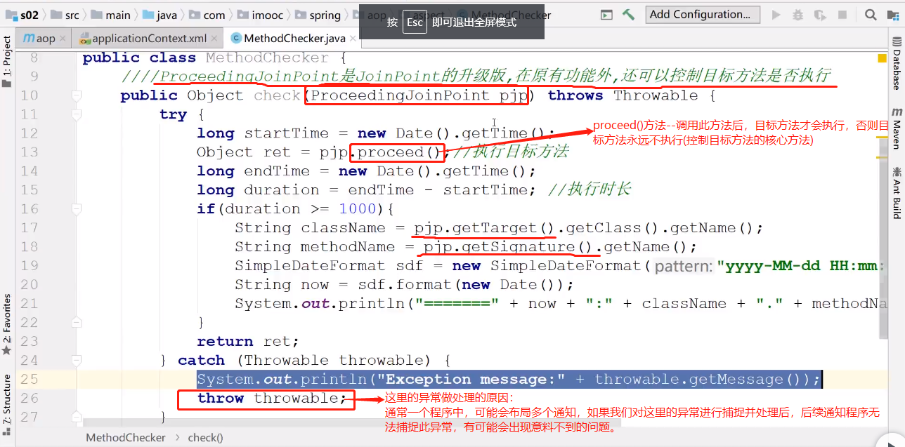
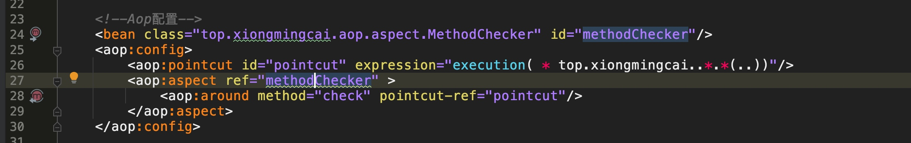

# Spring 利用AOP进行方法性能筛查[环绕通知]

1. 注意：绕通知的方法，需要添加返回值（返回值为触发此环绕通知的方法的返回值）

2. proceed()方法-->ProceedingJoinPoin 参数调用此方法后，目标方法才会执行，否则目标方法永远不执行(控制目标方法的核心方法)、（返回值为目标方法的返回值）

> 这里的异常做处理的原因：通常一个程序中，可能会布局多个通知，如果我们对这里的异常进行捕捉并处理后，后续通知程序无法捕捉此异常，有可能会出现意料不到的问题。

https://github.com/MingCaiXiong/spring-learn/commit/074927e811e594534fd036e7d5e0d23ab9ab2e58

[Aop标准流程:](mweblib://16184837619624)
[PointCut切点表达式](mweblib://16185333550548)
[Spring AOP五种通知类型](mweblib://16185346440965)
[Spring 利用AOP进行方法性能筛查[环绕通知]](mweblib://16185605677769)
[Spring AOP(Aspect Oriented Programming)：](mweblib://16184815128666)