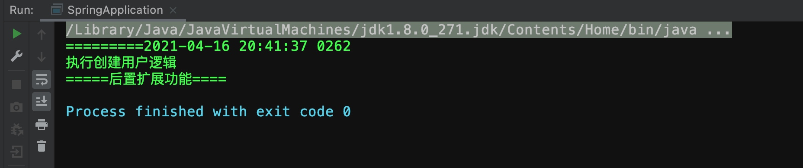

# Spring AOP 实现原理：（面试高频重点）


* Spring基于代理模式实现功能动态扩展，包含两种形式：

* 目标类拥有接口，通过JDK动态代理实现功能扩展

* 目标类没有接口，通过CGLib组件实现功能扩展

什么是代理模式：


* 代理模式通过代理对象对元对象的实现功能扩展
* 生活中的例子：客户（客户类）需要租房，然后找到中介（代理类），房东（委托类）。代理类和委托类要共同实现租房（接口）的逻辑。中介还可以向客户收取手续费（因为代理类内部里有委托类对象，所以代理类被实例化后可以对原始逻辑进行额外扩展）
* **按照如下例子，手动创建代理类的代理模式即为静态代理。**

## 具体例子:
###创建userService接口
```java
public interface UserService {
    public void createUser();
}
```
### 创建委托类，具体实现接口的业务逻辑
```java
public class UserServiceImpl implements UserService {
    public void createUser(){
        System.out.println("执行创建用户逻辑");
    }
}
```
### 创建代理类，  
持有委托类的对象，为了方便嵌套代理，这里放的是公共的接口，构造方法中传入的是一个具体的委托类或者其他代理类，然后用公共接口接收。
```java
public class UserServiceProxy implements UserService {
//持有委托类对象
    private UserService userService;

    public UserServiceProxy(UserService userService) {
        this.userService = userService;
    }

    @Override
    public void createUser() {
        System.out.println("========="+ new SimpleDateFormat("yyyy-MM-dd HH:mm:ss SSSS").format(new Date()));
        userService.createUser();
    }
}
```
### 代理类里还可以再嵌套代理类

```java
public class UserServiceProxy1 implements UserService {
    //持有委托类对象
    private UserService userService;

    public UserServiceProxy1(UserService userService) {
        this.userService = userService;
    }

    @Override
    public void createUser() {
        userService.createUser();
        System.out.println("=====后置扩展功能====");
    }
}


```
### 实例化时注意嵌套关系：


```java
public class SpringApplication {
    public static void main(String[] args) {
        UserService userService = new UserServiceProxy1(new UserServiceProxy(
        new UserServiceImpl()));
        userService.createUser();
    }
}

```

效果如图



## 总结
代理类和实现类都要实现相同接口，每次实现功能扩展都需要创建一个代理类，这样做有个坏处，随着功能的不断扩大，每个具体实现类都要拥有至少一个代理类，会使系统变得臃肿，这个时候我们就可以使用动态代理。

https://github.com/MingCaiXiong/spring-learn/commit/847a3a4e7af0bac3f91ef28c58c71dc8079a98d4